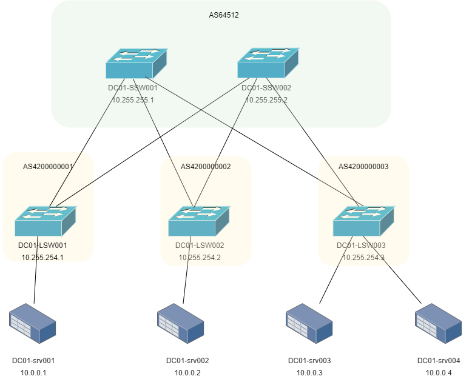

# Задание:

1. настроить BGP для Underlay сети.


# Решение:

1. [Создание, документация сети](#создание-сети)
2. [Проверка IP связности](#проверка-доступности)


    
### Создание сети:
В качестве оборудования было выбрано оборудование Arista ver. 4.29.2F, в качестве среды разработки - Pnetlab. Подключение было выполнено согласно прилагаемой схеме:




#### Описание:
- 10.255.255.X/24 - SPINE loopback IP address, где X - номер SPINE
- 10.255.254.X/24 - LEAF loopback IP address, где X - номер LEAF
- 10.255.253.0/24 - линковая подсеть для связи SPINE-LEAF. Используются /31 подсети. Четный номер - SPINE, нечетный LEAF
- 10.0.0.0/24 - сервисы
- AS64512 - номер автономной системы для SPINE'ов
- AS4200000XXX - номера автономных систем для LEAF'ов, где XXX - соотвествует номеру LEAF'а с добавлением нулей в начале

Для упрощения конфигурации используем BGP Dynamic neighbors в диапазоне IP 10.255.253.0/24 ASN 4200000001-4200000255. Таймеры BGP 3 9. Используем BFD.

#### Конфигурация:
<details>
<summary><b>SPINE 1:</b></summary>

```
interface Ethernet1
   description # DC01-LSW001 #
   no switchport
   ip address 10.255.253.100/31
   arp aging timeout 300
   bfd interval 2000 min-rx 2000 multiplier 5
   no ip ospf neighbor bfd
   isis enable dc01
   isis bfd
   isis network point-to-point
!
interface Ethernet2
   description # DC01-LSW002 #
   no switchport
   ip address 10.255.253.102/31
   arp aging timeout 300
   bfd interval 2000 min-rx 2000 multiplier 5
   no ip ospf neighbor bfd
   isis enable dc01
   isis bfd
   isis network point-to-point
!
interface Ethernet3
   description # DC01-LSW003 #
   no switchport
   ip address 10.255.253.104/31
   arp aging timeout 300
   bfd interval 2000 min-rx 2000 multiplier 5
   no ip ospf neighbor bfd
   isis enable dc01
   isis bfd
   isis network point-to-point
!
interface Loopback0
   ip address 10.255.255.1/32
   isis enable dc01
!
ip prefix-list prf_loopback_leafs seq 10 permit 10.255.254.0/24 le 32
ip prefix-list prf_loopback_spines seq 10 permit 10.255.255.0/24 le 32
!
route-map from_connected_to_bgp permit 10
   match ip address prefix-list prf_loopback_leafs
!
route-map from_connected_to_bgp permit 20
   match ip address prefix-list prf_loopback_spines
!
peer-filter pf_leafs
   10 match as-range 4200000001-4200000255 result accept
!
router bgp 64512
   router-id 10.255.255.1
   timers bgp 3 9
   maximum-paths 4 ecmp 4
   bgp listen range 10.255.253.0/24 peer-group dyn_leafs peer-filter pf_leafs
   neighbor dyn_leafs peer group
   neighbor dyn_leafs bfd
   neighbor dyn_leafs send-community extended
   !
   address-family ipv4
      neighbor dyn_leafs activate
      redistribute connected route-map from_connected_to_bgp
!


```
</details>
<details>
<summary><b>SPINE 2:</b></summary>

```
interface Ethernet1
   description # DC01-LSW001 #
   no switchport
   ip address 10.255.253.200/31
   arp aging timeout 300
   bfd interval 2000 min-rx 2000 multiplier 5
   no ip ospf neighbor bfd
   isis enable dc01
   isis bfd
   isis network point-to-point
!
interface Ethernet2
   description # DC01-LSW002 #
   no switchport
   ip address 10.255.253.202/31
   arp aging timeout 300
   bfd interval 2000 min-rx 2000 multiplier 5
   no ip ospf neighbor bfd
   isis enable dc01
   isis bfd
   isis network point-to-point
!
interface Ethernet3
   description # DC01-LSW003 #
   no switchport
   ip address 10.255.253.204/31
   arp aging timeout 300
   bfd interval 2000 min-rx 2000 multiplier 5
   no ip ospf neighbor bfd
   isis enable dc01
   isis bfd
   isis network point-to-point
!
interface Loopback0
   ip address 10.255.255.2/32
   isis enable dc01
!
ip prefix-list prf_loopback_leafs seq 10 permit 10.255.254.0/24 le 32
ip prefix-list prf_loopback_spines seq 10 permit 10.255.255.0/24 le 32
!
route-map from_connected_to_bgp permit 10
   match ip address prefix-list prf_loopback_leafs
!
route-map from_connected_to_bgp permit 20
   match ip address prefix-list prf_loopback_spines
!
peer-filter pf_leafs
   10 match as-range 4200000001-4200000255 result accept
!
router bgp 64512
   router-id 10.255.255.2
   timers bgp 3 9
   maximum-paths 4 ecmp 4
   bgp listen range 10.255.253.0/24 peer-group dyn_leafs peer-filter pf_leafs
   neighbor dyn_leafs peer group
   neighbor dyn_leafs bfd
   neighbor dyn_leafs send-community extended
   !
   address-family ipv4
      neighbor dyn_leafs activate
      redistribute connected route-map from_connected_to_bgp
!
```
</details>


<details>
<summary><b>LEAF 1:</b></summary>

```
interface Ethernet1
   description # DC01-SSW001 #
   no switchport
   ip address 10.255.253.101/31
   arp aging timeout 300
   bfd interval 2000 min-rx 2000 multiplier 5
   no ip ospf neighbor bfd
   isis enable dc01
   isis bfd
   isis network point-to-point
!
interface Ethernet2
   description # DC01-SSW002 #
   no switchport
   ip address 10.255.253.201/31
   arp aging timeout 300
   bfd interval 2000 min-rx 2000 multiplier 5
   no ip ospf neighbor bfd
   isis enable dc01
   isis bfd
   isis network point-to-point
!
interface Loopback0
   ip address 10.255.254.1/32
   isis enable dc01
!
ip prefix-list prf_loopback_leafs seq 10 permit 10.255.254.0/24 le 32
ip prefix-list prf_loopback_spines seq 10 permit 10.255.255.0/24 le 32
!
route-map from_connected_to_bgp permit 10
   match ip address prefix-list prf_loopback_leafs
!
route-map from_connected_to_bgp permit 20
   match ip address prefix-list prf_loopback_spines
!
router bgp 4200000001
   router-id 10.255.254.1
   timers bgp 3 9
   maximum-paths 4 ecmp 4
   neighbor leafs peer group
   neighbor spines peer group
   neighbor spines remote-as 64512
   neighbor spines bfd
   neighbor spines send-community extended
   neighbor 10.255.253.100 peer group spines
   neighbor 10.255.253.200 peer group spines
   !
   address-family ipv4
      neighbor leafs activate
      redistribute connected route-map from_connected_to_bgp
!
```
</details>


<details>
<summary><b>LEAF 2:</b></summary>

```
!
interface Ethernet1
   description # DC01-SSW001 #
   no switchport
   ip address 10.255.253.103/31
   arp aging timeout 300
   bfd interval 2000 min-rx 2000 multiplier 5
   no ip ospf neighbor bfd
   isis enable dc01
   isis bfd
   isis network point-to-point
!
interface Ethernet2
   description # DC01-SSW002 #
   no switchport
   ip address 10.255.253.203/31
   arp aging timeout 300
   bfd interval 2000 min-rx 2000 multiplier 5
   no ip ospf neighbor bfd
   isis enable dc01
   isis bfd
   isis network point-to-point
!
interface Ethernet3
   description # DC01-LSW003 #
   speed forced 40gfull
   no switchport
   ip address 10.255.253.204/31
   arp aging timeout 300
   bfd interval 1000 min-rx 1000 multiplier 3
   ip ospf neighbor bfd
   ip ospf network point-to-point
   ip ospf authentication message-digest
   ip ospf authentication-key 7 CuLN1L9ii+Bw/X3oykPG5w==
   isis enable dc01
   isis network point-to-point
!
interface Loopback0
   ip address 10.255.254.2/32
   isis enable dc01
!
ip prefix-list prf_loopback_leafs seq 10 permit 10.255.254.0/24 le 32
ip prefix-list prf_loopback_spines seq 10 permit 10.255.255.0/24 le 32
!
route-map from_connected_to_bgp permit 10
   match ip address prefix-list prf_loopback_leafs
!
route-map from_connected_to_bgp permit 20
   match ip address prefix-list prf_loopback_spines
!
router bgp 4200000002
   router-id 10.255.254.2
   timers bgp 3 9
   maximum-paths 4 ecmp 4
   neighbor spines peer group
   neighbor spines remote-as 64512
   neighbor spines bfd
   neighbor spines send-community extended
   neighbor 10.255.253.102 peer group spines
   neighbor 10.255.253.202 peer group spines
   !
   address-family ipv4
      neighbor spines activate
      redistribute connected route-map from_connected_to_bgp
!
```
</details>


<details>
<summary><b>LEAF 3:</b></summary>

```
interface Ethernet1
   description # DC01-SSW001 #
   speed forced 40gfull
   no switchport
   ip address 10.255.253.105/31
   arp aging timeout 300
   bfd interval 1000 min-rx 1000 multiplier 3
   ip ospf neighbor bfd
   ip ospf network point-to-point
   ip ospf authentication message-digest
   ip ospf authentication-key 7 ywNY2V3LPbnmR85VqJaKfg==
interface Ethernet2
   description # DC01-SSW002 #
   speed forced 40gfull
   no switchport
   ip address 10.255.253.205/31
   arp aging timeout 300
   bfd interval 1000 min-rx 1000 multiplier 3
   ip ospf neighbor bfd
   ip ospf network point-to-point
   ip ospf authentication message-digest
   ip ospf authentication-key 7 ywNY2V3LPbnmR85VqJaKfg==
interface Loopback0
   ip address 10.255.254.3/32


ip routing
ip prefix-list prf_loopback_leafs seq 10 permit 10.255.254.0/24 le 32
ip prefix-list prf_loopback_spines seq 10 permit 10.255.255.0/24 le 32
!
route-map from_connected_to_bgp permit 10
   match ip address prefix-list prf_loopback_leafs
!
route-map from_connected_to_bgp permit 20
   match ip address prefix-list prf_loopback_spines
!
router bgp 4200000003
   router-id 10.255.254.3
   timers bgp 3 9
   maximum-paths 4 ecmp 4
   neighbor spines peer group
   neighbor spines remote-as 64512
   neighbor spines bfd
   neighbor spines send-community extended
   neighbor 10.255.253.104 peer group spines
   neighbor 10.255.253.204 peer group spines
   !
   address-family ipv4
      neighbor spines activate
      redistribute connected route-map from_connected_to_bgp
!
```
</details>


📥 [Скачать](./configs/eBGP)  файлы лабы в формате .zip


### Проверка доступности: 
Проверка выполняется на каждом из коммутаторов по следующим критериям:
 - просмотр BGP топологии и соседей;
 - просмотр таблицы маршрутизации на каждом коммутаторе;
 - просмотр соседей BFD
 - проверка связности посредством icmp echo request до каждого LEAF and SPINE.

Под катом находится пример проверки, выполненной на LEAF 1. На остальных устройства проверки выполняются аналогично.

<details>
<summary><b>LEAF 1:</b></summary>

```

DC01-LSW001# show ip bgp sum
BGP summary information for VRF default
Router identifier 10.255.254.1, local AS number 4200000001
Neighbor Status Codes: m - Under maintenance
  Neighbor       V AS           MsgRcvd   MsgSent  InQ OutQ  Up/Down State   PfxRcd PfxAcc
  10.255.253.100 4 64512            224       226    0    0 00:09:26 Estab   3      3
  10.255.253.200 4 64512            226       227    0    0 00:09:25 Estab   3      3
DC01-LSW001#show ip bgp
BGP routing table information for VRF default
Router identifier 10.255.254.1, local AS number 4200000001
Route status codes: s - suppressed contributor, * - valid, > - active, E - ECMP head, e - ECMP
                    S - Stale, c - Contributing to ECMP, b - backup, L - labeled-unicast
                    % - Pending BGP convergence
Origin codes: i - IGP, e - EGP, ? - incomplete
RPKI Origin Validation codes: V - valid, I - invalid, U - unknown
AS Path Attributes: Or-ID - Originator ID, C-LST - Cluster List, LL Nexthop - Link Local Nexthop

          Network                Next Hop              Metric  AIGP       LocPref Weight  Path
 * >      10.255.254.1/32        -                     -       -          -       0       i
 * >Ec    10.255.254.2/32        10.255.253.100        0       -          100     0       64512 4200000002 i
 *  ec    10.255.254.2/32        10.255.253.200        0       -          100     0       64512 4200000002 i
 * >Ec    10.255.254.3/32        10.255.253.100        0       -          100     0       64512 4200000003 i
 *  ec    10.255.254.3/32        10.255.253.200        0       -          100     0       64512 4200000003 i
 * >      10.255.255.1/32        10.255.253.100        0       -          100     0       64512 i
 * >      10.255.255.2/32        10.255.253.200        0       -          100     0       64512 i
DC01-LSW001#show bfd peers
VRF name: default
-----------------
DstAddr            MyDisc   YourDisc Interface/Transport   Type         LastUp
-------------- ---------- ---------- ------------------- ------ ---------------
10.255.253.100 1209227137 4173596904       Ethernet1(14) normal 05/04/26 15:53
10.255.253.200 1440274337 1578561772       Ethernet2(15) normal 05/04/26 15:53

   LastDown            LastDiag    State
-------------- ------------------- -----
         NA       No Diagnostic       Up
         NA       No Diagnostic       Up

DC01-LSW001#show ip route

VRF: default
Codes: C - connected, S - static, K - kernel,
       O - OSPF, IA - OSPF inter area, E1 - OSPF external type 1,
       E2 - OSPF external type 2, N1 - OSPF NSSA external type 1,
       N2 - OSPF NSSA external type2, B - Other BGP Routes,
       B I - iBGP, B E - eBGP, R - RIP, I L1 - IS-IS level 1,
       I L2 - IS-IS level 2, O3 - OSPFv3, A B - BGP Aggregate,
       A O - OSPF Summary, NG - Nexthop Group Static Route,
       V - VXLAN Control Service, M - Martian,
       DH - DHCP client installed default route,
       DP - Dynamic Policy Route, L - VRF Leaked,
       G  - gRIBI, RC - Route Cache Route

Gateway of last resort is not set

 C        10.255.253.100/31 is directly connected, Ethernet1
 C        10.255.253.200/31 is directly connected, Ethernet2
 C        10.255.254.1/32 is directly connected, Loopback0
 B E      10.255.254.2/32 [200/0] via 10.255.253.100, Ethernet1
                                  via 10.255.253.200, Ethernet2
 B E      10.255.254.3/32 [200/0] via 10.255.253.100, Ethernet1
                                  via 10.255.253.200, Ethernet2
 B E      10.255.255.1/32 [200/0] via 10.255.253.100, Ethernet1
 B E      10.255.255.2/32 [200/0] via 10.255.253.200, Ethernet2

DC01-LSW001#ping 10.255.254.1 so lo0
PING 10.255.254.1 (10.255.254.1) from 10.255.254.1 : 72(100) bytes of data.
80 bytes from 10.255.254.1: icmp_seq=1 ttl=64 time=1.85 ms
80 bytes from 10.255.254.1: icmp_seq=2 ttl=64 time=0.315 ms
80 bytes from 10.255.254.1: icmp_seq=3 ttl=64 time=0.277 ms
80 bytes from 10.255.254.1: icmp_seq=4 ttl=64 time=0.269 ms
80 bytes from 10.255.254.1: icmp_seq=5 ttl=64 time=0.272 ms

--- 10.255.254.1 ping statistics ---
5 packets transmitted, 5 received, 0% packet loss, time 20ms
rtt min/avg/max/mdev = 0.269/0.597/1.853/0.628 ms, ipg/ewma 5.115/1.202 ms
DC01-LSW001#ping 10.255.254.2 so lo0
PING 10.255.254.2 (10.255.254.2) from 10.255.254.1 : 72(100) bytes of data.
80 bytes from 10.255.254.2: icmp_seq=1 ttl=63 time=59.2 ms
80 bytes from 10.255.254.2: icmp_seq=2 ttl=63 time=54.9 ms
80 bytes from 10.255.254.2: icmp_seq=3 ttl=63 time=54.0 ms
80 bytes from 10.255.254.2: icmp_seq=4 ttl=63 time=52.7 ms
80 bytes from 10.255.254.2: icmp_seq=5 ttl=63 time=58.6 ms

--- 10.255.254.2 ping statistics ---
5 packets transmitted, 5 received, 0% packet loss, time 48ms
rtt min/avg/max/mdev = 52.720/55.913/59.212/2.578 ms, pipe 5, ipg/ewma 12.249/57.579 ms
DC01-LSW001#ping 10.255.254.3 so lo0
PING 10.255.254.3 (10.255.254.3) from 10.255.254.1 : 72(100) bytes of data.
80 bytes from 10.255.254.3: icmp_seq=1 ttl=63 time=60.3 ms
80 bytes from 10.255.254.3: icmp_seq=2 ttl=63 time=71.0 ms
80 bytes from 10.255.254.3: icmp_seq=3 ttl=63 time=73.6 ms
80 bytes from 10.255.254.3: icmp_seq=4 ttl=63 time=66.0 ms
80 bytes from 10.255.254.3: icmp_seq=5 ttl=63 time=73.6 ms

--- 10.255.254.3 ping statistics ---
5 packets transmitted, 5 received, 0% packet loss, time 44ms
rtt min/avg/max/mdev = 60.317/68.926/73.650/5.132 ms, pipe 5, ipg/ewma 11.008/64.777 ms
DC01-LSW001#ping 10.255.255.1 so lo0
PING 10.255.255.1 (10.255.255.1) from 10.255.254.1 : 72(100) bytes of data.
80 bytes from 10.255.255.1: icmp_seq=1 ttl=64 time=34.7 ms
80 bytes from 10.255.255.1: icmp_seq=2 ttl=64 time=33.1 ms
80 bytes from 10.255.255.1: icmp_seq=3 ttl=64 time=34.6 ms
80 bytes from 10.255.255.1: icmp_seq=4 ttl=64 time=14.9 ms
80 bytes from 10.255.255.1: icmp_seq=5 ttl=64 time=9.76 ms

--- 10.255.255.1 ping statistics ---
5 packets transmitted, 5 received, 0% packet loss, time 101ms
rtt min/avg/max/mdev = 9.762/25.457/34.797/10.849 ms, pipe 3, ipg/ewma 25.308/29.342 ms
DC01-LSW001#ping 10.255.255.2 so lo0
PING 10.255.255.2 (10.255.255.2) from 10.255.254.1 : 72(100) bytes of data.
80 bytes from 10.255.255.2: icmp_seq=1 ttl=64 time=12.2 ms
80 bytes from 10.255.255.2: icmp_seq=2 ttl=64 time=10.0 ms
80 bytes from 10.255.255.2: icmp_seq=3 ttl=64 time=9.48 ms
80 bytes from 10.255.255.2: icmp_seq=4 ttl=64 time=19.1 ms
80 bytes from 10.255.255.2: icmp_seq=5 ttl=64 time=16.5 ms

--- 10.255.255.2 ping statistics ---
5 packets transmitted, 5 received, 0% packet loss, time 67ms
rtt min/avg/max/mdev = 9.485/13.483/19.124/3.757 ms, pipe 2, ipg/ewma 16.943/13.106 ms
DC01-LSW001#


```
</details>