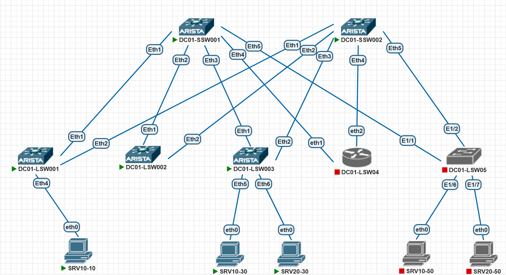

# Задание:

1. настроить маршрутизацию в рамках Overlay между клиентами.


# Решение:

1. [Создание, документация сети](#создание-сети)
2. [Проверка IP связности](#проверка-доступности)


    
### Создание сети:
Для создания тестовой среды использованы:
- ПО Pnetlab для создания виртуального стенда;
- коммутатор Arista ver. 4.29.2F в роли SPINE в количестве 2 шт (DC01-SSW01-02);
- коммутатор Arista ver. 4.29.2F в роли LEAF в количестве 3 шт (DC01-LSW01-03);
- коммутатор стороннего вендора в роли LEAF в количестве 1 шт (DC01-LSW04);
- коммутатор стороннего вендора в роли LEAF в количестве 1 шт (DC01-LSW05);
- "выход в интернет" через МСЭ Fortigate

Подключение было выполнено согласно прилагаемой схеме:




#### Описание:
- 10.255.255.X/24 - SPINE loopback IP address, где X - номер SPINE
- 10.255.254.X/24 - LEAF loopback IP address, где X - номер LEAF
- 10.255.253.0/24 - линковая подсеть для связи SPINE-LEAF. Используются /31 подсети. Четный номер - SPINE, нечетный LEAF
- 10.0.X.0/17 - сервисы, где X соотвествует VLAN ID из диапазона 1-99
- AS64512 - номер автономной системы для SPINE'ов
- AS4200000XXX - номера автономных систем для LEAF'ов, где XXX - соотвествует номеру LEAF'а с добавлением нулей в начале
- Хосты имеют именя SRVXX-YZ, где XX - номер VLAN из дипазона 01-99, Y - номер LEAF, Z - порядковый номер, начиная с 0. IP-адрес хоста при этом будет в формате 10.0.XX.YZ/24.
- Используем схему VLAN-AWARE, RT 64512:1 (ASN SPINE:1)
- VNI в формате XXYYYY, где XX - номер ЦОД, YYYY - номер VLAN, VNI14096 для L3 маршрутизации
- для выхода из evpn фабрики используем адресацию 10.1.2.0/30 до МСЭ Fortigate, тестовый IP за пределами фабрики 8.8.8.8.

Коммутатор DC01-LSW04 работает на ROS v7, DC01-LSW05 на NX-OS. Настроить в такой топологии с Arista VeOS не получилось.

#### Конфигурация сетевого оборудования:
<details>
<summary><b>SPINE 1:</b></summary>

```
interface Ethernet1
   description # DC01-LSW001 #
   no switchport
   ip address 10.255.253.100/31
   arp aging timeout 300
   bfd interval 2000 min-rx 2000 multiplier 5
   no ip ospf neighbor bfd
   isis enable dc01
   isis bfd
   isis network point-to-point
!
interface Ethernet2
   description # DC01-LSW002 #
   no switchport
   ip address 10.255.253.102/31
   arp aging timeout 300
   bfd interval 2000 min-rx 2000 multiplier 5
   no ip ospf neighbor bfd
   isis enable dc01
   isis bfd
   isis network point-to-point
!

router bgp 64512
   router-id 10.255.255.1
   timers bgp 3 9
   maximum-paths 4 ecmp 4
   bgp listen range 10.255.253.0/24 peer-group dyn_leafs peer-filter pf_leafs
   neighbor dyn_leafs peer group
   neighbor dyn_leafs bfd
   neighbor dyn_leafs send-community extended
   !
   address-family evpn
      neighbor dyn_leafs activate
   !
   address-family ipv4
      neighbor dyn_leafs activate
      redistribute connected route-map from_connected_to_bgp
!

```
</details>
<details>
<summary><b>SPINE 2:</b></summary>

```

interface Ethernet1
   description # DC01-LSW001 #
   no switchport
   ip address 10.255.253.200/31
   arp aging timeout 300
   bfd interval 2000 min-rx 2000 multiplier 5
   no ip ospf neighbor bfd
   isis enable dc01
   isis bfd
   isis network point-to-point
!
interface Ethernet2
   description # DC01-LSW002 #
   no switchport
   ip address 10.255.253.202/31
   arp aging timeout 300
   bfd interval 2000 min-rx 2000 multiplier 5
   no ip ospf neighbor bfd
   isis enable dc01
   isis bfd
   isis network point-to-point
!

router bgp 64512
   router-id 10.255.255.2
   timers bgp 3 9
   maximum-paths 4 ecmp 4
   bgp listen range 10.255.253.0/24 peer-group dyn_leafs peer-filter pf_leafs
   neighbor dyn_leafs peer group
   neighbor dyn_leafs bfd
   neighbor dyn_leafs send-community extended
   !
   address-family evpn
      neighbor dyn_leafs activate
   !
   address-family ipv4
      neighbor dyn_leafs activate
      redistribute connected route-map from_connected_to_bgp
!
```
</details>

На SPINE'ах нет ни VLAN (кроме VLAN 1), ни интерфейсов vxlan... 
На LEAF'ах в созданы VRF, VLAN, SVI для VLAN в VRF.

<details>
<summary><b>LEAF 1:</b></summary>

```
vlan 10,20
!
vrf instance PROD
!
interface Loopback0
   ip address 10.255.254.1/32
   isis enable dc01
!
interface Loopback10
   ip address 10.255.254.101/32
!
!
interface Vxlan1
   vxlan source-interface Loopback10
   vxlan udp-port 4789
   vxlan vlan 10 vni 10010
   vxlan vlan 20 vni 10020
   vxlan vrf PROD vni 14096
!
ip virtual-router mac-address 00:00:00:00:00:01
!
ip routing
ip routing vrf PROD
!

ip prefix-list prf_loopback_leafs seq 10 permit 10.255.254.0/24 le 32
ip prefix-list prf_loopback_spines seq 10 permit 10.255.255.0/24 le 32
!
route-map from_connected_to_bgp permit 10
   match ip address prefix-list prf_loopback_leafs
!
route-map from_connected_to_bgp permit 20
   match ip address prefix-list prf_loopback_spines
!
router bgp 4200000001
   router-id 10.255.254.1
   timers bgp 3 9
   maximum-paths 4 ecmp 4
   neighbor spines peer group
   neighbor spines remote-as 64512
   neighbor spines bfd
   neighbor spines send-community extended
   neighbor 10.255.253.100 peer group spines
   neighbor 10.255.253.200 peer group spines
   !
   vlan-aware-bundle VLAN-AWARE
      rd 4200000001:1
      route-target both 64512:1
      redistribute learned
      vlan 10,20
   !
   address-family evpn
      neighbor spines activate
   !
   address-family ipv4
      neighbor spines activate
      redistribute connected route-map from_connected_to_bgp
   !
   vrf PROD
      rd 4200000001:4096
      route-target import evpn 64512:4096
      route-target export evpn 64512:4096
      redistribute connected
!
```
</details>


<details>
<summary><b>LEAF 2:</b></summary>

```

vlan 10,20
!
vrf instance PROD
!
interface Loopback0
   ip address 10.255.254.2/32
   isis enable dc01
!
interface Loopback10
   ip address 10.255.254.102/32
!
interface Vxlan1
   vxlan source-interface Loopback10
   vxlan udp-port 4789
   vxlan vlan 10 vni 10010
   vxlan vlan 20 vni 10020
   vxlan vrf PROD vni 14096
!
ip virtual-router mac-address 00:00:00:00:00:01
!
ip routing
ip routing vrf PROD
!

ip prefix-list AS65000_out
   seq 10 permit 10.0.0.0/8
!
ip prefix-list prf_loopback_leafs
   seq 10 permit 10.255.254.0/24 le 32
!
ip prefix-list prf_loopback_spines
   seq 10 permit 10.255.255.0/24 le 32
!
ip prefix-list rfc1918
   seq 10 permit 10.0.0.0/8 le 32
   seq 20 permit 172.16.0.0/12 le 32
   seq 40 permit 192.168.0.0/16 le 32
!
route-map AS65000_out permit 10
   match ip address prefix-list AS65000_out
   set community 65000:100 additive
!
route-map from_connected_to_bgp permit 10
   match ip address prefix-list prf_loopback_leafs
!
route-map from_connected_to_bgp permit 20
   match ip address prefix-list prf_loopback_spines
!
router bgp 4200000002
   router-id 10.255.254.2
   timers bgp 3 9
   maximum-paths 4 ecmp 4
   neighbor spines peer group
   neighbor spines remote-as 64512
   neighbor spines bfd
   neighbor spines send-community extended
   neighbor 10.255.253.102 peer group spines
   neighbor 10.255.253.202 peer group spines
   !
   vlan-aware-bundle VLAN-AWARE
      rd 4200000001:1
      route-target both 64512:1
      redistribute learned
      vlan 10,20
   !
   address-family evpn
      neighbor spines activate
   !
   address-family ipv4
      neighbor spines activate
      redistribute connected route-map from_connected_to_bgp
   !
   vrf PROD
      rd 4200000002:4096
      route-target import evpn 64512:4096
      route-target export evpn 64512:4096
      neighbor 10.1.2.2 remote-as 65000
      neighbor 10.1.2.2 route-map AS65000_out out
      neighbor 10.1.2.2 send-community standard
      aggregate-address 10.0.0.0/8 advertise-only
!

```

</details>

<details>
<summary><b>LEAF 3:</b></summary>

```

vlan 10,20
!
vrf instance PROD
!
interface Loopback0
   ip address 10.255.254.3/32
   isis enable dc01
!
interface Loopback10
   ip address 10.255.254.103/32
!

!
interface Vxlan1
   vxlan source-interface Loopback10
   vxlan udp-port 4789
   vxlan vlan 10 vni 10010
   vxlan vlan 20 vni 10020
!
ip virtual-router mac-address 00:00:00:00:00:01
!
ip routing
!
router bgp 4200000003
   router-id 10.255.254.3
   timers bgp 3 9
   maximum-paths 4 ecmp 4
   neighbor spines peer group
   neighbor spines remote-as 64512
   neighbor spines bfd
   neighbor spines send-community extended
   neighbor 10.255.253.104 peer group spines
   neighbor 10.255.253.204 peer group spines
   !
   vlan-aware-bundle VLAN-AWARE
      rd 4200000003:1
      route-target both 64512:1
      redistribute learned
      vlan 10,20
   !
   address-family evpn
      neighbor spines activate
   !
   address-family ipv4
      neighbor spines activate
      redistribute connected route-map from_connected_to_bgp
   !
!
```


</details>


<details>
<summary><b>МСЭ:</b></summary>

```
FortiGate-VM64-KVM # show system interface
config system interface
    edit "port1"
        set vdom "root"
        set ip 10.1.2.2 255.255.255.252
        set allowaccess ping https ssh http
        set type physical
        set snmp-index 1
    next
    edit "port2"
        set vdom "root"
        set type physical
        set snmp-index 2
    next
    edit "port3"
        set vdom "root"
        set type physical
        set snmp-index 3
    next
    edit "port4"
        set vdom "root"
        set type physical
        set snmp-index 4
    next
    edit "naf.root"
        set vdom "root"
        set type tunnel
        set src-check disable
        set snmp-index 5
    next
    edit "l2t.root"
        set vdom "root"
        set type tunnel
        set snmp-index 6
    next
    edit "ssl.root"
        set vdom "root"
        set type tunnel
        set alias "SSL VPN interface"
        set snmp-index 7
    next
    edit "fortilink"
        set vdom "root"
        set fortilink enable
        set ip 10.255.1.1 255.255.255.0
        set allowaccess ping fabric
        set type aggregate
        set lldp-reception enable
        set lldp-transmission enable
        set snmp-index 8
    next
    edit "loopback0"
        set vdom "root"
        set ip 8.8.8.8 255.255.255.255
        set allowaccess ping
        set type loopback
        set snmp-index 9
    next
end

FortiGate-VM64-KVM #   show router static
config router static
    edit 1
        set distance 250
        set blackhole enable
        set vrf 0
    next
end

FortiGate-VM64-KVM # show router bgp
config router bgp
    set as 65000
    set keepalive-timer 3
    set holdtime-timer 9
    set graceful-restart enable
    config neighbor
        edit "10.1.2.1"
            set remote-as 4200000002
        next
    end
    config network
        edit 1
            set prefix 8.8.8.8 255.255.255.255
        next
    end
    config redistribute "connected"
    end
    config redistribute "rip"
    end
    config redistribute "ospf"
    end
    config redistribute "static"
        set status enable
    end
    config redistribute "isis"
    end
    config redistribute6 "connected"
    end
    config redistribute6 "rip"
    end
    config redistribute6 "ospf"
    end
    config redistribute6 "static"
    end
    config redistribute6 "isis"
    end
end

FortiGate-VM64-KVM #  show firewall policy
config firewall policy
    edit 1
        set name "DC01"
        set uuid a5c2650c-5457-51f1-01e9-6e6f9a37eaa4
        set srcintf "port1"
        set dstintf "any"
        set action accept
        set srcaddr "all"
        set dstaddr "all"
        set schedule "always"
        set service "ALL"
    next
end
```

</details>


#### Конфигурация хостов:
<details>
<summary><b>SRV10-10:</b></summary>

```
NAME   IP/MASK              GATEWAY           MAC                DNS
VPCS1  10.0.10.10/24        10.0.10.1         00:50:79:66:68:29  10.1.0.2
```
</details>
<details>
<summary><b>SRV10-30:</b></summary>

```
NAME   IP/MASK              GATEWAY           MAC                DNS
VPCS1  10.0.10.30/24        10.0.10.1         00:50:79:66:68:2b  10.1.0.10
```
</details>
<details>
<summary><b>SRV20-30:</b></summary>

```
NAME   IP/MASK              GATEWAY           MAC                DNS
VPCS1  10.0.20.30/24        10.0.20.1         00:50:79:66:68:38  10.0.1.10
```
</details>


📥 [Скачать](./configs)  файлы лабы в текстовом формате 


### Проверка доступности: 
Проверка выполняется на каждом из коммутаторов по следующим критериям:
 - просмотр BGP топологии и соседей;
 - просмотр таблицы маршрутизации на каждом коммутаторе;
 - проверка связности посредством icmp echo request.

Проверка на LEAF 1:
<details>
<summary><b>LEAF 1:</b></summary>

```

DC01-LSW001#show bgp evpn
BGP routing table information for VRF default
Router identifier 10.255.254.1, local AS number 4200000001
Route status codes: * - valid, > - active, S - Stale, E - ECMP head, e - ECMP
                    c - Contributing to ECMP, % - Pending BGP convergence
Origin codes: i - IGP, e - EGP, ? - incomplete
AS Path Attributes: Or-ID - Originator ID, C-LST - Cluster List, LL Nexthop - Link Local Nexthop

          Network                Next Hop              Metric  LocPref Weight  Path
 * >      RD: 4200000001:1 mac-ip 10010 0050.7966.6829
                                 -                     -       -       0       i
 * >      RD: 4200000001:1 mac-ip 10010 0050.7966.6829 10.0.10.10
                                 -                     -       -       0       i
 * >Ec    RD: 4200000003:1 mac-ip 10010 0050.7966.682b
                                 10.255.254.103        -       100     0       64512 4200000003 i
 *  ec    RD: 4200000003:1 mac-ip 10010 0050.7966.682b
                                 10.255.254.103        -       100     0       64512 4200000003 i
 * >Ec    RD: 4200000003:1 mac-ip 10010 5a8a.e33a.8a20
                                 10.255.254.103        -       100     0       64512 4200000003 i
 *  ec    RD: 4200000003:1 mac-ip 10010 5a8a.e33a.8a20
                                 10.255.254.103        -       100     0       64512 4200000003 i
 * >      RD: 4200000001:1 mac-ip 10010 5abe.da7a.e31c
                                 -                     -       -       0       i
 * >Ec    RD: 4200000003:1 mac-ip 10020 0050.7966.6838
                                 10.255.254.103        -       100     0       64512 4200000003 i
 *  ec    RD: 4200000003:1 mac-ip 10020 0050.7966.6838
                                 10.255.254.103        -       100     0       64512 4200000003 i
 * >Ec    RD: 4200000003:1 mac-ip 10020 0050.7966.6838 10.0.20.30
                                 10.255.254.103        -       100     0       64512 4200000003 i
 *  ec    RD: 4200000003:1 mac-ip 10020 0050.7966.6838 10.0.20.30
                                 10.255.254.103        -       100     0       64512 4200000003 i
 * >      RD: 4200000001:1 imet 10010 10.255.254.101
                                 -                     -       -       0       i
 * >Ec    RD: 4200000001:1 imet 10010 10.255.254.102
                                 10.255.254.102        -       100     0       64512 4200000002 i
 *  ec    RD: 4200000001:1 imet 10010 10.255.254.102
                                 10.255.254.102        -       100     0       64512 4200000002 i
 * >Ec    RD: 4200000003:1 imet 10010 10.255.254.103
                                 10.255.254.103        -       100     0       64512 4200000003 i
 *  ec    RD: 4200000003:1 imet 10010 10.255.254.103
                                 10.255.254.103        -       100     0       64512 4200000003 i
 * >      RD: 4200000001:1 imet 10020 10.255.254.101
                                 -                     -       -       0       i
 * >Ec    RD: 4200000001:1 imet 10020 10.255.254.102
                                 10.255.254.102        -       100     0       64512 4200000002 i
 *  ec    RD: 4200000001:1 imet 10020 10.255.254.102
                                 10.255.254.102        -       100     0       64512 4200000002 i
 * >Ec    RD: 4200000003:1 imet 10020 10.255.254.103
                                 10.255.254.103        -       100     0       64512 4200000003 i
 *  ec    RD: 4200000003:1 imet 10020 10.255.254.103
                                 10.255.254.103        -       100     0       64512 4200000003 i
 * >Ec    RD: 4200000002:4096 ip-prefix 0.0.0.0/0
                                 10.255.254.102        -       100     0       64512 4200000002 65000 ?
 *  ec    RD: 4200000002:4096 ip-prefix 0.0.0.0/0
                                 10.255.254.102        -       100     0       64512 4200000002 65000 ?
 * >Ec    RD: 4200000002:4096 ip-prefix 8.8.8.8/32
                                 10.255.254.102        -       100     0       64512 4200000002 65000 i
 *  ec    RD: 4200000002:4096 ip-prefix 8.8.8.8/32
                                 10.255.254.102        -       100     0       64512 4200000002 65000 i
 * >      RD: 4200000001:4096 ip-prefix 10.0.10.0/24
                                 -                     -       -       0       i
 * >Ec    RD: 4200000003:4096 ip-prefix 10.0.10.0/24
                                 10.255.254.103        -       100     0       64512 4200000003 i
 *  ec    RD: 4200000003:4096 ip-prefix 10.0.10.0/24
                                 10.255.254.103        -       100     0       64512 4200000003 i
 * >Ec    RD: 4200000003:4096 ip-prefix 10.0.20.0/24
                                 10.255.254.103        -       100     0       64512 4200000003 i
 *  ec    RD: 4200000003:4096 ip-prefix 10.0.20.0/24
                                 10.255.254.103        -       100     0       64512 4200000003 i
DC01-LSW001#  show ip route vrf PROS
% IP Routing table for VRF PROS does not exist.
DC01-LSW001#  show ip route vrf PROD

VRF: PROD
Codes: C - connected, S - static, K - kernel,
       O - OSPF, IA - OSPF inter area, E1 - OSPF external type 1,
       E2 - OSPF external type 2, N1 - OSPF NSSA external type 1,
       N2 - OSPF NSSA external type2, B - Other BGP Routes,
       B I - iBGP, B E - eBGP, R - RIP, I L1 - IS-IS level 1,
       I L2 - IS-IS level 2, O3 - OSPFv3, A B - BGP Aggregate,
       A O - OSPF Summary, NG - Nexthop Group Static Route,
       V - VXLAN Control Service, M - Martian,
       DH - DHCP client installed default route,
       DP - Dynamic Policy Route, L - VRF Leaked,
       G  - gRIBI, RC - Route Cache Route

Gateway of last resort:
 B E      0.0.0.0/0 [200/0] via VTEP 10.255.254.102 VNI 14096 router-mac 50:41:f5:4b:bd:0c local-interface Vxlan1

 B E      8.8.8.8/32 [200/0] via VTEP 10.255.254.102 VNI 14096 router-mac 50:41:f5:4b:bd:0c local-interface Vxlan1
 C        10.0.10.0/24 is directly connected, Vlan10
 B E      10.0.20.30/32 [200/0] via VTEP 10.255.254.103 VNI 14096 router-mac 50:4d:47:65:c2:5f local-interface Vxlan1
 B E      10.0.20.0/24 [200/0] via VTEP 10.255.254.103 VNI 14096 router-mac 50:4d:47:65:c2:5f local-interface Vxlan1

DC01-LSW001#sh mac address-table vl 10
          Mac Address Table
------------------------------------------------------------------

Vlan    Mac Address       Type        Ports      Moves   Last Move
----    -----------       ----        -----      -----   ---------
  10    0000.0000.0001    STATIC      Cpu
  10    0050.7966.6829    DYNAMIC     Et4        1       0:01:28 ago
  10    0050.7966.682b    DYNAMIC     Vx1        1       0:01:17 ago
  10    5a8a.e33a.8a20    DYNAMIC     Vx1        1       0:02:46 ago
  10    5abe.da7a.e31c    DYNAMIC     Et4        1       0:02:47 ago
Total Mac Addresses for this criterion: 5

          Multicast Mac Address Table
------------------------------------------------------------------

Vlan    Mac Address       Type        Ports
----    -----------       ----        -----
Total Mac Addresses for this criterion: 0
DC01-LSW001#sh mac address-table vl 20
          Mac Address Table
------------------------------------------------------------------

Vlan    Mac Address       Type        Ports      Moves   Last Move
----    -----------       ----        -----      -----   ---------
  20    0000.0000.0001    STATIC      Cpu
  20    0050.7966.6838    DYNAMIC     Vx1        1       0:01:12 ago
Total Mac Addresses for this criterion: 2

          Multicast Mac Address Table
------------------------------------------------------------------

Vlan    Mac Address       Type        Ports
----    -----------       ----        -----
Total Mac Addresses for this criterion: 0
DC01-LSW001#show ip bgp vrf PROD
BGP routing table information for VRF PROD
Router identifier 10.0.10.1, local AS number 4200000001
Route status codes: s - suppressed contributor, * - valid, > - active, E - ECMP head, e - ECMP
                    S - Stale, c - Contributing to ECMP, b - backup, L - labeled-unicast
                    % - Pending BGP convergence
Origin codes: i - IGP, e - EGP, ? - incomplete
RPKI Origin Validation codes: V - valid, I - invalid, U - unknown
AS Path Attributes: Or-ID - Originator ID, C-LST - Cluster List, LL Nexthop - Link Local Nexthop

          Network                Next Hop              Metric  AIGP       LocPref Weight  Path
 * >Ec    0.0.0.0/0              10.255.254.102        0       -          100     0       64512 4200000002 65000 ?
 *  ec    0.0.0.0/0              10.255.254.102        0       -          100     0       64512 4200000002 65000 ?
 * >Ec    8.8.8.8/32             10.255.254.102        0       -          100     0       64512 4200000002 65000 i
 *  ec    8.8.8.8/32             10.255.254.102        0       -          100     0       64512 4200000002 65000 i
 * >      10.0.10.0/24           -                     -       -          -       0       i
 *  Ec    10.0.10.0/24           10.255.254.103        0       -          100     0       64512 4200000003 i
 *  ec    10.0.10.0/24           10.255.254.103        0       -          100     0       64512 4200000003 i
 * >Ec    10.0.20.0/24           10.255.254.103        0       -          100     0       64512 4200000003 i
 *  ec    10.0.20.0/24           10.255.254.103        0       -          100     0       64512 4200000003 i
 * >Ec    10.0.20.30/32          10.255.254.103        0       -          100     0       64512 4200000003 i
 *  ec    10.0.20.30/32          10.255.254.103        0       -          100     0       64512 4200000003 i


```
</details>


Проверка на SPINE 1:
<details>
<summary><b>SPINE 1:</b></summary>

```

DC01-SSW001#show bgp evpn
BGP routing table information for VRF default
Router identifier 10.255.255.1, local AS number 64512
Route status codes: * - valid, > - active, S - Stale, E - ECMP head, e - ECMP
                    c - Contributing to ECMP, % - Pending BGP convergence
Origin codes: i - IGP, e - EGP, ? - incomplete
AS Path Attributes: Or-ID - Originator ID, C-LST - Cluster List, LL Nexthop - Link Local Nexthop

          Network                Next Hop              Metric  LocPref Weight  Path
 * >      RD: 4200000001:1 mac-ip 10010 0050.7966.6829
                                 10.255.254.101        -       100     0       4200000001 i
 * >      RD: 4200000001:1 mac-ip 10010 0050.7966.6829 10.0.10.10
                                 10.255.254.101        -       100     0       4200000001 i
 * >      RD: 4200000001:1 imet 10010 10.255.254.101
                                 10.255.254.101        -       100     0       4200000001 i
 * >      RD: 4200000001:1 imet 10010 10.255.254.102
                                 10.255.254.102        -       100     0       4200000002 i
 * >      RD: 4200000003:1 imet 10010 10.255.254.103
                                 10.255.254.103        -       100     0       4200000003 i
 * >      RD: 4200000001:1 imet 10020 10.255.254.101
                                 10.255.254.101        -       100     0       4200000001 i
 * >      RD: 4200000001:1 imet 10020 10.255.254.102
                                 10.255.254.102        -       100     0       4200000002 i
 * >      RD: 4200000003:1 imet 10020 10.255.254.103
                                 10.255.254.103        -       100     0       4200000003 i
 * >      RD: 4200000002:4096 ip-prefix 0.0.0.0/0
                                 10.255.254.102        -       100     0       4200000002 65000 ?
 * >      RD: 4200000002:4096 ip-prefix 8.8.8.8/32
                                 10.255.254.102        -       100     0       4200000002 65000 i
 * >      RD: 4200000001:4096 ip-prefix 10.0.10.0/24
                                 10.255.254.101        -       100     0       4200000001 i
 * >      RD: 4200000003:4096 ip-prefix 10.0.10.0/24
                                 10.255.254.103        -       100     0       4200000003 i
 * >      RD: 4200000003:4096 ip-prefix 10.0.20.0/24
                                 10.255.254.103        -       100     0       4200000003 i


```
</details>


Проверка на хостах:
<details>
<summary><b>SRV10-10:</b></summary>

```

VPCS> ping 10.0.10.1

84 bytes from 10.0.10.1 icmp_seq=1 ttl=64 time=115.700 ms
84 bytes from 10.0.10.1 icmp_seq=2 ttl=64 time=27.872 ms
^C
VPCS> ping 10.0.20.1

84 bytes from 10.0.20.1 icmp_seq=1 ttl=63 time=229.479 ms
^C
VPCS> ping 10.0.10.30

84 bytes from 10.0.10.30 icmp_seq=1 ttl=64 time=84.161 ms
^C
VPCS> ping 10.0.20.30

84 bytes from 10.0.20.30 icmp_seq=1 ttl=62 time=675.684 ms
^C
VPCS> tracert 10.0.20.30
Bad command: "tracert 10.0.20.30". Use ? for help.

VPCS> trace 10.0.20.30
trace to 10.0.20.30, 8 hops max, press Ctrl+C to stop
 1   10.0.10.1   24.069 ms  9.161 ms  11.289 ms
 2   10.0.20.1   77.220 ms  200.476 ms  40.222 ms
 3   *10.0.20.30   64.622 ms (ICMP type:3, code:3, Destination port unreachable)

VPCS> ping 8.8.8.8

84 bytes from 8.8.8.8 icmp_seq=1 ttl=253 time=349.931 ms
84 bytes from 8.8.8.8 icmp_seq=2 ttl=253 time=75.119 ms
84 bytes from 8.8.8.8 icmp_seq=3 ttl=253 time=67.246 ms
^C
VPCS> trace 8.8.8.8
trace to 8.8.8.8, 8 hops max, press Ctrl+C to stop
 1   10.0.10.1   19.399 ms  9.617 ms  11.586 ms
 2   10.0.10.1   68.563 ms  62.633 ms  50.745 ms
 3     *  *  *
 4     *  *  *
 5     *  *  *
 6     *  *  *
 7     *  *  *
 8     *  *  *

VPCS> ping 8.8.8.8

8.8.8.8 icmp_seq=1 timeout
84 bytes from 8.8.8.8 icmp_seq=2 ttl=254 time=740.236 ms
84 bytes from 8.8.8.8 icmp_seq=3 ttl=253 time=181.682 ms
84 bytes from 8.8.8.8 icmp_seq=4 ttl=253 time=191.838 ms
84 bytes from 8.8.8.8 icmp_seq=5 ttl=253 time=52.545 ms


```
</details>
