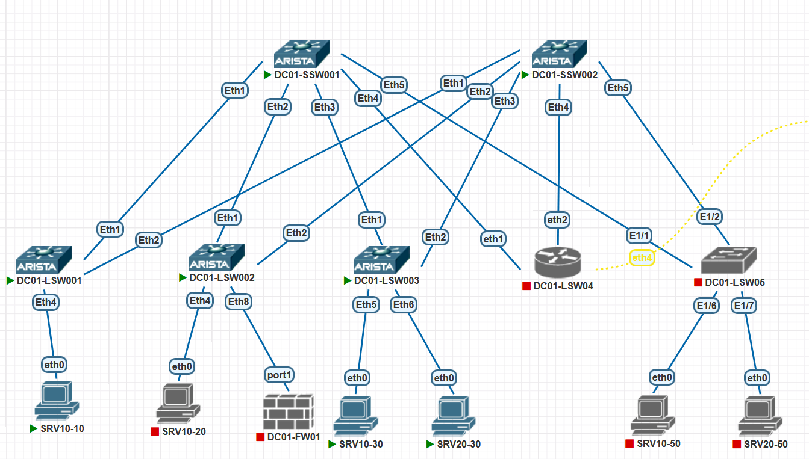

# Задание:

1. настроить маршрутизацию в рамках Overlay между клиентами. Сделать без появления в EVPN-е type-5 маршрутов и без создания vrf-а на спайнах


# Решение:

1. [Создание, документация сети](#создание-сети)
2. [Проверка IP связности](#проверка-доступности)


    
### Создание сети:
Для создания тестовой среды использованы:
- ПО Pnetlab для создания виртуального стенда;
- коммутатор Arista ver. 4.29.2F в роли SPINE в количестве 2 шт (DC01-SSW01-02);
- коммутатор Arista ver. 4.29.2F в роли LEAF в количестве 3 шт (DC01-LSW01-03);

Подключение было выполнено согласно прилагаемой схеме:




#### Описание:
- 10.255.255.X/24 - SPINE loopback IP address, где X - номер SPINE
- 10.255.254.X/24 - LEAF loopback IP address, где X - номер LEAF
- 10.255.253.0/24 - линковая подсеть для связи SPINE-LEAF. Используются /31 подсети. Четный номер - SPINE, нечетный LEAF
- 10.0.X.0/17 - сервисы, где X соотвествует VLAN ID из диапазона 1-99
- AS64512 - номер автономной системы для SPINE'ов
- AS4200000XXX - номера автономных систем для LEAF'ов, где XXX - соотвествует номеру LEAF'а с добавлением нулей в начале
- Хосты имеют именя SRVXX-YZ, где XX - номер VLAN из дипазона 01-99, Y - номер LEAF, Z - порядковый номер, начиная с 0. IP-адрес хоста при этом будет в формате 10.0.XX.YZ/24.
- Используем схему VLAN-BASED
- VNI в формате XXYYYY, где XX - номер ЦОД, YYYY - номер VLAN


#### Конфигурация сетевого оборудования:
<details>
<summary><b>SPINE 1:</b></summary>

```


! Command: show running-config
! device: DC01-SSW001 (vEOS-lab, EOS-4.29.2F)
!
! boot system flash:/vEOS-lab.swi
!
no aaa root
!
cdp
   receive
!
transceiver qsfp default-mode 4x10G
!
service routing protocols model multi-agent
!
logging format timestamp traditional timezone
!
hostname DC01-SSW001
!
spanning-tree mode mstp
!
clock timezone Etc/GMT-3
!
interface Ethernet1
   description # DC01-LSW001 #
   no switchport
   ip address 10.255.253.100/31
   arp aging timeout 300
   bfd interval 2000 min-rx 2000 multiplier 5
   no ip ospf neighbor bfd
   isis enable dc01
   isis bfd
   isis network point-to-point
!
interface Ethernet2
   description # DC01-LSW002 #
   no switchport
   ip address 10.255.253.102/31
   arp aging timeout 300
   bfd interval 2000 min-rx 2000 multiplier 5
   no ip ospf neighbor bfd
   isis enable dc01
   isis bfd
   isis network point-to-point
!
interface Ethernet3
   description # DC01-LSW003 #
   no switchport
   ip address 10.255.253.104/31
   arp aging timeout 300
   bfd interval 2000 min-rx 2000 multiplier 5
   no ip ospf neighbor bfd
   isis enable dc01
   isis bfd
   isis network point-to-point
!
interface Ethernet4
!
interface Ethernet5
   description # DC01-LSW005 #
   no switchport
   ip address 10.255.253.108/31
   arp aging timeout 300
   bfd interval 999 min-rx 999 multiplier 5
!
interface Ethernet6
!
interface Ethernet7
!
interface Ethernet8
!
interface Loopback0
   ip address 10.255.255.1/32
   isis enable dc01
!
interface Management1
!
ip routing
!
ip prefix-list prf_loopback_leafs seq 10 permit 10.255.254.0/24 le 32
ip prefix-list prf_loopback_spines seq 10 permit 10.255.255.0/24 le 32
!
route-map from_connected_to_bgp permit 10
   match ip address prefix-list prf_loopback_leafs
!
route-map from_connected_to_bgp permit 20
   match ip address prefix-list prf_loopback_spines
!
peer-filter pf_leafs
   10 match as-range 4200000001-4200000255 result accept
!
router bgp 64512
   router-id 10.255.255.1
   timers bgp 3 9
   maximum-paths 4 ecmp 4
   bgp listen range 10.255.253.0/24 peer-group dyn_leafs peer-filter pf_leafs
   neighbor dyn_leafs peer group
   neighbor dyn_leafs bfd
   neighbor dyn_leafs send-community extended
   neighbor 10.255.253.109 remote-as 4200000005
   !
   address-family evpn
      neighbor dyn_leafs activate
      neighbor 10.255.253.109 activate
   !
   address-family ipv4
      neighbor dyn_leafs activate
      neighbor 10.255.253.109 activate
      redistribute connected route-map from_connected_to_bgp
!
end

```
</details>


<details>
<summary><b>SPINE 2:</b></summary>

```


! Command: show running-config
! device: DC01-SSW002 (vEOS-lab, EOS-4.29.2F)
!
! boot system flash:/vEOS-lab.swi
!
no aaa root
!
cdp
   receive
!
transceiver qsfp default-mode 4x10G
!
service routing protocols model multi-agent
!
logging format timestamp traditional timezone
!
hostname DC01-SSW002
!
spanning-tree mode mstp
!
clock timezone Etc/GMT-3
!
interface Ethernet1
   description # DC01-LSW001 #
   no switchport
   ip address 10.255.253.200/31
   arp aging timeout 300
   bfd interval 2000 min-rx 2000 multiplier 5
   no ip ospf neighbor bfd
   no isis bfd
!
interface Ethernet2
   description # DC01-LSW002 #
   no switchport
   ip address 10.255.253.202/31
   arp aging timeout 300
   bfd interval 2000 min-rx 2000 multiplier 5
   no ip ospf neighbor bfd
   no isis bfd
!
interface Ethernet3
   description # DC01-LSW003 #
   no switchport
   ip address 10.255.253.204/31
   arp aging timeout 300
   bfd interval 2000 min-rx 2000 multiplier 5
   no ip ospf neighbor bfd
   no isis bfd
!
interface Ethernet4
   description # DC01-LSW004 #
   no switchport
   ip address 10.255.253.206/31
   arp aging timeout 300
   bfd interval 2000 min-rx 2000 multiplier 5
   no ip ospf neighbor bfd
   no isis bfd
!
interface Ethernet5
   description # DC01-LSW005 #
   no switchport
   ip address 10.255.253.208/31
   arp aging timeout 300
   bfd interval 2000 min-rx 2000 multiplier 5
   no ip ospf neighbor bfd
   no isis bfd
!
interface Ethernet6
!
interface Ethernet7
!
interface Ethernet8
!
interface Loopback0
   ip address 10.255.255.2/32
   isis enable dc01
!
interface Management1
!
ip routing
!
ip prefix-list prf_loopback_leafs seq 10 permit 10.255.254.0/24 le 32
ip prefix-list prf_loopback_spines seq 10 permit 10.255.255.0/24 le 32
!
route-map from_connected_to_bgp permit 10
   match ip address prefix-list prf_loopback_leafs
!
route-map from_connected_to_bgp permit 20
   match ip address prefix-list prf_loopback_spines
!
peer-filter pf_leafs
   10 match as-range 4200000001-4200000255 result accept
!
router bgp 64512
   router-id 10.255.255.2
   timers bgp 3 9
   maximum-paths 4 ecmp 4
   bgp listen range 10.255.253.0/24 peer-group dyn_leafs peer-filter pf_leafs
   neighbor dyn_leafs peer group
   neighbor dyn_leafs bfd
   neighbor dyn_leafs send-community extended
   !
   vlan-aware-bundle VLAN-AWARE
      rd 64512:2
      route-target both 64512:2
      redistribute learned
      vlan 10,20
   !
   address-family evpn
      neighbor dyn_leafs activate
   !
   address-family ipv4
      neighbor dyn_leafs activate
      redistribute connected route-map from_connected_to_bgp
!
end

```
</details>
На SPINE'ах нет ни VLAN (кроме VLAN 1), ни интерфейсов vxlan... 
На LEAF'ах в созданы VRF, VLAN, SVI для VLAN в VRF.

<details>
<summary><b>LEAF 1:</b></summary>

```
! Command: show running-config
! device: DC01-LSW001 (vEOS-lab, EOS-4.29.2F)
!
! boot system flash:/vEOS-lab.swi
!
no aaa root
!
cdp
   receive
!
transceiver qsfp default-mode 4x10G
!
service routing protocols model multi-agent
!
logging format timestamp traditional timezone
!
hostname DC01-LSW001
!
spanning-tree mode mstp
!
clock timezone Etc/GMT-3
!
vlan 10,20
!
vrf instance PROD
   rd 4200000001:14096
!
interface Ethernet1
   description # DC01-SSW001 #
   no switchport
   ip address 10.255.253.101/31
   arp aging timeout 300
   bfd interval 2000 min-rx 2000 multiplier 5
!
interface Ethernet2
   description # DC01-SSW002 #
   no switchport
   ip address 10.255.253.201/31
   arp aging timeout 300
   bfd interval 2000 min-rx 2000 multiplier 5
!
interface Ethernet3
!
interface Ethernet4
   switchport access vlan 10
   spanning-tree portfast
!
interface Ethernet5
   switchport access vlan 10
!
interface Ethernet6
   switchport access vlan 20
!
interface Ethernet7
!
interface Ethernet8
!
interface Loopback0
   ip address 10.255.254.1/32
   isis enable dc01
!
interface Loopback10
   ip address 10.255.254.101/32
!
interface Management1
!
interface Vlan10
   vrf PROD
   ip address virtual 10.0.10.1/24
!
interface Vlan20
   vrf PROD
   ip address 10.0.20.1/24
!
interface Vxlan1
   vxlan source-interface Loopback10
   vxlan udp-port 4789
   vxlan vlan 10 vni 10010
   vxlan vlan 20 vni 10020
!
ip virtual-router mac-address 00:00:00:00:00:01
!
ip routing
ip routing vrf PROD
!
ip prefix-list prf_loopback_leafs seq 10 permit 10.255.254.0/24 le 32
ip prefix-list prf_loopback_spines seq 10 permit 10.255.255.0/24 le 32
!
route-map from_connected_to_bgp permit 10
   match ip address prefix-list prf_loopback_leafs
!
route-map from_connected_to_bgp permit 20
   match ip address prefix-list prf_loopback_spines
!
router bgp 4200000001
   router-id 10.255.254.1
   timers bgp 3 9
   maximum-paths 4 ecmp 4
   neighbor spines peer group
   neighbor spines remote-as 64512
   neighbor spines bfd
   neighbor spines send-community extended
   neighbor 10.255.253.100 peer group spines
   neighbor 10.255.253.200 peer group spines
   !
   vlan 10
      rd 4200000001:10010
      route-target import 64512:10
      route-target export 64512:10
      redistribute learned
   !
   vlan 20
      rd 4200000001:10020
      route-target both 64512:20
      redistribute learned
   !
   address-family evpn
      neighbor spines activate
   !
   address-family ipv4
      neighbor spines activate
      redistribute connected route-map from_connected_to_bgp
   !
   vrf PROD
      rd 4200000001:4096
      route-target import evpn 64512:4096
      route-target export evpn 64512:4096
      redistribute connected
!
end

```
</details>


<details>
<summary><b>LEAF 2:</b></summary>

```

! Command: show running-config
! device: DC01-LSW002 (vEOS-lab, EOS-4.29.2F)
!
! boot system flash:/vEOS-lab.swi
!
no aaa root
!
cdp
   receive
!
transceiver qsfp default-mode 4x10G
!
service routing protocols model multi-agent
!
logging format timestamp traditional timezone
!
hostname DC01-LSW002
!
spanning-tree mode mstp
!
clock timezone Etc/GMT-3
!
vlan 10,20
!
vrf instance PROD
!
interface Ethernet1
   description # DC01-SSW001 #
   no switchport
   ip address 10.255.253.103/31
   arp aging timeout 300
   bfd interval 2000 min-rx 2000 multiplier 5
!
interface Ethernet2
   description # DC01-SSW002 #
   no switchport
   ip address 10.255.253.203/31
   arp aging timeout 300
   bfd interval 2000 min-rx 2000 multiplier 5
!
interface Ethernet3
   description # DC01-LSW003 #
   speed forced 40gfull
   no switchport
   ip address 10.255.253.204/31
   arp aging timeout 300
   bfd interval 1000 min-rx 1000 multiplier 3
   ip ospf neighbor bfd
   ip ospf network point-to-point
   ip ospf authentication message-digest
   ip ospf authentication-key 7 CuLN1L9ii+Bw/X3oykPG5w==
   isis enable dc01
   isis network point-to-point
!
interface Ethernet4
   switchport access vlan 10
   spanning-tree portfast
!
interface Ethernet5
!
interface Ethernet6
!
interface Ethernet7
!
interface Ethernet8
   no switchport
   vrf PROD
   ip address 10.1.2.1/30
!
interface Loopback0
   ip address 10.255.254.2/32
   isis enable dc01
!
interface Loopback10
   ip address 10.255.254.102/32
!
interface Management1
!
interface Vlan10
   no autostate
   vrf PROD
   ip address virtual 10.0.10.1/24
!
interface Vxlan1
   vxlan source-interface Loopback10
   vxlan udp-port 4789
   vxlan vlan 10 vni 10010
   vxlan vlan 20 vni 10020
!
ip virtual-router mac-address 00:00:00:00:00:01
!
ip routing
ip routing vrf PROD
!
ip prefix-list AS65000_out
   seq 10 permit 10.0.0.0/8
!
ip prefix-list prf_loopback_leafs
   seq 10 permit 10.255.254.0/24 le 32
!
ip prefix-list prf_loopback_spines
   seq 10 permit 10.255.255.0/24 le 32
!
ip prefix-list rfc1918
   seq 10 permit 10.0.0.0/8 le 32
   seq 20 permit 172.16.0.0/12 le 32
   seq 40 permit 192.168.0.0/16 le 32
!
route-map AS65000_out permit 10
   match ip address prefix-list AS65000_out
   set community 65000:100 additive
!
route-map from_connected_to_bgp permit 10
   match ip address prefix-list prf_loopback_leafs
!
route-map from_connected_to_bgp permit 20
   match ip address prefix-list prf_loopback_spines
!
router bgp 4200000002
   router-id 10.255.254.2
   timers bgp 3 9
   maximum-paths 4 ecmp 4
   neighbor spines peer group
   neighbor spines remote-as 64512
   neighbor spines bfd
   neighbor spines send-community extended
   neighbor 10.1.2.2 remote-as 65000
   neighbor 10.255.253.102 peer group spines
   neighbor 10.255.253.202 peer group spines
   !
   vlan-aware-bundle VLAN-AWARE
      rd 4200000001:1
      route-target both 64512:1
      redistribute learned
      vlan 10,20
   !
   address-family evpn
      neighbor spines activate
   !
   address-family ipv4
      neighbor spines activate
      neighbor 10.1.2.2 activate
      redistribute connected route-map from_connected_to_bgp
   !
   vrf PROD
      rd 4200000002:4096
      route-target import evpn 64512:4096
      route-target export evpn 64512:4096
      neighbor 10.1.2.2 remote-as 65000
      neighbor 10.1.2.2 route-map AS65000_out out
      neighbor 10.1.2.2 send-community standard
      aggregate-address 10.0.0.0/8 advertise-only
!
end


```

</details>

<details>
<summary><b>LEAF 3:</b></summary>

```

! Command: show running-config
! device: DC01-LSW003 (vEOS-lab, EOS-4.29.2F)
!
! boot system flash:/vEOS-lab.swi
!
no aaa root
!
transceiver qsfp default-mode 4x10G
!
service routing protocols model multi-agent
!
logging format timestamp traditional timezone
!
hostname DC01-LSW003
!
spanning-tree mode mstp
!
clock timezone Etc/GMT-3
!
vlan 10,20
!
vrf instance PROD
   rd 4200000003:14096
!
interface Ethernet1
   description # DC01-SSW001 #
   no switchport
   ip address 10.255.253.105/31
   arp aging timeout 300
   bfd interval 2000 min-rx 2000 multiplier 5
!
interface Ethernet2
   description # DC01-SSW002 #
   no switchport
   ip address 10.255.253.205/31
   arp aging timeout 300
   bfd interval 2000 min-rx 2000 multiplier 5
!
interface Ethernet3
!
interface Ethernet4
   switchport access vlan 10
!
interface Ethernet5
   switchport access vlan 10
!
interface Ethernet6
   switchport access vlan 20
!
interface Ethernet7
!
interface Ethernet8
!
interface Loopback0
   ip address 10.255.254.3/32
   isis enable dc01
!
interface Loopback10
   ip address 10.255.254.103/32
!
interface Management1
!
interface Vlan10
   vrf PROD
   ip address 10.0.10.1/24
!
interface Vlan20
   vrf PROD
   ip address 10.0.20.1/24
!
interface Vxlan1
   vxlan source-interface Loopback10
   vxlan udp-port 4789
   vxlan vlan 10 vni 10010
   vxlan vlan 20 vni 10020
!
ip virtual-router mac-address 00:00:00:00:00:01
!
ip routing
ip routing vrf PROD
!
ip prefix-list prf_loopback_leafs seq 10 permit 10.255.254.0/24 le 32
ip prefix-list prf_loopback_spines seq 10 permit 10.255.255.0/24 le 32
!
route-map from_connected_to_bgp permit 10
   match ip address prefix-list prf_loopback_leafs
!
route-map from_connected_to_bgp permit 20
   match ip address prefix-list prf_loopback_spines
!
router bgp 4200000003
   router-id 10.255.254.3
   timers bgp 3 9
   maximum-paths 4 ecmp 4
   neighbor spines peer group
   neighbor spines remote-as 64512
   neighbor spines bfd
   neighbor spines send-community extended
   neighbor 10.255.253.104 peer group spines
   neighbor 10.255.253.204 peer group spines
   !
   vlan 10
      rd 4200000003:10010
      route-target import 64512:10
      route-target export 64512:10
      redistribute learned
   !
   vlan 20
      rd 4200000003:10020
      route-target both 64512:20
      redistribute learned
   !
   address-family evpn
      neighbor spines activate
   !
   address-family ipv4
      neighbor spines activate
      redistribute connected route-map from_connected_to_bgp
   !
   vrf PROD
      rd 4200000003:4096
      route-target import evpn 64512:4096
      route-target export evpn 64512:4096
      redistribute connected
!
end


```


</details>


#### Конфигурация хостов:
<details>
<summary><b>SRV10-10:</b></summary>

```
NAME   IP/MASK              GATEWAY           MAC                DNS
VPCS1  10.0.10.10/24        10.0.10.1         00:50:79:66:68:29  10.1.0.2
```
</details>
<details>
<summary><b>SRV10-30:</b></summary>

```
NAME   IP/MASK              GATEWAY           MAC                DNS
VPCS1  10.0.10.30/24        10.0.10.1         00:50:79:66:68:2b  10.1.0.10
```
</details>
<details>
<summary><b>SRV20-30:</b></summary>

```
NAME   IP/MASK              GATEWAY           MAC                DNS
VPCS1  10.0.20.30/24        10.0.20.1         00:50:79:66:68:38  10.0.1.10
```
</details>


📥 [Скачать](./configs)  файлы лабы в текстовом формате 


### Проверка доступности: 
Проверка выполняется на каждом из коммутаторов по следующим критериям:
 - просмотр BGP топологии и соседей;
 - просмотр таблицы маршрутизации на каждом коммутаторе;
 - проверка связности посредством icmp echo request.

Проверка на LEAF 1:
<details>
<summary><b>LEAF 1:</b></summary>

```

DC01-LSW001#show bgp evpn
BGP routing table information for VRF default
Router identifier 10.255.254.1, local AS number 4200000001
Route status codes: * - valid, > - active, S - Stale, E - ECMP head, e - ECMP
                    c - Contributing to ECMP, % - Pending BGP convergence
Origin codes: i - IGP, e - EGP, ? - incomplete
AS Path Attributes: Or-ID - Originator ID, C-LST - Cluster List, LL Nexthop - Link Local Nexthop

          Network                Next Hop              Metric  LocPref Weight  Path
 * >      RD: 4200000001:10010 mac-ip 0050.7966.6829
                                 -                     -       -       0       i
 * >      RD: 4200000001:10010 mac-ip 0050.7966.6829 10.0.10.10
                                 -                     -       -       0       i
 * >Ec    RD: 4200000003:10020 mac-ip 0050.7966.6838
                                 10.255.254.103        -       100     0       64512 4200000003 i
 *  ec    RD: 4200000003:10020 mac-ip 0050.7966.6838
                                 10.255.254.103        -       100     0       64512 4200000003 i
 * >Ec    RD: 4200000003:10020 mac-ip 0050.7966.6838 10.0.20.30
                                 10.255.254.103        -       100     0       64512 4200000003 i
 *  ec    RD: 4200000003:10020 mac-ip 0050.7966.6838 10.0.20.30
                                 10.255.254.103        -       100     0       64512 4200000003 i
 * >      RD: 4200000001:10010 imet 10.255.254.101
                                 -                     -       -       0       i
 * >      RD: 4200000001:10020 imet 10.255.254.101
                                 -                     -       -       0       i
 * >Ec    RD: 4200000003:10010 imet 10.255.254.103
                                 10.255.254.103        -       100     0       64512 4200000003 i
 *  ec    RD: 4200000003:10010 imet 10.255.254.103
                                 10.255.254.103        -       100     0       64512 4200000003 i
 * >Ec    RD: 4200000003:10020 imet 10.255.254.103
                                 10.255.254.103        -       100     0       64512 4200000003 i
 *  ec    RD: 4200000003:10020 imet 10.255.254.103
                                 10.255.254.103        -       100     0       64512 4200000003 i
 * >Ec    RD: 4200000001:1 imet 10010 10.255.254.102
                                 10.255.254.102        -       100     0       64512 4200000002 i
 *  ec    RD: 4200000001:1 imet 10010 10.255.254.102
                                 10.255.254.102        -       100     0       64512 4200000002 i
 * >Ec    RD: 4200000001:1 imet 10020 10.255.254.102
                                 10.255.254.102        -       100     0       64512 4200000002 i
 *  ec    RD: 4200000001:1 imet 10020 10.255.254.102
                                 10.255.254.102        -       100     0       64512 4200000002 i
DC01-LSW001#


```
</details>


Проверка на SPINE 1:
<details>
<summary><b>SPINE 1:</b></summary>

```


DC01-SSW001#    show bgp evpn
BGP routing table information for VRF default
Router identifier 10.255.255.1, local AS number 64512
Route status codes: * - valid, > - active, S - Stale, E - ECMP head, e - ECMP
                    c - Contributing to ECMP, % - Pending BGP convergence
Origin codes: i - IGP, e - EGP, ? - incomplete
AS Path Attributes: Or-ID - Originator ID, C-LST - Cluster List, LL Nexthop - Link Local Nexthop

          Network                Next Hop              Metric  LocPref Weight  Path
 * >      RD: 4200000001:10010 mac-ip 0050.7966.6829
                                 10.255.254.101        -       100     0       4200000001 i
 * >      RD: 4200000001:10010 mac-ip 0050.7966.6829 10.0.10.10
                                 10.255.254.101        -       100     0       4200000001 i
 * >      RD: 4200000003:10020 mac-ip 0050.7966.6838
                                 10.255.254.103        -       100     0       4200000003 i
 * >      RD: 4200000003:10020 mac-ip 0050.7966.6838 10.0.20.30
                                 10.255.254.103        -       100     0       4200000003 i
 * >      RD: 4200000001:10010 imet 10.255.254.101
                                 10.255.254.101        -       100     0       4200000001 i
 * >      RD: 4200000001:10020 imet 10.255.254.101
                                 10.255.254.101        -       100     0       4200000001 i
 * >      RD: 4200000003:10010 imet 10.255.254.103
                                 10.255.254.103        -       100     0       4200000003 i
 * >      RD: 4200000003:10020 imet 10.255.254.103
                                 10.255.254.103        -       100     0       4200000003 i
 * >      RD: 4200000001:1 imet 10010 10.255.254.102
                                 10.255.254.102        -       100     0       4200000002 i
 * >      RD: 4200000001:1 imet 10020 10.255.254.102
                                 10.255.254.102        -       100     0       4200000002 i
DC01-SSW001#


```
</details>


Проверка на хостах:
<details>
<summary><b>SRV20-30:</b></summary>

```


VPCS> show ip all

NAME   IP/MASK              GATEWAY           MAC                DNS
VPCS1  10.0.20.30/24        10.0.20.1         00:50:79:66:68:38  10.0.1.10

VPCS> ping 10.0.10.1

84 bytes from 10.0.10.1 icmp_seq=1 ttl=64 time=58.916 ms
84 bytes from 10.0.10.1 icmp_seq=2 ttl=64 time=13.817 ms
^C
VPCS> ping 10.0.20.1

84 bytes from 10.0.20.1 icmp_seq=1 ttl=64 time=25.185 ms
^C
VPCS> ping 10.0.10.30

84 bytes from 10.0.10.30 icmp_seq=1 ttl=63 time=665.198 ms
^C
VPCS> ping 10.0.20.30

10.0.20.30 icmp_seq=1 ttl=64 time=0.001 ms
10.0.20.30 icmp_seq=2 ttl=64 time=0.001 ms
10.0.20.30 icmp_seq=3 ttl=64 time=0.001 ms
10.0.20.30 icmp_seq=4 ttl=64 time=0.001 ms
10.0.20.30 icmp_seq=5 ttl=64 time=0.001 ms

VPCS> ping 10.0.10.10

84 bytes from 10.0.10.10 icmp_seq=1 ttl=63 time=180.216 ms
84 bytes from 10.0.10.10 icmp_seq=2 ttl=63 time=271.367 ms
^C
VPCS>


```
</details>
