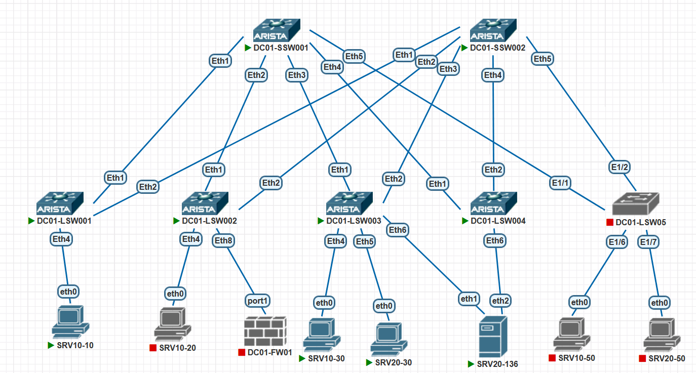

# Задание:

1. настроить отказоустойчивое подключение клиентов с использованием EVPN Multihoming.


# Решение:

1. [Создание, документация сети](#создание-сети)
2. [Проверка IP связности](#проверка-доступности)


    
### Создание сети:
Для создания тестовой среды использованы:
- ПО Pnetlab для создания виртуального стенда;
- коммутатор Arista ver. 4.29.2F в роли SPINE в количестве 2 шт (DC01-SSW01-02);
- коммутатор Arista ver. 4.29.2F в роли LEAF в количестве 3 шт (DC01-LSW01-03);
- коммутатор Arista ver. 4.33.1.1F в роли LEAF в количестве 1 шт (DC01-LSW04);

Подключение было выполнено согласно прилагаемой схеме:




#### Описание:
- 10.255.255.X/24 - SPINE loopback IP address, где X - номер SPINE
- 10.255.254.X/24 - LEAF loopback IP address, где X - номер LEAF
- 10.255.253.0/24 - линковая подсеть для связи SPINE-LEAF. Используются /31 подсети. Четный номер - SPINE, нечетный LEAF
- 10.0.X.0/17 - сервисы, где X соотвествует VLAN ID из диапазона 1-99
- AS64512 - номер автономной системы для SPINE'ов
- AS4200000XXX - номера автономных систем для LEAF'ов, где XXX - соотвествует номеру LEAF'а с добавлением нулей в начале
- Хосты имеют именя SRVXX-YZ, где XX - номер VLAN из дипазона 01-99, Y - номер LEAF, Z - порядковый номер, начиная с 0. IP-адрес хоста при этом будет в формате 10.0.XX.YZ/24.
- Используем схему VLAN-BASED
- VNI в формате XXYYYY, где XX - номер ЦОД, YYYY - номер VLAN


#### Конфигурация сетевого оборудования:
<details>
<summary><b>SPINE 1:</b></summary>

```


! Command: show running-config
! device: DC01-SSW001 (vEOS-lab, EOS-4.29.2F)
!
! boot system flash:/vEOS-lab.swi
!
no aaa root
!
cdp
   receive
!
transceiver qsfp default-mode 4x10G
!
service routing protocols model multi-agent
!
logging format timestamp traditional timezone
!
hostname DC01-SSW001
!
spanning-tree mode mstp
!
clock timezone Etc/GMT-3
!
interface Ethernet1
   description # DC01-LSW001 #
   no switchport
   ip address 10.255.253.100/31
   arp aging timeout 300
   bfd interval 2000 min-rx 2000 multiplier 5
!
interface Ethernet2
   description # DC01-LSW002 #
   no switchport
   ip address 10.255.253.102/31
   arp aging timeout 300
   bfd interval 2000 min-rx 2000 multiplier 5
!
interface Ethernet3
   description # DC01-LSW003 #
   no switchport
   ip address 10.255.253.104/31
   arp aging timeout 300
   bfd interval 2000 min-rx 2000 multiplier 5
!
interface Ethernet4
   description # DC01-LSW004 #
   no switchport
   ip address 10.255.253.106/31
   arp aging timeout 300
   bfd interval 2000 min-rx 2000 multiplier 5
!
interface Ethernet5
   description # DC01-LSW005 #
   no switchport
   ip address 10.255.253.108/31
   arp aging timeout 300
   bfd interval 999 min-rx 999 multiplier 5
!
interface Ethernet6
!
interface Ethernet7
!
interface Ethernet8
!
interface Loopback0
   ip address 10.255.255.1/32
   isis enable dc01
!
interface Management1
!
ip routing
!
ip prefix-list prf_loopback_leafs seq 10 permit 10.255.254.0/24 le 32
ip prefix-list prf_loopback_spines seq 10 permit 10.255.255.0/24 le 32
!
route-map from_connected_to_bgp permit 10
   match ip address prefix-list prf_loopback_leafs
!
route-map from_connected_to_bgp permit 20
   match ip address prefix-list prf_loopback_spines
!
peer-filter pf_leafs
   10 match as-range 4200000001-4200000255 result accept
!
router bgp 64512
   router-id 10.255.255.1
   timers bgp 3 9
   maximum-paths 4 ecmp 4
   bgp listen range 10.255.253.0/24 peer-group dyn_leafs peer-filter pf_leafs
   neighbor dyn_leafs peer group
   neighbor dyn_leafs bfd
   neighbor dyn_leafs send-community extended
   neighbor 10.255.253.109 remote-as 4200000005
   !
   address-family evpn
      neighbor dyn_leafs activate
      neighbor 10.255.253.109 activate
   !
   address-family ipv4
      neighbor dyn_leafs activate
      neighbor 10.255.253.109 activate
      redistribute connected route-map from_connected_to_bgp
!
end


```
</details>


<details>
<summary><b>SPINE 2:</b></summary>

```


! Command: show running-config
! device: DC01-SSW002 (vEOS-lab, EOS-4.29.2F)
!
! boot system flash:/vEOS-lab.swi
!
no aaa root
!
cdp
   receive
!
transceiver qsfp default-mode 4x10G
!
service routing protocols model multi-agent
!
logging format timestamp traditional timezone
!
hostname DC01-SSW002
!
spanning-tree mode mstp
!
clock timezone Etc/GMT-3
!
interface Ethernet1
   description # DC01-LSW001 #
   no switchport
   ip address 10.255.253.200/31
   arp aging timeout 300
   bfd interval 2000 min-rx 2000 multiplier 5
!
interface Ethernet2
   description # DC01-LSW002 #
   no switchport
   ip address 10.255.253.202/31
   arp aging timeout 300
   bfd interval 2000 min-rx 2000 multiplier 5
!
interface Ethernet3
   description # DC01-LSW003 #
   no switchport
   ip address 10.255.253.204/31
   arp aging timeout 300
   bfd interval 2000 min-rx 2000 multiplier 5
!
interface Ethernet4
   description # DC01-LSW004 #
   no switchport
   ip address 10.255.253.206/31
   arp aging timeout 300
   bfd interval 2000 min-rx 2000 multiplier 5
!
interface Ethernet5
   description # DC01-LSW005 #
   no switchport
   ip address 10.255.253.208/31
   arp aging timeout 300
   bfd interval 2000 min-rx 2000 multiplier 5
   no ip ospf neighbor bfd
   no isis bfd
!
interface Ethernet6
!
interface Ethernet7
!
interface Ethernet8
!
interface Loopback0
   ip address 10.255.255.2/32
   isis enable dc01
!
interface Management1
!
ip routing
!
ip prefix-list prf_loopback_leafs seq 10 permit 10.255.254.0/24 le 32
ip prefix-list prf_loopback_spines seq 10 permit 10.255.255.0/24 le 32
!
route-map from_connected_to_bgp permit 10
   match ip address prefix-list prf_loopback_leafs
!
route-map from_connected_to_bgp permit 20
   match ip address prefix-list prf_loopback_spines
!
peer-filter pf_leafs
   10 match as-range 4200000001-4200000255 result accept
!
router bgp 64512
   router-id 10.255.255.2
   timers bgp 3 9
   maximum-paths 4 ecmp 4
   bgp listen range 10.255.253.0/24 peer-group dyn_leafs peer-filter pf_leafs
   neighbor dyn_leafs peer group
   neighbor dyn_leafs bfd
   neighbor dyn_leafs send-community extended
   !
   address-family evpn
      neighbor dyn_leafs activate
   !
   address-family ipv4
      neighbor dyn_leafs activate
      redistribute connected route-map from_connected_to_bgp
!
end


```
</details>
На SPINE'ах нет ни VLAN (кроме VLAN 1), ни интерфейсов vxlan... 
На LEAF'ах в созданы VRF, VLAN, SVI для VLAN в VRF.

<details>
<summary><b>LEAF 1:</b></summary>

```
! Command: show running-config
! device: DC01-LSW001 (vEOS-lab, EOS-4.29.2F)
!
! boot system flash:/vEOS-lab.swi
!
no aaa root
!
cdp
   receive
!
transceiver qsfp default-mode 4x10G
!
service routing protocols model multi-agent
!
logging format timestamp traditional timezone
!
hostname DC01-LSW001
!
spanning-tree mode mstp
!
clock timezone Etc/GMT-3
!
vlan 10,20
!
vrf instance PROD
   rd 4200000001:14096
!
interface Ethernet1
   description # DC01-SSW001 #
   no switchport
   ip address 10.255.253.101/31
   arp aging timeout 300
   bfd interval 2000 min-rx 2000 multiplier 5
!
interface Ethernet2
   description # DC01-SSW002 #
   no switchport
   ip address 10.255.253.201/31
   arp aging timeout 300
   bfd interval 2000 min-rx 2000 multiplier 5
!
interface Ethernet3
!
interface Ethernet4
   switchport access vlan 10
   spanning-tree portfast
!
interface Ethernet5
   switchport access vlan 10
!
interface Ethernet6
   switchport access vlan 20
!
interface Ethernet7
!
interface Ethernet8
!
interface Loopback0
   ip address 10.255.254.1/32
   isis enable dc01
!
interface Loopback10
   ip address 10.255.254.101/32
!
interface Management1
!
interface Vlan10
   vrf PROD
   ip address virtual 10.0.10.1/24
!
interface Vlan20
   vrf PROD
   ip address 10.0.20.1/24
!
interface Vxlan1
   vxlan source-interface Loopback10
   vxlan udp-port 4789
   vxlan vlan 10 vni 10010
   vxlan vlan 20 vni 10020
!
ip virtual-router mac-address 00:00:00:00:00:01
!
ip routing
ip routing vrf PROD
!
ip prefix-list prf_loopback_leafs seq 10 permit 10.255.254.0/24 le 32
ip prefix-list prf_loopback_spines seq 10 permit 10.255.255.0/24 le 32
!
route-map from_connected_to_bgp permit 10
   match ip address prefix-list prf_loopback_leafs
!
route-map from_connected_to_bgp permit 20
   match ip address prefix-list prf_loopback_spines
!
router bgp 4200000001
   router-id 10.255.254.1
   timers bgp 3 9
   maximum-paths 4 ecmp 4
   neighbor spines peer group
   neighbor spines remote-as 64512
   neighbor spines bfd
   neighbor spines send-community extended
   neighbor 10.255.253.100 peer group spines
   neighbor 10.255.253.200 peer group spines
   !
   vlan 10
      rd 4200000001:10010
      route-target import 64512:10
      route-target export 64512:10
      redistribute learned
   !
   vlan 20
      rd 4200000001:10020
      route-target both 64512:20
      redistribute learned
   !
   address-family evpn
      neighbor spines activate
   !
   address-family ipv4
      neighbor spines activate
      redistribute connected route-map from_connected_to_bgp
   !
   vrf PROD
      rd 4200000001:4096
      route-target import evpn 64512:4096
      route-target export evpn 64512:4096
      redistribute connected
!
end


```
</details>


<details>
<summary><b>LEAF 2:</b></summary>

```


! Command: show running-config
! device: DC01-LSW002 (vEOS-lab, EOS-4.29.2F)
!
! boot system flash:/vEOS-lab.swi
!
no aaa root
!
cdp
   receive
!
transceiver qsfp default-mode 4x10G
!
service routing protocols model multi-agent
!
logging format timestamp traditional timezone
!
hostname DC01-LSW002
!
spanning-tree mode mstp
!
clock timezone Etc/GMT-3
!
vlan 10,20
!
vrf instance PROD
!
interface Ethernet1
   description # DC01-SSW001 #
   no switchport
   ip address 10.255.253.103/31
   arp aging timeout 300
   bfd interval 2000 min-rx 2000 multiplier 5
!
interface Ethernet2
   description # DC01-SSW002 #
   no switchport
   ip address 10.255.253.203/31
   arp aging timeout 300
   bfd interval 2000 min-rx 2000 multiplier 5
!
interface Ethernet3
!
interface Ethernet4
   switchport access vlan 10
   spanning-tree portfast
!
interface Ethernet5
!
interface Ethernet6
!
interface Ethernet7
!
interface Ethernet8
   no switchport
   vrf PROD
   ip address 10.1.2.1/30
!
interface Loopback0
   ip address 10.255.254.2/32
   isis enable dc01
!
interface Loopback10
   ip address 10.255.254.102/32
!
interface Management1
!
interface Vlan10
   no autostate
   vrf PROD
   ip address virtual 10.0.10.1/24
!
interface Vxlan1
   vxlan source-interface Loopback10
   vxlan udp-port 4789
   vxlan vlan 10 vni 10010
   vxlan vlan 20 vni 10020
!
ip virtual-router mac-address 00:00:00:00:00:01
!
ip routing
ip routing vrf PROD
!
ip prefix-list AS65000_out
   seq 10 permit 10.0.0.0/8
!
ip prefix-list prf_loopback_leafs
   seq 10 permit 10.255.254.0/24 le 32
!
ip prefix-list prf_loopback_spines
   seq 10 permit 10.255.255.0/24 le 32
!
ip prefix-list rfc1918
   seq 10 permit 10.0.0.0/8 le 32
   seq 20 permit 172.16.0.0/12 le 32
   seq 40 permit 192.168.0.0/16 le 32
!
route-map AS65000_out permit 10
   match ip address prefix-list AS65000_out
   set community 65000:100 additive
!
route-map from_connected_to_bgp permit 10
   match ip address prefix-list prf_loopback_leafs
!
route-map from_connected_to_bgp permit 20
   match ip address prefix-list prf_loopback_spines
!
router bgp 4200000002
   router-id 10.255.254.2
   timers bgp 3 9
   maximum-paths 4 ecmp 4
   neighbor spines peer group
   neighbor spines remote-as 64512
   neighbor spines bfd
   neighbor spines send-community extended
   neighbor 10.1.2.2 remote-as 65000
   neighbor 10.255.253.102 peer group spines
   neighbor 10.255.253.202 peer group spines
   !
   vlan 10
      rd 4200000003:10010
      route-target import 64512:10
      route-target export 64512:10
      redistribute learned
   !
   vlan 20
      rd 4200000003:10020
      route-target both 64512:20
      redistribute learned
   !
   address-family evpn
      neighbor spines activate
   !
   address-family ipv4
      neighbor spines activate
      neighbor 10.1.2.2 activate
      redistribute connected route-map from_connected_to_bgp
   !
   vrf PROD
      rd 4200000002:4096
      route-target import evpn 64512:4096
      route-target export evpn 64512:4096
      neighbor 10.1.2.2 remote-as 65000
      neighbor 10.1.2.2 route-map AS65000_out out
      neighbor 10.1.2.2 send-community standard
      aggregate-address 10.0.0.0/8 advertise-only
!
end


```

</details>

<details>
<summary><b>LEAF 3:</b></summary>

```

! Command: show running-config
! device: DC01-LSW003 (vEOS-lab, EOS-4.29.2F)
!
! boot system flash:/vEOS-lab.swi
!
no aaa root
!
transceiver qsfp default-mode 4x10G
!
service routing protocols model multi-agent
!
logging format timestamp traditional timezone
!
hostname DC01-LSW003
!
spanning-tree mode mstp
!
clock timezone Etc/GMT-3
!
vlan 10,20
!
vrf instance PROD
   rd 4200000003:14096
!
interface Port-Channel6
   switchport access vlan 20
   !
   evpn ethernet-segment
      identifier 0001:50c1:5528:a4cc:0001
      designated-forwarder election algorithm preference 100
      route-target import 55:28:a4:cc:00:01
   lacp system-id 50c1.5528.a4cc
   spanning-tree portfast
   spanning-tree guard root
!
interface Ethernet1
   description # DC01-SSW001 #
   no switchport
   ip address 10.255.253.105/31
   arp aging timeout 300
   bfd interval 2000 min-rx 2000 multiplier 5
!
interface Ethernet2
   description # DC01-SSW002 #
   no switchport
   ip address 10.255.253.205/31
   arp aging timeout 300
   bfd interval 2000 min-rx 2000 multiplier 5
!
interface Ethernet3
!
interface Ethernet4
   switchport access vlan 10
!
interface Ethernet5
   switchport access vlan 20
!
interface Ethernet6
   switchport access vlan 20
   channel-group 6 mode on
   spanning-tree portfast
   spanning-tree guard root
!
interface Ethernet7
!
interface Ethernet8
!
interface Loopback0
   ip address 10.255.254.3/32
   isis enable dc01
!
interface Loopback10
   ip address 10.255.254.103/32
!
interface Management1
!
interface Vlan10
   vrf PROD
   ip address 10.0.10.1/24
!
interface Vlan20
   vrf PROD
   ip address 10.0.20.1/24
!
interface Vxlan1
   vxlan source-interface Loopback10
   vxlan udp-port 4789
   vxlan vlan 10 vni 10010
   vxlan vlan 20 vni 10020
!
ip virtual-router mac-address 00:00:00:00:00:01
!
ip routing
ip routing vrf PROD
!
ip prefix-list prf_loopback_leafs seq 10 permit 10.255.254.0/24 le 32
ip prefix-list prf_loopback_spines seq 10 permit 10.255.255.0/24 le 32
!
route-map from_connected_to_bgp permit 10
   match ip address prefix-list prf_loopback_leafs
!
route-map from_connected_to_bgp permit 20
   match ip address prefix-list prf_loopback_spines
!
router bgp 4200000003
   router-id 10.255.254.3
   timers bgp 3 9
   maximum-paths 4 ecmp 4
   neighbor spines peer group
   neighbor spines remote-as 64512
   neighbor spines bfd
   neighbor spines send-community extended
   neighbor 10.255.253.104 peer group spines
   neighbor 10.255.253.204 peer group spines
   !
   vlan 10
      rd 4200000003:10010
      route-target import 64512:10
      route-target export 64512:10
      redistribute learned
   !
   vlan 20
      rd 4200000003:10020
      route-target both 64512:20
      redistribute learned
   !
   address-family evpn
      neighbor spines activate
   !
   address-family ipv4
      neighbor spines activate
      redistribute connected route-map from_connected_to_bgp
   !
   vrf PROD
      rd 4200000003:4096
      route-target import evpn 64512:4096
      route-target export evpn 64512:4096
      redistribute connected
!
end


```


</details>

<details>
<summary><b>LEAF 4:</b></summary>

```

! Command: show running-config
! device: DC01-LSW004 (vEOS-lab, EOS-4.33.1.1F)
!
! boot system flash:/vEOS-lab.swi
!
no aaa root
!
cdp
   receive
!
no service interface inactive port-id allocation disabled
!
transceiver qsfp default-mode 4x10G
!
service routing protocols model multi-agent
!
logging format timestamp traditional timezone
!
hostname DC01-LSW004
!
spanning-tree mode mstp
!
system l1
   unsupported speed action error
   unsupported error-correction action error
!
clock timezone Etc/GMT-3
!
vlan 10,20
!
vrf instance PROD
   rd 4200000004:14096
!
interface Port-Channel6
   switchport access vlan 20
   !
   evpn ethernet-segment
      identifier 0001:50c1:5528:a4cc:0001
      designated-forwarder election algorithm preference 50
      route-target import 55:28:a4:cc:00:01
   lacp system-id 50c1.5528.a4cc
   spanning-tree portfast
   spanning-tree guard root
!
interface Ethernet1
   description # DC01-SSW001 #
   no switchport
   ip address 10.255.253.107/31
   arp aging timeout 300
   bfd interval 2000 min-rx 2000 multiplier 5
!
interface Ethernet2
   description # DC01-SSW002 #
   no switchport
   ip address 10.255.253.207/31
   arp aging timeout 300
   bfd interval 2000 min-rx 2000 multiplier 5
!
interface Ethernet3
!
interface Ethernet4
!
interface Ethernet5
!
interface Ethernet6
   switchport access vlan 20
   channel-group 6 mode on
   spanning-tree portfast
   spanning-tree guard root
!
interface Ethernet7
!
interface Ethernet8
!
interface Loopback0
   ip address 10.255.254.4/32
   isis enable dc01
!
interface Loopback10
   ip address 10.255.254.104/32
!
interface Management1
!
interface Vlan10
   vrf PROD
   ip address virtual 10.0.10.1/24
!
interface Vlan20
   vrf PROD
   ip address 10.0.20.1/24
!
interface Vxlan1
   vxlan source-interface Loopback10
   vxlan udp-port 4789
   vxlan vlan 10 vni 10010
   vxlan vlan 20 vni 10020
!
ip virtual-router mac-address 00:00:00:00:00:01
!
ip routing
ip routing vrf PROD
!
ip prefix-list prf_loopback_leafs seq 10 permit 10.255.254.0/24 le 32
ip prefix-list prf_loopback_spines seq 10 permit 10.255.255.0/24 le 32
!
route-map from_connected_to_bgp permit 10
   match ip address prefix-list prf_loopback_leafs
!
route-map from_connected_to_bgp permit 20
   match ip address prefix-list prf_loopback_spines
!
router bgp 4200000004
   router-id 10.255.254.4
   timers bgp 3 9
   maximum-paths 4 ecmp 4
   neighbor spines peer group
   neighbor spines remote-as 64512
   neighbor spines bfd
   neighbor spines send-community extended
   neighbor 10.255.253.106 peer group spines
   neighbor 10.255.253.206 peer group spines
   !
   vlan 10
      rd 4200000004:10010
      route-target import 64512:10
      route-target export 64512:10
      redistribute learned
   !
   vlan 20
      rd 4200000004:10020
      route-target both 64512:20
      redistribute learned
   !
   address-family evpn
      neighbor spines activate
   !
   address-family ipv4
      neighbor spines activate
      redistribute connected route-map from_connected_to_bgp
   !
   vrf PROD
      rd 4200000004:4096
      route-target import evpn 64512:4096
      route-target export evpn 64512:4096
      redistribute connected
!
router multicast
   ipv4
      software-forwarding kernel
   !
   ipv6
      software-forwarding kernel
!
end


```


</details>

#### Конфигурация хостов:
<details>
<summary><b>SRV10-10:</b></summary>

```
NAME   IP/MASK              GATEWAY           MAC                DNS
VPCS1  10.0.10.10/24        10.0.10.1         00:50:79:66:68:29  10.1.0.2
```
</details>
<details>
<summary><b>SRV10-30:</b></summary>

```
NAME   IP/MASK              GATEWAY           MAC                DNS
VPCS1  10.0.10.30/24        10.0.10.1         00:50:79:66:68:2b  10.1.0.10
```
</details>
<details>
<summary><b>SRV20-30:</b></summary>

```
NAME   IP/MASK              GATEWAY           MAC                DNS
VPCS1  10.0.20.30/24        10.0.20.1         00:50:79:66:68:38  10.0.1.10
```
</details>

<details>
<summary><b>SRV20-136:</b></summary>

```

Eth1, eth2 Объединены в Bond0, ip add 10.0.20.136, gw 10.0.20.1
bond0: flags=5187<UP,BROADCAST,RUNNING,MASTER,MULTICAST>  mtu 1500
        inet 10.0.20.136  netmask 255.255.255.0  broadcast 0.0.0.0
        ether 50:00:00:43:00:01  txqueuelen 1000  (Ethernet)
        RX packets 7343  bytes 872251 (872.2 KB)
        RX errors 0  dropped 217  overruns 0  frame 0
        TX packets 531  bytes 47606 (47.6 KB)
        TX errors 0  dropped 0 overruns 0  carrier 0  collisions 0


```
</details>


📥 [Скачать](./configs)  файлы лабы в текстовом формате 

#### Выполненная работа:
В текущую конфигурацию 2х LEAF 3x SPINE Добавлен LEAF 4 с ПО, версия которого немного отличается от LEAF 3. На основе LEAF 3 и 4 был создан etherchannel для хоста SRV20-136. ESI выбран по формуле: 0001.мак_"главного"_свича.порядковый_номер_etherchannel'a, lacp id равен маку "главного" коммутатора в etherchannel'e. Провериить работу с учётом LACP нет тех возможности, для проверки пришлось сделать shutdown на порту LEAF 3 и 4 вместе с shutdown соответствующего порта на хосте, т.к. состояние линка не arista не зависит от наличия второго конца линка.

### Проверка доступности: 
Проверка выполняется на каждом из коммутаторов по следующим критериям:
 - просмотр BGP топологии и соседей;
 - просмотр таблицы маршрутизации на каждом коммутаторе;
 - проверка связности посредством icmp echo request.
 В pnetlab имеется ограничение по протоколам lacp, ввиду этого пришлось делать static link-aggregation
 - 

Проверка на LEAF 1:
<details>
<summary><b>LEAF 1:</b></summary>

```


DC01-LSW001#show bgp evpn route-type ethernet-segment
BGP routing table information for VRF default
Router identifier 10.255.254.1, local AS number 4200000001
Route status codes: * - valid, > - active, S - Stale, E - ECMP head, e - ECMP
                    c - Contributing to ECMP, % - Pending BGP convergence
Origin codes: i - IGP, e - EGP, ? - incomplete
AS Path Attributes: Or-ID - Originator ID, C-LST - Cluster List, LL Nexthop - Link Local Nexthop

          Network                Next Hop              Metric  LocPref Weight  Path
 * >Ec    RD: 10.255.254.103:1 ethernet-segment 0001:50c1:5528:a4cc:0001 10.255.254.103
                                 10.255.254.103        -       100     0       64512 4200000003 i
 *  ec    RD: 10.255.254.103:1 ethernet-segment 0001:50c1:5528:a4cc:0001 10.255.254.103
                                 10.255.254.103        -       100     0       64512 4200000003 i
 * >Ec    RD: 10.255.254.104:1 ethernet-segment 0001:50c1:5528:a4cc:0001 10.255.254.104
                                 10.255.254.104        -       100     0       64512 4200000004 i
 *  ec    RD: 10.255.254.104:1 ethernet-segment 0001:50c1:5528:a4cc:0001 10.255.254.104
                                 10.255.254.104        -       100     0       64512 4200000004 i
DC01-LSW001#show bgp evpn route-type auto-discovery
BGP routing table information for VRF default
Router identifier 10.255.254.1, local AS number 4200000001
Route status codes: * - valid, > - active, S - Stale, E - ECMP head, e - ECMP
                    c - Contributing to ECMP, % - Pending BGP convergence
Origin codes: i - IGP, e - EGP, ? - incomplete
AS Path Attributes: Or-ID - Originator ID, C-LST - Cluster List, LL Nexthop - Link Local Nexthop

          Network                Next Hop              Metric  LocPref Weight  Path
 * >Ec    RD: 4200000003:10020 auto-discovery 0 0001:50c1:5528:a4cc:0001
                                 10.255.254.103        -       100     0       64512 4200000003 i
 *  ec    RD: 4200000003:10020 auto-discovery 0 0001:50c1:5528:a4cc:0001
                                 10.255.254.103        -       100     0       64512 4200000003 i
 * >Ec    RD: 4200000004:10020 auto-discovery 0 0001:50c1:5528:a4cc:0001
                                 10.255.254.104        -       100     0       64512 4200000004 i
 *  ec    RD: 4200000004:10020 auto-discovery 0 0001:50c1:5528:a4cc:0001
                                 10.255.254.104        -       100     0       64512 4200000004 i
 * >Ec    RD: 10.255.254.103:1 auto-discovery 0001:50c1:5528:a4cc:0001
                                 10.255.254.103        -       100     0       64512 4200000003 i
 *  ec    RD: 10.255.254.103:1 auto-discovery 0001:50c1:5528:a4cc:0001
                                 10.255.254.103        -       100     0       64512 4200000003 i
 * >Ec    RD: 10.255.254.104:1 auto-discovery 0001:50c1:5528:a4cc:0001
                                 10.255.254.104        -       100     0       64512 4200000004 i
 *  ec    RD: 10.255.254.104:1 auto-discovery 0001:50c1:5528:a4cc:0001
                                 10.255.254.104        -       100     0       64512 4200000004 i
DC01-LSW001#


```
</details>


Проверка на LEAF 3:
<details>
<summary><b>LEAF 3:</b></summary>

```


DC01-LSW003#sh port-channel brief
Port Channel Port-Channel6:
  Active Ports: Ethernet6
DC01-LSW003#show bgp evpn summary
BGP summary information for VRF default
Router identifier 10.255.254.3, local AS number 4200000003
Neighbor Status Codes: m - Under maintenance
  Neighbor       V AS           MsgRcvd   MsgSent  InQ OutQ  Up/Down State   PfxRcd PfxAcc
  10.255.253.104 4 64512         168953    169131    0    0 01:14:07 Estab   9      9
  10.255.253.204 4 64512         168939    169150    0    0 01:14:07 Estab   9      9

DC01-LSW003#show bgp evpn vni 10020
BGP routing table information for VRF default
Router identifier 10.255.254.3, local AS number 4200000003
Route status codes: * - valid, > - active, S - Stale, E - ECMP head, e - ECMP
                    c - Contributing to ECMP, % - Pending BGP convergence
Origin codes: i - IGP, e - EGP, ? - incomplete
AS Path Attributes: Or-ID - Originator ID, C-LST - Cluster List, LL Nexthop - Link Local Nexthop

          Network                Next Hop              Metric  LocPref Weight  Path
 * >      RD: 4200000003:10020 auto-discovery 0 0001:50c1:5528:a4cc:0001
                                 -                     -       -       0       i
 * >Ec    RD: 4200000004:10020 auto-discovery 0 0001:50c1:5528:a4cc:0001
                                 10.255.254.104        -       100     0       64512 4200000004 i
 *  ec    RD: 4200000004:10020 auto-discovery 0 0001:50c1:5528:a4cc:0001
                                 10.255.254.104        -       100     0       64512 4200000004 i
 * >Ec    RD: 4200000001:10020 imet 10.255.254.101
                                 10.255.254.101        -       100     0       64512 4200000001 i
 *  ec    RD: 4200000001:10020 imet 10.255.254.101
                                 10.255.254.101        -       100     0       64512 4200000001 i
 * >Ec    RD: 4200000003:10020 imet 10.255.254.102
                                 10.255.254.102        -       100     0       64512 4200000002 i
 *  ec    RD: 4200000003:10020 imet 10.255.254.102
                                 10.255.254.102        -       100     0       64512 4200000002 i
 * >      RD: 4200000003:10020 imet 10.255.254.103
                                 -                     -       -       0       i
 * >Ec    RD: 4200000004:10020 imet 10.255.254.104
                                 10.255.254.104        -       100     0       64512 4200000004 i
 *  ec    RD: 4200000004:10020 imet 10.255.254.104
                                 10.255.254.104        -       100     0       64512 4200000004 i
DC01-LSW003#show bgp evpn route-type auto-discovery
BGP routing table information for VRF default
Router identifier 10.255.254.3, local AS number 4200000003
Route status codes: * - valid, > - active, S - Stale, E - ECMP head, e - ECMP
                    c - Contributing to ECMP, % - Pending BGP convergence
Origin codes: i - IGP, e - EGP, ? - incomplete
AS Path Attributes: Or-ID - Originator ID, C-LST - Cluster List, LL Nexthop - Link Local Nexthop

          Network                Next Hop              Metric  LocPref Weight  Path
 * >      RD: 4200000003:10020 auto-discovery 0 0001:50c1:5528:a4cc:0001
                                 -                     -       -       0       i
 * >Ec    RD: 4200000004:10020 auto-discovery 0 0001:50c1:5528:a4cc:0001
                                 10.255.254.104        -       100     0       64512 4200000004 i
 *  ec    RD: 4200000004:10020 auto-discovery 0 0001:50c1:5528:a4cc:0001
                                 10.255.254.104        -       100     0       64512 4200000004 i
 * >      RD: 10.255.254.103:1 auto-discovery 0001:50c1:5528:a4cc:0001
                                 -                     -       -       0       i
 * >Ec    RD: 10.255.254.104:1 auto-discovery 0001:50c1:5528:a4cc:0001
                                 10.255.254.104        -       100     0       64512 4200000004 i
 *  ec    RD: 10.255.254.104:1 auto-discovery 0001:50c1:5528:a4cc:0001
                                 10.255.254.104        -       100     0       64512 4200000004 i
DC01-LSW003#show bgp evpn route-type ethernet-segment
BGP routing table information for VRF default
Router identifier 10.255.254.3, local AS number 4200000003
Route status codes: * - valid, > - active, S - Stale, E - ECMP head, e - ECMP
                    c - Contributing to ECMP, % - Pending BGP convergence
Origin codes: i - IGP, e - EGP, ? - incomplete
AS Path Attributes: Or-ID - Originator ID, C-LST - Cluster List, LL Nexthop - Link Local Nexthop

          Network                Next Hop              Metric  LocPref Weight  Path
 * >      RD: 10.255.254.103:1 ethernet-segment 0001:50c1:5528:a4cc:0001 10.255.254.103
                                 -                     -       -       0       i
 * >Ec    RD: 10.255.254.104:1 ethernet-segment 0001:50c1:5528:a4cc:0001 10.255.254.104
                                 10.255.254.104        -       100     0       64512 4200000004 i
 *  ec    RD: 10.255.254.104:1 ethernet-segment 0001:50c1:5528:a4cc:0001 10.255.254.104
                                 10.255.254.104        -       100     0       64512 4200000004 i
DC01-LSW003#


```
</details>


Проверка на LEAF 4:
<details>
<summary><b>LEAF 4:</b></summary>

```

DC01-LSW004#show port-channel brief
Port Channel Port-Channel6:
  Active Ports: Ethernet6
DC01-LSW004#show bgp evpn vni 10020
BGP routing table information for VRF default
Router identifier 10.255.254.4, local AS number 4200000004
Route status codes: * - valid, > - active, S - Stale, E - ECMP head, e - ECMP
                    c - Contributing to ECMP, % - Pending best path selection
Origin codes: i - IGP, e - EGP, ? - incomplete
AS Path Attributes: Or-ID - Originator ID, C-LST - Cluster List, LL Nexthop - Link Local Nexthop

          Network                Next Hop              Metric  LocPref Weight  Path
 * >Ec    RD: 4200000003:10020 auto-discovery 0 0001:50c1:5528:a4cc:0001
                                 10.255.254.103        -       100     0       64512 4200000003 i
 *  ec    RD: 4200000003:10020 auto-discovery 0 0001:50c1:5528:a4cc:0001
                                 10.255.254.103        -       100     0       64512 4200000003 i
 * >      RD: 4200000004:10020 auto-discovery 0 0001:50c1:5528:a4cc:0001
                                 -                     -       -       0       i
 * >Ec    RD: 4200000001:10020 imet 10.255.254.101
                                 10.255.254.101        -       100     0       64512 4200000001 i
 *  ec    RD: 4200000001:10020 imet 10.255.254.101
                                 10.255.254.101        -       100     0       64512 4200000001 i
 * >Ec    RD: 4200000003:10020 imet 10.255.254.102
                                 10.255.254.102        -       100     0       64512 4200000002 i
 *  ec    RD: 4200000003:10020 imet 10.255.254.102
                                 10.255.254.102        -       100     0       64512 4200000002 i
 * >Ec    RD: 4200000003:10020 imet 10.255.254.103
                                 10.255.254.103        -       100     0       64512 4200000003 i
 *  ec    RD: 4200000003:10020 imet 10.255.254.103
                                 10.255.254.103        -       100     0       64512 4200000003 i
 * >      RD: 4200000004:10020 imet 10.255.254.104
                                 -                     -       -       0       i
DC01-LSW004#show bgp evpn route-type auto-discovery
BGP routing table information for VRF default
Router identifier 10.255.254.4, local AS number 4200000004
Route status codes: * - valid, > - active, S - Stale, E - ECMP head, e - ECMP
                    c - Contributing to ECMP, % - Pending best path selection
Origin codes: i - IGP, e - EGP, ? - incomplete
AS Path Attributes: Or-ID - Originator ID, C-LST - Cluster List, LL Nexthop - Link Local Nexthop

          Network                Next Hop              Metric  LocPref Weight  Path
 * >Ec    RD: 4200000003:10020 auto-discovery 0 0001:50c1:5528:a4cc:0001
                                 10.255.254.103        -       100     0       64512 4200000003 i
 *  ec    RD: 4200000003:10020 auto-discovery 0 0001:50c1:5528:a4cc:0001
                                 10.255.254.103        -       100     0       64512 4200000003 i
 * >      RD: 4200000004:10020 auto-discovery 0 0001:50c1:5528:a4cc:0001
                                 -                     -       -       0       i
 * >Ec    RD: 10.255.254.103:1 auto-discovery 0001:50c1:5528:a4cc:0001
                                 10.255.254.103        -       100     0       64512 4200000003 i
 *  ec    RD: 10.255.254.103:1 auto-discovery 0001:50c1:5528:a4cc:0001
                                 10.255.254.103        -       100     0       64512 4200000003 i
 * >      RD: 10.255.254.104:1 auto-discovery 0001:50c1:5528:a4cc:0001
                                 -                     -       -       0       i
DC01-LSW004#show bgp evpn route-type ethernet-segment
BGP routing table information for VRF default
Router identifier 10.255.254.4, local AS number 4200000004
Route status codes: * - valid, > - active, S - Stale, E - ECMP head, e - ECMP
                    c - Contributing to ECMP, % - Pending best path selection
Origin codes: i - IGP, e - EGP, ? - incomplete
AS Path Attributes: Or-ID - Originator ID, C-LST - Cluster List, LL Nexthop - Link Local Nexthop

          Network                Next Hop              Metric  LocPref Weight  Path
 * >Ec    RD: 10.255.254.103:1 ethernet-segment 0001:50c1:5528:a4cc:0001 10.255.254.103
                                 10.255.254.103        -       100     0       64512 4200000003 i
 *  ec    RD: 10.255.254.103:1 ethernet-segment 0001:50c1:5528:a4cc:0001 10.255.254.103
                                 10.255.254.103        -       100     0       64512 4200000003 i
 * >      RD: 10.255.254.104:1 ethernet-segment 0001:50c1:5528:a4cc:0001 10.255.254.104
                                 -                     -       -       0       i


```
</details>

Будем выполнять отключение порта коммутатора (ethernet 6 shutdown и eth1/eth2 shutdown на хосте)

Команды для проверки:
<details>
<summary><b>Проверка:</b></summary>

```


DC01-LSW003(config)#int eth 6
DC01-LSW003(config-if-Et6)#shutdown

root@Docker:/#
root@Docker:/# ip link set eth1 down

DC01-LSW003(config-if-Et6)#no shu
DC01-LSW003(config-if-Et6)#end

root@Docker:/# ip link set eth1 up

DC01-LSW004(config)#interface Ethernet6
DC01-LSW004(config-if-Et6)#shutdown

root@Docker:/# ip link set eth2 down

DC01-LSW004(config-if-Et6)#no shutdown
DC01-LSW004(config-if-Et6)#end

root@Docker:/# ip link set eth2 up


```
</details>


<details>
<summary><b>Пинг сервера с SRV10-10:</b></summary>

```


84 bytes from 10.0.20.136 icmp_seq=1 ttl=63 time=674.511 ms
84 bytes from 10.0.20.136 icmp_seq=2 ttl=63 time=114.197 ms
84 bytes from 10.0.20.136 icmp_seq=3 ttl=63 time=87.434 ms
84 bytes from 10.0.20.136 icmp_seq=4 ttl=63 time=117.024 ms
84 bytes from 10.0.20.136 icmp_seq=5 ttl=63 time=495.382 ms
84 bytes from 10.0.20.136 icmp_seq=6 ttl=63 time=77.837 ms
84 bytes from 10.0.20.136 icmp_seq=7 ttl=63 time=86.739 ms
84 bytes from 10.0.20.136 icmp_seq=8 ttl=63 time=142.468 ms
84 bytes from 10.0.20.136 icmp_seq=9 ttl=63 time=419.924 ms
84 bytes from 10.0.20.136 icmp_seq=10 ttl=63 time=217.376 ms
84 bytes from 10.0.20.136 icmp_seq=11 ttl=63 time=72.324 ms
84 bytes from 10.0.20.136 icmp_seq=12 ttl=63 time=102.349 ms
84 bytes from 10.0.20.136 icmp_seq=13 ttl=63 time=346.550 ms
84 bytes from 10.0.20.136 icmp_seq=14 ttl=63 time=110.217 ms
84 bytes from 10.0.20.136 icmp_seq=15 ttl=63 time=139.715 ms
84 bytes from 10.0.20.136 icmp_seq=16 ttl=63 time=131.652 ms
84 bytes from 10.0.20.136 icmp_seq=17 ttl=63 time=120.304 ms
84 bytes from 10.0.20.136 icmp_seq=18 ttl=63 time=138.628 ms
84 bytes from 10.0.20.136 icmp_seq=19 ttl=63 time=330.029 ms
84 bytes from 10.0.20.136 icmp_seq=20 ttl=63 time=466.759 ms
84 bytes from 10.0.20.136 icmp_seq=21 ttl=63 time=106.772 ms
84 bytes from 10.0.20.136 icmp_seq=22 ttl=63 time=183.913 ms
84 bytes from 10.0.20.136 icmp_seq=23 ttl=63 time=95.582 ms
84 bytes from 10.0.20.136 icmp_seq=24 ttl=63 time=233.157 ms
84 bytes from 10.0.20.136 icmp_seq=25 ttl=63 time=469.579 ms
84 bytes from 10.0.20.136 icmp_seq=26 ttl=63 time=106.102 ms
84 bytes from 10.0.20.136 icmp_seq=27 ttl=63 time=92.613 ms
84 bytes from 10.0.20.136 icmp_seq=28 ttl=63 time=130.494 ms
84 bytes from 10.0.20.136 icmp_seq=29 ttl=63 time=213.513 ms
84 bytes from 10.0.20.136 icmp_seq=30 ttl=63 time=232.562 ms
84 bytes from 10.0.20.136 icmp_seq=31 ttl=63 time=96.823 ms
84 bytes from 10.0.20.136 icmp_seq=32 ttl=63 time=119.574 ms
84 bytes from 10.0.20.136 icmp_seq=33 ttl=63 time=87.602 ms
84 bytes from 10.0.20.136 icmp_seq=34 ttl=63 time=121.543 ms
84 bytes from 10.0.20.136 icmp_seq=35 ttl=63 time=108.050 ms
84 bytes from 10.0.20.136 icmp_seq=36 ttl=63 time=81.044 ms
84 bytes from 10.0.20.136 icmp_seq=37 ttl=63 time=165.599 ms
84 bytes from 10.0.20.136 icmp_seq=38 ttl=63 time=322.959 ms
84 bytes from 10.0.20.136 icmp_seq=39 ttl=63 time=75.552 ms
84 bytes from 10.0.20.136 icmp_seq=40 ttl=63 time=98.971 ms
84 bytes from 10.0.20.136 icmp_seq=41 ttl=63 time=117.051 ms
84 bytes from 10.0.20.136 icmp_seq=42 ttl=63 time=280.672 ms
84 bytes from 10.0.20.136 icmp_seq=43 ttl=63 time=737.424 ms
84 bytes from 10.0.20.136 icmp_seq=44 ttl=63 time=279.461 ms
84 bytes from 10.0.20.136 icmp_seq=45 ttl=63 time=551.006 ms
84 bytes from 10.0.20.136 icmp_seq=46 ttl=63 time=127.490 ms
84 bytes from 10.0.20.136 icmp_seq=47 ttl=63 time=189.269 ms
84 bytes from 10.0.20.136 icmp_seq=48 ttl=63 time=83.019 ms
84 bytes from 10.0.20.136 icmp_seq=49 ttl=63 time=76.910 ms
84 bytes from 10.0.20.136 icmp_seq=50 ttl=63 time=284.802 ms
84 bytes from 10.0.20.136 icmp_seq=51 ttl=63 time=113.616 ms
84 bytes from 10.0.20.136 icmp_seq=52 ttl=63 time=94.436 ms
84 bytes from 10.0.20.136 icmp_seq=53 ttl=63 time=94.515 ms
84 bytes from 10.0.20.136 icmp_seq=54 ttl=63 time=120.395 ms
84 bytes from 10.0.20.136 icmp_seq=55 ttl=63 time=174.505 ms
84 bytes from 10.0.20.136 icmp_seq=56 ttl=63 time=97.831 ms
84 bytes from 10.0.20.136 icmp_seq=57 ttl=63 time=78.453 ms
84 bytes from 10.0.20.136 icmp_seq=58 ttl=63 time=181.128 ms
84 bytes from 10.0.20.136 icmp_seq=59 ttl=63 time=105.306 ms
84 bytes from 10.0.20.136 icmp_seq=60 ttl=63 time=75.128 ms
84 bytes from 10.0.20.136 icmp_seq=61 ttl=63 time=223.956 ms
84 bytes from 10.0.20.136 icmp_seq=62 ttl=63 time=84.896 ms
84 bytes from 10.0.20.136 icmp_seq=63 ttl=63 time=241.889 ms
84 bytes from 10.0.20.136 icmp_seq=64 ttl=63 time=192.289 ms
84 bytes from 10.0.20.136 icmp_seq=65 ttl=63 time=117.704 ms
84 bytes from 10.0.20.136 icmp_seq=66 ttl=63 time=180.172 ms
84 bytes from 10.0.20.136 icmp_seq=67 ttl=63 time=179.119 ms
84 bytes from 10.0.20.136 icmp_seq=68 ttl=63 time=119.247 ms
84 bytes from 10.0.20.136 icmp_seq=69 ttl=63 time=102.856 ms
84 bytes from 10.0.20.136 icmp_seq=70 ttl=63 time=198.327 ms
84 bytes from 10.0.20.136 icmp_seq=71 ttl=63 time=448.843 ms
84 bytes from 10.0.20.136 icmp_seq=72 ttl=63 time=97.763 ms
84 bytes from 10.0.20.136 icmp_seq=73 ttl=63 time=112.578 ms
84 bytes from 10.0.20.136 icmp_seq=74 ttl=63 time=80.479 ms
84 bytes from 10.0.20.136 icmp_seq=75 ttl=63 time=256.574 ms
84 bytes from 10.0.20.136 icmp_seq=76 ttl=63 time=565.074 ms
84 bytes from 10.0.20.136 icmp_seq=77 ttl=63 time=264.560 ms
84 bytes from 10.0.20.136 icmp_seq=78 ttl=63 time=74.024 ms
84 bytes from 10.0.20.136 icmp_seq=79 ttl=63 time=105.799 ms
84 bytes from 10.0.20.136 icmp_seq=80 ttl=63 time=88.311 ms
84 bytes from 10.0.20.136 icmp_seq=81 ttl=63 time=362.690 ms
84 bytes from 10.0.20.136 icmp_seq=82 ttl=63 time=114.114 ms
84 bytes from 10.0.20.136 icmp_seq=83 ttl=63 time=96.611 ms
84 bytes from 10.0.20.136 icmp_seq=84 ttl=63 time=170.464 ms
84 bytes from 10.0.20.136 icmp_seq=85 ttl=63 time=163.018 ms
84 bytes from 10.0.20.136 icmp_seq=86 ttl=63 time=249.598 ms
84 bytes from 10.0.20.136 icmp_seq=87 ttl=63 time=93.330 ms
84 bytes from 10.0.20.136 icmp_seq=88 ttl=63 time=73.768 ms
84 bytes from 10.0.20.136 icmp_seq=89 ttl=63 time=84.765 ms
84 bytes from 10.0.20.136 icmp_seq=90 ttl=63 time=114.695 ms
84 bytes from 10.0.20.136 icmp_seq=91 ttl=63 time=99.407 ms
84 bytes from 10.0.20.136 icmp_seq=92 ttl=63 time=156.649 ms
84 bytes from 10.0.20.136 icmp_seq=93 ttl=63 time=86.445 ms
84 bytes from 10.0.20.136 icmp_seq=94 ttl=63 time=211.476 ms
84 bytes from 10.0.20.136 icmp_seq=95 ttl=63 time=105.616 ms
84 bytes from 10.0.20.136 icmp_seq=96 ttl=63 time=236.409 ms
84 bytes from 10.0.20.136 icmp_seq=97 ttl=63 time=97.790 ms
84 bytes from 10.0.20.136 icmp_seq=98 ttl=63 time=231.176 ms
84 bytes from 10.0.20.136 icmp_seq=99 ttl=63 time=136.606 ms
84 bytes from 10.0.20.136 icmp_seq=100 ttl=63 time=99.149 ms
84 bytes from 10.0.20.136 icmp_seq=101 ttl=63 time=181.228 ms
84 bytes from 10.0.20.136 icmp_seq=102 ttl=63 time=327.566 ms
84 bytes from 10.0.20.136 icmp_seq=103 ttl=63 time=85.620 ms
84 bytes from 10.0.20.136 icmp_seq=104 ttl=63 time=153.914 ms
84 bytes from 10.0.20.136 icmp_seq=105 ttl=63 time=119.805 ms
84 bytes from 10.0.20.136 icmp_seq=106 ttl=63 time=89.802 ms
84 bytes from 10.0.20.136 icmp_seq=107 ttl=63 time=411.836 ms
84 bytes from 10.0.20.136 icmp_seq=108 ttl=63 time=75.606 ms
84 bytes from 10.0.20.136 icmp_seq=109 ttl=63 time=108.132 ms
84 bytes from 10.0.20.136 icmp_seq=110 ttl=63 time=90.648 ms
84 bytes from 10.0.20.136 icmp_seq=111 ttl=63 time=187.602 ms
84 bytes from 10.0.20.136 icmp_seq=112 ttl=63 time=431.538 ms
84 bytes from 10.0.20.136 icmp_seq=113 ttl=63 time=138.226 ms
84 bytes from 10.0.20.136 icmp_seq=114 ttl=63 time=141.218 ms
84 bytes from 10.0.20.136 icmp_seq=115 ttl=63 time=205.307 ms
84 bytes from 10.0.20.136 icmp_seq=116 ttl=63 time=161.155 ms
84 bytes from 10.0.20.136 icmp_seq=117 ttl=63 time=245.151 ms
84 bytes from 10.0.20.136 icmp_seq=118 ttl=63 time=80.029 ms
84 bytes from 10.0.20.136 icmp_seq=119 ttl=63 time=109.418 ms
84 bytes from 10.0.20.136 icmp_seq=120 ttl=63 time=82.729 ms
84 bytes from 10.0.20.136 icmp_seq=121 ttl=63 time=94.180 ms
84 bytes from 10.0.20.136 icmp_seq=122 ttl=63 time=76.683 ms
84 bytes from 10.0.20.136 icmp_seq=123 ttl=63 time=79.777 ms
84 bytes from 10.0.20.136 icmp_seq=124 ttl=63 time=290.946 ms
84 bytes from 10.0.20.136 icmp_seq=125 ttl=63 time=203.400 ms
84 bytes from 10.0.20.136 icmp_seq=126 ttl=63 time=82.875 ms
84 bytes from 10.0.20.136 icmp_seq=127 ttl=63 time=138.597 ms
84 bytes from 10.0.20.136 icmp_seq=128 ttl=63 time=101.403 ms
84 bytes from 10.0.20.136 icmp_seq=129 ttl=63 time=180.737 ms
84 bytes from 10.0.20.136 icmp_seq=130 ttl=63 time=133.653 ms
84 bytes from 10.0.20.136 icmp_seq=131 ttl=63 time=74.299 ms
84 bytes from 10.0.20.136 icmp_seq=132 ttl=63 time=124.123 ms
84 bytes from 10.0.20.136 icmp_seq=133 ttl=63 time=440.362 ms
84 bytes from 10.0.20.136 icmp_seq=134 ttl=63 time=94.092 ms
84 bytes from 10.0.20.136 icmp_seq=135 ttl=63 time=85.138 ms
84 bytes from 10.0.20.136 icmp_seq=136 ttl=63 time=187.209 ms
84 bytes from 10.0.20.136 icmp_seq=137 ttl=63 time=201.809 ms
84 bytes from 10.0.20.136 icmp_seq=138 ttl=63 time=451.392 ms
84 bytes from 10.0.20.136 icmp_seq=139 ttl=63 time=124.218 ms
84 bytes from 10.0.20.136 icmp_seq=140 ttl=63 time=94.906 ms
84 bytes from 10.0.20.136 icmp_seq=141 ttl=63 time=78.304 ms
84 bytes from 10.0.20.136 icmp_seq=142 ttl=63 time=134.573 ms
84 bytes from 10.0.20.136 icmp_seq=143 ttl=63 time=427.886 ms
84 bytes from 10.0.20.136 icmp_seq=144 ttl=63 time=82.521 ms
84 bytes from 10.0.20.136 icmp_seq=145 ttl=63 time=81.484 ms
84 bytes from 10.0.20.136 icmp_seq=146 ttl=63 time=95.459 ms
84 bytes from 10.0.20.136 icmp_seq=147 ttl=63 time=212.807 ms
84 bytes from 10.0.20.136 icmp_seq=148 ttl=63 time=100.139 ms
84 bytes from 10.0.20.136 icmp_seq=149 ttl=63 time=140.989 ms
84 bytes from 10.0.20.136 icmp_seq=150 ttl=63 time=95.776 ms
84 bytes from 10.0.20.136 icmp_seq=151 ttl=63 time=356.593 ms
84 bytes from 10.0.20.136 icmp_seq=152 ttl=63 time=102.349 ms
84 bytes from 10.0.20.136 icmp_seq=153 ttl=63 time=106.033 ms
84 bytes from 10.0.20.136 icmp_seq=154 ttl=63 time=117.747 ms
84 bytes from 10.0.20.136 icmp_seq=155 ttl=63 time=93.756 ms
84 bytes from 10.0.20.136 icmp_seq=156 ttl=63 time=427.409 ms
84 bytes from 10.0.20.136 icmp_seq=157 ttl=63 time=131.429 ms
84 bytes from 10.0.20.136 icmp_seq=158 ttl=63 time=74.009 ms
84 bytes from 10.0.20.136 icmp_seq=159 ttl=63 time=76.452 ms
84 bytes from 10.0.20.136 icmp_seq=160 ttl=63 time=234.607 ms
84 bytes from 10.0.20.136 icmp_seq=161 ttl=63 time=260.345 ms
84 bytes from 10.0.20.136 icmp_seq=162 ttl=63 time=114.283 ms
84 bytes from 10.0.20.136 icmp_seq=163 ttl=63 time=129.062 ms
84 bytes from 10.0.20.136 icmp_seq=164 ttl=63 time=135.581 ms
84 bytes from 10.0.20.136 icmp_seq=165 ttl=63 time=112.869 ms
84 bytes from 10.0.20.136 icmp_seq=166 ttl=63 time=600.118 ms
84 bytes from 10.0.20.136 icmp_seq=167 ttl=63 time=93.591 ms
84 bytes from 10.0.20.136 icmp_seq=168 ttl=63 time=91.994 ms
84 bytes from 10.0.20.136 icmp_seq=169 ttl=63 time=157.649 ms
84 bytes from 10.0.20.136 icmp_seq=170 ttl=63 time=97.102 ms
84 bytes from 10.0.20.136 icmp_seq=171 ttl=63 time=78.368 ms
84 bytes from 10.0.20.136 icmp_seq=172 ttl=63 time=123.792 ms
84 bytes from 10.0.20.136 icmp_seq=173 ttl=63 time=141.140 ms
84 bytes from 10.0.20.136 icmp_seq=174 ttl=63 time=404.222 ms
84 bytes from 10.0.20.136 icmp_seq=175 ttl=63 time=97.450 ms
84 bytes from 10.0.20.136 icmp_seq=176 ttl=63 time=92.535 ms
84 bytes from 10.0.20.136 icmp_seq=177 ttl=63 time=120.451 ms
84 bytes from 10.0.20.136 icmp_seq=178 ttl=63 time=306.298 ms
84 bytes from 10.0.20.136 icmp_seq=179 ttl=63 time=422.853 ms
84 bytes from 10.0.20.136 icmp_seq=180 ttl=63 time=116.157 ms
84 bytes from 10.0.20.136 icmp_seq=181 ttl=63 time=89.158 ms
84 bytes from 10.0.20.136 icmp_seq=182 ttl=63 time=132.642 ms
84 bytes from 10.0.20.136 icmp_seq=183 ttl=63 time=183.863 ms
84 bytes from 10.0.20.136 icmp_seq=184 ttl=63 time=544.678 ms
84 bytes from 10.0.20.136 icmp_seq=185 ttl=63 time=80.567 ms
84 bytes from 10.0.20.136 icmp_seq=186 ttl=63 time=86.996 ms
84 bytes from 10.0.20.136 icmp_seq=187 ttl=63 time=119.928 ms
84 bytes from 10.0.20.136 icmp_seq=188 ttl=63 time=155.115 ms
84 bytes from 10.0.20.136 icmp_seq=189 ttl=63 time=243.973 ms
84 bytes from 10.0.20.136 icmp_seq=190 ttl=63 time=138.986 ms
84 bytes from 10.0.20.136 icmp_seq=191 ttl=63 time=76.293 ms
84 bytes from 10.0.20.136 icmp_seq=192 ttl=63 time=79.974 ms
84 bytes from 10.0.20.136 icmp_seq=193 ttl=63 time=103.666 ms
84 bytes from 10.0.20.136 icmp_seq=194 ttl=63 time=184.821 ms
84 bytes from 10.0.20.136 icmp_seq=195 ttl=63 time=153.543 ms
84 bytes from 10.0.20.136 icmp_seq=196 ttl=63 time=97.833 ms
84 bytes from 10.0.20.136 icmp_seq=197 ttl=63 time=408.573 ms
84 bytes from 10.0.20.136 icmp_seq=198 ttl=63 time=93.543 ms
84 bytes from 10.0.20.136 icmp_seq=199 ttl=63 time=240.846 ms
10.0.20.136 icmp_seq=200 timeout
10.0.20.136 icmp_seq=201 timeout
10.0.20.136 icmp_seq=202 timeout
10.0.20.136 icmp_seq=203 timeout
10.0.20.136 icmp_seq=204 timeout
10.0.20.136 icmp_seq=205 timeout
10.0.20.136 icmp_seq=206 timeout
10.0.20.136 icmp_seq=207 timeout
10.0.20.136 icmp_seq=208 timeout
10.0.20.136 icmp_seq=209 timeout
10.0.20.136 icmp_seq=210 timeout
10.0.20.136 icmp_seq=211 timeout
10.0.20.136 icmp_seq=212 timeout
10.0.20.136 icmp_seq=213 timeout
84 bytes from 10.0.20.136 icmp_seq=214 ttl=63 time=194.452 ms
84 bytes from 10.0.20.136 icmp_seq=215 ttl=63 time=110.414 ms
84 bytes from 10.0.20.136 icmp_seq=216 ttl=63 time=105.594 ms
84 bytes from 10.0.20.136 icmp_seq=217 ttl=63 time=99.965 ms
84 bytes from 10.0.20.136 icmp_seq=218 ttl=63 time=171.739 ms
84 bytes from 10.0.20.136 icmp_seq=219 ttl=63 time=700.054 ms
10.0.20.136 icmp_seq=220 timeout
10.0.20.136 icmp_seq=221 timeout
10.0.20.136 icmp_seq=222 timeout
84 bytes from 10.0.20.136 icmp_seq=223 ttl=63 time=300.662 ms
84 bytes from 10.0.20.136 icmp_seq=224 ttl=63 time=55.873 ms
84 bytes from 10.0.20.136 icmp_seq=225 ttl=63 time=38.706 ms
84 bytes from 10.0.20.136 icmp_seq=226 ttl=63 time=92.516 ms
10.0.20.136 icmp_seq=227 timeout
10.0.20.136 icmp_seq=228 timeout
84 bytes from 10.0.20.136 icmp_seq=229 ttl=63 time=185.637 ms
84 bytes from 10.0.20.136 icmp_seq=230 ttl=63 time=182.325 ms
84 bytes from 10.0.20.136 icmp_seq=231 ttl=63 time=131.785 ms
84 bytes from 10.0.20.136 icmp_seq=232 ttl=63 time=473.003 ms
84 bytes from 10.0.20.136 icmp_seq=233 ttl=63 time=91.998 ms
84 bytes from 10.0.20.136 icmp_seq=234 ttl=63 time=96.504 ms
84 bytes from 10.0.20.136 icmp_seq=235 ttl=63 time=123.998 ms
84 bytes from 10.0.20.136 icmp_seq=236 ttl=63 time=273.405 ms
84 bytes from 10.0.20.136 icmp_seq=237 ttl=63 time=407.223 ms
84 bytes from 10.0.20.136 icmp_seq=238 ttl=63 time=89.457 ms
84 bytes from 10.0.20.136 icmp_seq=239 ttl=63 time=113.066 ms
84 bytes from 10.0.20.136 icmp_seq=240 ttl=63 time=188.995 ms
84 bytes from 10.0.20.136 icmp_seq=241 ttl=63 time=535.348 ms
10.0.20.136 icmp_seq=242 timeout
10.0.20.136 icmp_seq=243 timeout
10.0.20.136 icmp_seq=244 timeout
10.0.20.136 icmp_seq=245 timeout
10.0.20.136 icmp_seq=246 timeout
10.0.20.136 icmp_seq=247 timeout
10.0.20.136 icmp_seq=248 timeout
10.0.20.136 icmp_seq=249 timeout
84 bytes from 10.0.20.136 icmp_seq=250 ttl=63 time=70.773 ms
84 bytes from 10.0.20.136 icmp_seq=251 ttl=63 time=120.699 ms
10.0.20.136 icmp_seq=252 timeout
84 bytes from 10.0.20.136 icmp_seq=253 ttl=63 time=73.015 ms
84 bytes from 10.0.20.136 icmp_seq=254 ttl=63 time=69.100 ms
84 bytes from 10.0.20.136 icmp_seq=255 ttl=63 time=365.475 ms
84 bytes from 10.0.20.136 icmp_seq=256 ttl=63 time=137.149 ms
84 bytes from 10.0.20.136 icmp_seq=257 ttl=63 time=80.558 ms
84 bytes from 10.0.20.136 icmp_seq=258 ttl=63 time=71.882 ms
84 bytes from 10.0.20.136 icmp_seq=259 ttl=63 time=236.028 ms
84 bytes from 10.0.20.136 icmp_seq=260 ttl=63 time=81.810 ms
84 bytes from 10.0.20.136 icmp_seq=261 ttl=63 time=72.242 ms
84 bytes from 10.0.20.136 icmp_seq=262 ttl=63 time=93.376 ms
84 bytes from 10.0.20.136 icmp_seq=263 ttl=63 time=149.738 ms
84 bytes from 10.0.20.136 icmp_seq=264 ttl=63 time=202.861 ms
84 bytes from 10.0.20.136 icmp_seq=265 ttl=63 time=92.770 ms


```
</details>

Таймауты - это время, затраченное на выключение портов руками. К сожалению, из-за ограничений Pnetlab.
