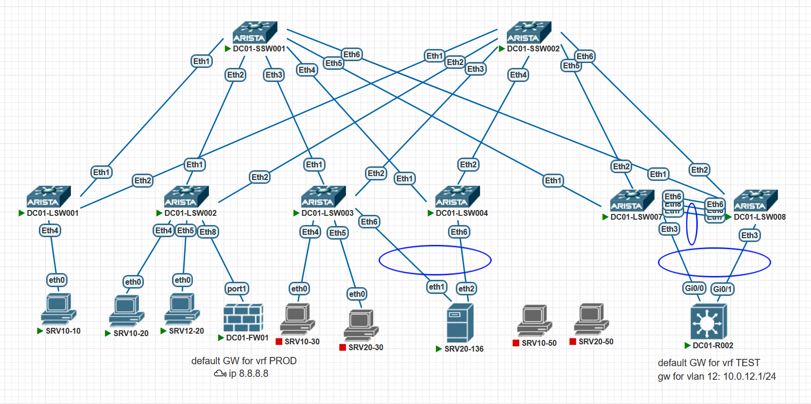
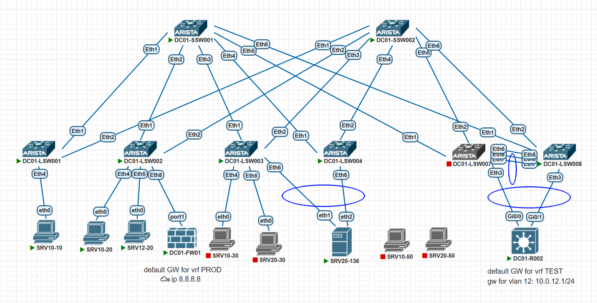
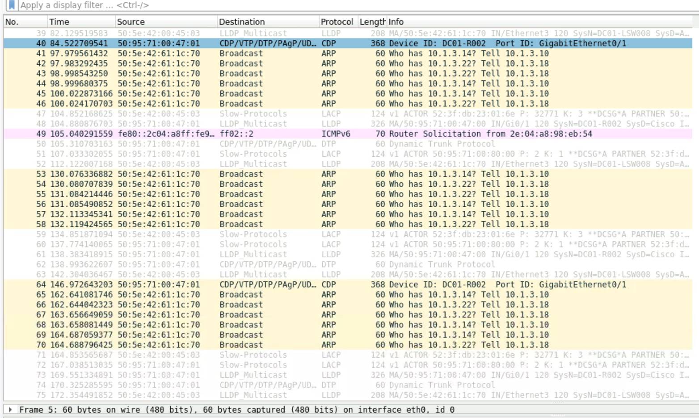

# Задание:

1. настроить отказоустойчивое подключение клиентов с использованием EVPN Multihoming.


# Решение:

1. [Создание, документация сети](#создание-сети)
2. [Проверка IP связности](#проверка-доступности)
3. [Дополнительное задание](#дополнительное-задание)


    
### Создание сети:
Для создания тестовой среды использованы:
- ПО Pnetlab для создания виртуального стенда;
- коммутатор Arista ver. 4.29.2F в роли SPINE в количестве 2 шт (DC01-SSW01-02);
- коммутатор Arista ver. 4.29.2F в роли LEAF в количестве 3 шт (DC01-LSW01-03);
- коммутатор Arista ver. 4.33.1.1F в роли LEAF в количестве 1 шт (DC01-LSW04);

Подключение было выполнено согласно прилагаемой схеме:




#### Описание:
- 10.255.255.X/24 - SPINE loopback IP address, где X - номер SPINE
- 10.255.254.X/24 - LEAF loopback IP address, где X - номер LEAF
- 10.255.253.0/24 - линковая подсеть для связи SPINE-LEAF. Используются /31 подсети. Четный номер - SPINE, нечетный LEAF
- 10.0.X.0/17 - сервисы, где X соотвествует VLAN ID из диапазона 1-99
- AS64512 - номер автономной системы для SPINE'ов
- AS4200000XXX - номера автономных систем для LEAF'ов, где XXX - соотвествует номеру LEAF'а с добавлением нулей в начале
- Хосты имеют именя SRVXX-YZ, где XX - номер VLAN из дипазона 01-99, Y - номер LEAF, Z - порядковый номер, начиная с 0. IP-адрес хоста при этом будет в формате 10.0.XX.YZ/24.
- Используем схему VLAN-BASED
- VNI в формате XXYYYY, где XX - номер ЦОД, YYYY - номер VLAN


#### Конфигурация сетевого оборудования:
<details>
<summary><b>SPINE 1:</b></summary>

```

interface Ethernet1
   description # DC01-LSW001 #
   no switchport
   ip address 10.255.253.100/31
   arp aging timeout 300
   bfd interval 2000 min-rx 2000 multiplier 5
!
interface Ethernet2
   description # DC01-LSW002 #
   no switchport
   ip address 10.255.253.102/31
   arp aging timeout 300
   bfd interval 2000 min-rx 2000 multiplier 5
!
interface Ethernet3
   description # DC01-LSW003 #
   no switchport
   ip address 10.255.253.104/31
   arp aging timeout 300
   bfd interval 2000 min-rx 2000 multiplier 5
!
interface Ethernet4
   description # DC01-LSW004 #
   no switchport
   ip address 10.255.253.106/31
   arp aging timeout 300
   bfd interval 2000 min-rx 2000 multiplier 5
!
interface Ethernet5
   description # DC01-LSW005 #
   no switchport
   ip address 10.255.253.112/31
   arp aging timeout 300
   bfd interval 999 min-rx 999 multiplier 5
!
interface Ethernet6
   description # DC01-LSW006 #
   no switchport
   ip address 10.255.253.114/31
   arp aging timeout 300
   bfd interval 999 min-rx 999 multiplier 5

interface Loopback0
   ip address 10.255.255.1/32
   isis enable dc01
!
interface Management1
!
ip routing
!
ip prefix-list prf_loopback_leafs seq 10 permit 10.255.254.0/24 le 32
ip prefix-list prf_loopback_spines seq 10 permit 10.255.255.0/24 le 32
!
route-map from_connected_to_bgp permit 10
   match ip address prefix-list prf_loopback_leafs
!
route-map from_connected_to_bgp permit 20
   match ip address prefix-list prf_loopback_spines
!
peer-filter pf_leafs
   10 match as-range 4200000001-4200000255 result accept
!
router bgp 64512
   router-id 10.255.255.1
   timers bgp 10 30
   maximum-paths 4 ecmp 4
   bgp listen range 10.255.253.0/24 peer-group dyn_leafs peer-filter pf_leafs
   neighbor dyn_leafs peer group
   neighbor dyn_leafs send-community extended
   neighbor 10.255.253.109 remote-as 4200000005
   neighbor 10.255.253.109 send-community extended
   neighbor 10.255.253.111 remote-as 4200000006
   neighbor 10.255.253.111 send-community extended
   !
   address-family evpn
      neighbor dyn_leafs activate
      neighbor 10.255.253.109 activate
      neighbor 10.255.253.111 activate
   !
   address-family ipv4
      neighbor dyn_leafs activate
      neighbor 10.255.253.109 activate
      neighbor 10.255.253.111 activate
      redistribute connected route-map from_connected_to_bgp
!
end


```
</details>


<details>
<summary><b>SPINE 2:</b></summary>

```


hostname DC01-SSW002
!
spanning-tree mode mstp
!
interface Ethernet1
   description # DC01-LSW001 #
   no switchport
   ip address 10.255.253.200/31
   arp aging timeout 300
   bfd interval 2000 min-rx 2000 multiplier 5
!
interface Ethernet2
   description # DC01-LSW002 #
   no switchport
   ip address 10.255.253.202/31
   arp aging timeout 300
   bfd interval 2000 min-rx 2000 multiplier 5
!
interface Ethernet3
   description # DC01-LSW003 #
   no switchport
   ip address 10.255.253.204/31
   arp aging timeout 300
   bfd interval 2000 min-rx 2000 multiplier 5
!
interface Ethernet4
   description # DC01-LSW004 #
   no switchport
   ip address 10.255.253.206/31
   arp aging timeout 300
   bfd interval 2000 min-rx 2000 multiplier 5
!
interface Ethernet5
   description # DC01-LSW005 #
   no switchport
   ip address 10.255.253.212/31
   arp aging timeout 300
   bfd interval 2000 min-rx 2000 multiplier 5
!
interface Ethernet6
   description # DC01-LSW006 #
   no switchport
   ip address 10.255.253.214/31
   arp aging timeout 300
   bfd interval 2000 min-rx 2000 multiplier 5
!
interface Loopback0
   ip address 10.255.255.2/32
   isis enable dc01
!
ip routing
!
ip prefix-list prf_loopback_leafs seq 10 permit 10.255.254.0/24 le 32
ip prefix-list prf_loopback_spines seq 10 permit 10.255.255.0/24 le 32
!
route-map from_connected_to_bgp permit 10
   match ip address prefix-list prf_loopback_leafs
!
route-map from_connected_to_bgp permit 20
   match ip address prefix-list prf_loopback_spines
!
peer-filter pf_leafs
   10 match as-range 4200000001-4200000255 result accept
!
router bgp 64512
   router-id 10.255.255.2
   timers bgp 10 30
   maximum-paths 4 ecmp 4
   bgp listen range 10.255.253.0/24 peer-group dyn_leafs peer-filter pf_leafs
   neighbor dyn_leafs peer group
   neighbor dyn_leafs send-community extended
   neighbor 10.255.253.209 remote-as 4200000005
   neighbor 10.255.253.209 send-community extended
   neighbor 10.255.253.211 remote-as 4200000006
   neighbor 10.255.253.211 send-community extended
   !
   address-family evpn
      neighbor dyn_leafs activate
      neighbor 10.255.253.209 activate
      neighbor 10.255.253.211 activate
   !
   address-family ipv4
      neighbor dyn_leafs activate
      neighbor 10.255.253.209 activate
      neighbor 10.255.253.211 activate
      redistribute connected route-map from_connected_to_bgp
!
end


```
</details>


<details>
<summary><b>LEAF 1:</b></summary>

```

hostname DC01-LSW001
!
spanning-tree mode mstp
!
clock timezone Etc/GMT-3
!
vlan 10,20
!
vrf instance PROD
   rd 4200000001:14096
!
interface Ethernet1
   description # DC01-SSW001 #
   no switchport
   ip address 10.255.253.101/31
   arp aging timeout 300
   bfd interval 2000 min-rx 2000 multiplier 5
!
interface Ethernet2
   description # DC01-SSW002 #
   no switchport
   ip address 10.255.253.201/31
   arp aging timeout 300
   bfd interval 2000 min-rx 2000 multiplier 5
!
interface Ethernet3
!
interface Ethernet4
   switchport access vlan 10
   spanning-tree portfast
!
interface Ethernet5
   switchport access vlan 10
!
interface Ethernet6
   switchport access vlan 20
!
interface Loopback0
   ip address 10.255.254.1/32
   isis enable dc01
!
interface Loopback10
   ip address 10.255.254.101/32
!
interface Management1
!
interface Vlan10
   vrf PROD
   ip address virtual 10.0.10.1/24
!
interface Vlan20
   vrf PROD
   ip address 10.0.20.1/24
!
interface Vxlan1
   vxlan source-interface Loopback10
   vxlan udp-port 4789
   vxlan vlan 10 vni 10010
   vxlan vlan 11 vni 10011
   vxlan vlan 12 vni 10012
   vxlan vlan 20 vni 10020
   vxlan vrf PROD vni 14096
   vxlan vrf TEST vni 14095
!
ip virtual-router mac-address 00:00:00:00:00:01
!
ip routing
ip routing vrf PROD
!
ip prefix-list prf_loopback_leafs seq 10 permit 10.255.254.0/24 le 32
ip prefix-list prf_loopback_spines seq 10 permit 10.255.255.0/24 le 32
!
route-map from_connected_to_bgp permit 10
   match ip address prefix-list prf_loopback_leafs
!
route-map from_connected_to_bgp permit 20
   match ip address prefix-list prf_loopback_spines
!
router bgp 4200000001
   router-id 10.255.254.1
   timers bgp 10 30
   maximum-paths 4 ecmp 4
   neighbor spines peer group
   neighbor spines remote-as 64512
   neighbor spines bfd
   neighbor spines send-community extended
   neighbor 10.255.253.100 peer group spines
   neighbor 10.255.253.200 peer group spines
   !
   vlan 10
      rd 4200000001:10010
      route-target import 64512:10
      route-target export 64512:10
      redistribute learned
   !
   vlan 20
      rd 4200000001:10020
      route-target both 64512:20
      redistribute learned
   !
   address-family evpn
      neighbor spines activate
   !
   address-family ipv4
      neighbor spines activate
      redistribute connected route-map from_connected_to_bgp
   !
   vrf PROD
      rd 4200000001:4096
      route-target import evpn 64512:4096
      route-target export evpn 64512:4096
      redistribute connected
!
end


```
</details>


LEAF 2 настроен аналогично, за исключением номеров вланов на access-портах, но добавлен eBGP стык с МСЭ вне фабрики. 

<details>
<summary><b>LEAF 2:</b></summary>

```

hostname DC01-LSW002

vlan 10-12,20
!
vrf instance PROD
!
vrf instance TEST
   rd 4200000002:14095
!
interface Ethernet1
   description # DC01-SSW001 #
   no switchport
   ip address 10.255.253.103/31
   arp aging timeout 300
   bfd interval 2000 min-rx 2000 multiplier 5
!
interface Ethernet2
   description # DC01-SSW002 #
   no switchport
   ip address 10.255.253.203/31
   arp aging timeout 300
   bfd interval 2000 min-rx 2000 multiplier 5
!
interface Ethernet3
!
interface Ethernet4
   switchport access vlan 10
   spanning-tree portfast
!
interface Ethernet5
   switchport access vlan 12
   spanning-tree portfast
   spanning-tree bpduguard enable
!
interface Ethernet6
!
interface Ethernet7
!
interface Ethernet8
   no switchport
   vrf PROD
   ip address 10.1.2.1/30
!
interface Ethernet8.11
   encapsulation dot1q vlan 11
   vrf TEST
   ip address 10.1.3.1/30
!
interface Loopback0
   ip address 10.255.254.2/32
   isis enable dc01
!
interface Loopback10
   ip address 10.255.254.102/32
!
interface Management1
!
interface Vlan10
   no autostate
   vrf PROD
   ip address virtual 10.0.10.1/24
!
interface Vxlan1
   vxlan source-interface Loopback10
   vxlan udp-port 4789
   vxlan vlan 10 vni 10010
   vxlan vlan 11 vni 10011
   vxlan vlan 12 vni 10012
   vxlan vlan 20 vni 10020
   vxlan vrf PROD vni 14096
   vxlan vrf TEST vni 14095
!
ip virtual-router mac-address 00:00:00:00:00:01
!
ip routing
ip routing vrf PROD
no ip routing vrf TEST
!
ip prefix-list AS65000_out
   seq 10 permit 10.0.0.0/8
!
ip prefix-list prf_loopback_leafs
   seq 10 permit 10.255.254.0/24 le 32
!
ip prefix-list prf_loopback_spines
   seq 10 permit 10.255.255.0/24 le 32
!
ip prefix-list rfc1918
   seq 10 permit 10.0.0.0/8 le 32
   seq 20 permit 172.16.0.0/12 le 32
   seq 40 permit 192.168.0.0/16 le 32
!
route-map AS65000_out permit 10
   match ip address prefix-list AS65000_out
   set community 65000:100 additive
!
route-map from_connected_to_bgp permit 10
   match ip address prefix-list prf_loopback_leafs
!
route-map from_connected_to_bgp permit 20
   match ip address prefix-list prf_loopback_spines
!
router bgp 4200000002
   router-id 10.255.254.2
   timers bgp 10 30
   maximum-paths 4 ecmp 4
   neighbor spines peer group
   neighbor spines remote-as 64512
   neighbor spines bfd
   neighbor spines send-community extended
   neighbor 10.1.2.2 remote-as 65000
   neighbor 10.255.253.102 peer group spines
   neighbor 10.255.253.202 peer group spines
   !
   vlan 10
      rd 4200000003:10010
      route-target import 64512:10
      route-target export 64512:10
      redistribute learned
   !
   vlan 11
      rd 4200000002:10011
      route-target both 64512:11
      redistribute learned
   !
   vlan 12
      rd 4200000002:10012
      route-target both 64512:12
      redistribute learned
   !
   vlan 20
      rd 4200000003:10020
      route-target both 64512:20
      redistribute learned
   !
   address-family evpn
      neighbor spines activate
   !
   address-family ipv4
      neighbor spines activate
      neighbor 10.1.2.2 activate
      redistribute connected route-map from_connected_to_bgp
   !
   vrf PROD
      rd 4200000002:4096
      route-target import evpn 64512:4096
      route-target export evpn 64512:4096
      neighbor 10.1.2.2 remote-as 65000
      neighbor 10.1.2.2 route-map AS65000_out out
      neighbor 10.1.2.2 send-community standard
      aggregate-address 10.0.0.0/8 advertise-only
   !
   vrf TEST
      rd 4200000002:4095
      route-target import evpn 64512:4095
      route-target export evpn 64512:4095
      redistribute connected
!
end


```

</details>

LEAF 3 и 4 настроены аналогично 1-му, кроме ASN, IP на интерфейсах. Добавлен LAG до хоста с этих коммутатров по технологии EVPN Multi-homing. Для упрощения вывожу только его конфиг.
<details>
<summary><b>LEAF 3:</b></summary>

```


interface Port-Channel6
   switchport access vlan 20
   !
   evpn ethernet-segment
      identifier 0001:50c1:5528:a4cc:0001
      designated-forwarder election algorithm preference 100
      route-target import 55:28:a4:cc:00:01
   lacp system-id 50c1.5528.a4cc
   spanning-tree portfast
   spanning-tree guard root
!
interface Ethernet6
   switchport access vlan 20
   channel-group 6 mode on
   spanning-tree portfast
   spanning-tree guard root
!

```


</details>

<details>
<summary><b>LEAF 4:</b></summary>

```

interface Port-Channel6
   switchport access vlan 20
   !
   evpn ethernet-segment
      identifier 0001:50c1:5528:a4cc:0001
      designated-forwarder election algorithm preference 50
      route-target import 55:28:a4:cc:00:01
   lacp system-id 50c1.5528.a4cc
   spanning-tree portfast
   spanning-tree guard root
!
interface Ethernet6
   switchport access vlan 20
   channel-group 6 mode on
   spanning-tree portfast
   spanning-tree guard root
!

```


</details>

LEAF 7 и 8 настроены аналогично 1-му, кроме ASN, IP на интерфейсах. Добавлен LAG до хоста с этих коммутатров по технологии MC-LAG. Через MC-LAG подлючен выход из фабрики для тестового контура

<details>
<summary><b>LEAF 7:</b></summary>

```

!
hostname DC01-LSW007
!
spanning-tree mode mstp
no spanning-tree vlan-id 4001
!
!
clock timezone Etc/GMT-3
!
vlan 10,12,20,1011-1012
!
vlan 4001
   name MLAG_PEER
   trunk group MLAG_PEER
!
vrf instance MLAG
!
vrf instance PROD
   rd 4200000007:14096
!
vrf instance TEST
!
interface Port-Channel3
   switchport trunk allowed vlan 12,1011-1012
   switchport mode trunk
   mlag 3
!
interface Port-Channel7
   switchport mode trunk
   switchport trunk group MLAG_PEER
!
interface Ethernet1
   description # DC01-SSW001 #
   no switchport
   ip address 10.255.253.113/31
   arp aging timeout 300
   bfd interval 2000 min-rx 2000 multiplier 5
!
interface Ethernet2
   description # DC01-SSW002 #
   no switchport
   ip address 10.255.253.213/31
   arp aging timeout 300
   bfd interval 2000 min-rx 2000 multiplier 5
!
interface Ethernet3
   channel-group 3 mode active
!
interface Ethernet4
!
interface Ethernet5
!
interface Ethernet6
   no switchport
   vrf MLAG
   ip address 172.16.0.0/31
!
interface Ethernet7
   description Peer-link
   switchport mode trunk
   no switchport
   channel-group 7 mode active
!
interface Ethernet8
   description Peer-link
   switchport mode trunk
   no switchport
   channel-group 7 mode active
!
interface Loopback0
   ip address 10.255.254.7/32
   isis enable dc01
!
interface Loopback10
   ip address 10.255.254.107/32
!
interface Management1
!
interface Vlan10
   vrf PROD
   ip address virtual 10.0.10.1/24
!
interface Vlan20
   vrf PROD
   ip address 10.0.20.1/24
!
interface Vlan1011
   vrf TEST
   ip address 10.1.3.9/29
!
interface Vlan1012
   vrf PROD
   ip address 10.1.3.17/29
!
interface Vlan4001
   ip address 172.16.0.5/30
!
interface Vxlan1
   vxlan source-interface Loopback10
   vxlan udp-port 4789
   vxlan vlan 10 vni 10010
   vxlan vlan 11 vni 10011
   vxlan vlan 12 vni 10012
   vxlan vlan 20 vni 10020
   vxlan vrf PROD vni 14096
   vxlan vrf TEST vni 14095
!
ip virtual-router mac-address 00:00:00:00:00:01
!
ip routing
no ip routing vrf MLAG
ip routing vrf PROD
ip routing vrf TEST
!
ip prefix-list prf_loopback_leafs seq 10 permit 10.255.254.0/24 le 32
ip prefix-list prf_loopback_spines seq 10 permit 10.255.255.0/24 le 32
!
mlag configuration
   domain-id 07
   heartbeat-interval 15000
   local-interface Vlan4001
   peer-address 172.16.0.6
   peer-address heartbeat 172.16.0.1 vrf MLAG
   peer-link Port-Channel7
   reload-delay 300
!
route-map from_connected_to_bgp permit 10
   match ip address prefix-list prf_loopback_leafs
!
route-map from_connected_to_bgp permit 20
   match ip address prefix-list prf_loopback_spines
!
router bgp 4200000007
   router-id 10.255.254.7
   timers bgp 10 30
   maximum-paths 4 ecmp 4
   neighbor spines peer group
   neighbor spines remote-as 64512
   neighbor spines bfd
   neighbor spines send-community extended
   neighbor 10.255.253.112 peer group spines
   neighbor 10.255.253.212 peer group spines
   !
   vlan 10
      rd 4200000007:10010
      route-target import 64512:10
      route-target export 64512:10
      redistribute learned
   !
   vlan 12
      rd 4200000007:10012
      route-target both 64512:12
      redistribute learned
   !
   vlan 20
      rd 4200000007:10020
      route-target both 64512:20
      redistribute learned
   !
   address-family evpn
      neighbor spines activate
   !
   address-family ipv4
      neighbor spines activate
      redistribute connected route-map from_connected_to_bgp
   !
   vrf PROD
      rd 4200000007:4096
      route-target import evpn 64512:4096
      route-target export evpn 64512:4096
      neighbor 10.1.3.22 remote-as 65001
      neighbor 10.1.3.22 timers 60 180
      redistribute connected
   !
   vrf TEST
      rd 4200000007:4095
      route-target import evpn 64512:4095
      route-target export evpn 64512:4095
      neighbor 10.1.3.14 remote-as 65001
      neighbor 10.1.3.14 timers 60 180
      redistribute connected


```


</details>


<details>
<summary><b>LEAF 8:</b></summary>

```

!
hostname DC01-LSW008
!
spanning-tree mode mstp
no spanning-tree vlan-id 4001
!
system l1
   unsupported speed action error
   unsupported error-correction action error
!
clock timezone Etc/GMT-3
!
vlan 10,12,20,1011-1012
!
vlan 4001
   name MLAG_PEER
   trunk group MLAG_PEER
!
vrf instance MLAG
!
vrf instance PROD
   rd 4200000008:14096
!
vrf instance TEST
!
interface Port-Channel3
   switchport trunk allowed vlan 12,1011-1012
   switchport mode trunk
   mlag 3
   spanning-tree bpdufilter enable
!
interface Port-Channel7
   switchport mode trunk
   switchport trunk group MLAG_PEER
!
interface Ethernet1
   description # DC01-SSW001 #
   no switchport
   ip address 10.255.253.115/31
   arp aging timeout 300
   bfd interval 2000 min-rx 2000 multiplier 5
!
interface Ethernet2
   description # DC01-SSW002 #
   no switchport
   ip address 10.255.253.215/31
   arp aging timeout 300
   bfd interval 2000 min-rx 2000 multiplier 5
!
interface Ethernet3
   channel-group 3 mode active
!
interface Ethernet4
!
interface Ethernet5
!
interface Ethernet6
   no switchport
   vrf MLAG
   ip address 172.16.0.1/31
!
interface Ethernet7
   description Peer-link
   switchport mode trunk
   no switchport
   channel-group 7 mode active
!
interface Ethernet8
   description Peer-link
   switchport mode trunk
   no switchport
   channel-group 7 mode active
!
interface Loopback0
   ip address 10.255.254.8/32
   isis enable dc01
!
interface Loopback10
   ip address 10.255.254.108/32
!
interface Management1
!
interface Vlan10
   vrf PROD
   ip address virtual 10.0.10.1/24
!
interface Vlan20
   vrf PROD
   ip address 10.0.20.1/24
!
interface Vlan1011
   vrf TEST
   ip address 10.1.3.10/29
!
interface Vlan1012
   vrf PROD
   ip address 10.1.3.18/29
!
interface Vlan4001
   ip address 172.16.0.6/30
!
interface Vxlan1
   vxlan source-interface Loopback10
   vxlan udp-port 4789
   vxlan vlan 10 vni 10010
   vxlan vlan 11 vni 10011
   vxlan vlan 12 vni 10012
   vxlan vlan 20 vni 10020
   vxlan vrf PROD vni 14096
   vxlan vrf TEST vni 14095
!
ip virtual-router mac-address 00:00:00:00:00:01
!
ip routing
no ip routing vrf MLAG
ip routing vrf PROD
ip routing vrf TEST
!
ip prefix-list prf_loopback_leafs seq 10 permit 10.255.254.0/24 le 32
ip prefix-list prf_loopback_spines seq 10 permit 10.255.255.0/24 le 32
!
mlag configuration
   domain-id 07
   heartbeat-interval 15000
   local-interface Vlan4001
   peer-address 172.16.0.5
   peer-address heartbeat 172.16.0.0 vrf MLAG
   peer-link Port-Channel7
   reload-delay 300
!
route-map from_connected_to_bgp permit 10
   match ip address prefix-list prf_loopback_leafs
!
route-map from_connected_to_bgp permit 20
   match ip address prefix-list prf_loopback_spines
!
router bgp 4200000008
   router-id 10.255.254.8
   timers bgp 10 30
   maximum-paths 4 ecmp 4
   neighbor spines peer group
   neighbor spines remote-as 64512
   neighbor spines bfd
   neighbor spines send-community extended
   neighbor 10.255.253.114 peer group spines
   neighbor 10.255.253.214 peer group spines
   !
   vlan 10
      rd 4200000008:10010
      route-target import 64512:10
      route-target export 64512:10
      redistribute learned
   !
   vlan 12
      rd 4200000008:10012
      route-target both 64512:12
      redistribute learned
   !
   vlan 20
      rd 4200000008:10020
      route-target both 64512:20
      redistribute learned
   !
   address-family evpn
      neighbor spines activate
   !
   address-family ipv4
      neighbor spines activate
      redistribute connected route-map from_connected_to_bgp
   !
   vrf PROD
      rd 4200000008:4096
      route-target import evpn 64512:4096
      route-target export evpn 64512:4096
      neighbor 10.1.3.22 remote-as 65001
      neighbor 10.1.3.22 timers 60 180
      redistribute connected
   !
   vrf TEST
      rd 4200000008:4095
      route-target import evpn 64512:4095
      route-target export evpn 64512:4095
      neighbor 10.1.3.14 remote-as 65001
      neighbor 10.1.3.14 timers 60 180
      redistribute connected
!
router multicast
   ipv4
      software-forwarding kernel
   !
   ipv6
      software-forwarding kernel
!
end


```


</details>


<details>
<summary><b>DC01-FW001:</b></summary>

```

DC01-FW01 # show system interface port1.11
config system interface
    edit "port1.11"
        set vdom "root"
        set ip 10.1.3.2 255.255.255.252
        set allowaccess ping
        set device-identification enable
        set role lan
        set snmp-index 10
        set interface "port1"
        set vlanid 11
    next
    edit "loopback0"
        set vdom "root"
        set ip 8.8.8.8 255.255.255.255
        set allowaccess ping
        set type loopback
        set snmp-index 9
    next

end

config router bgp
    set as 65000
    set keepalive-timer 10
    set holdtime-timer 30
    set graceful-restart enable
    config neighbor
        edit "10.1.2.1"
            set capability-graceful-restart enable
            set capability-default-originate enable
            set remote-as 4200000002
        next
    end
    config network
        edit 1
            set prefix 8.8.8.8 255.255.255.255
        next
    end
    config redistribute "connected"
    end
    config redistribute "rip"
    end
    config redistribute "ospf"
    end
    config redistribute "static"
        set status enable
    end
    config redistribute "isis"
    end
    config redistribute6 "connected"
    end
    config redistribute6 "rip"
    end
    config redistribute6 "ospf"
    end
    config redistribute6 "static"
    end
    config redistribute6 "isis"
    end
end


```


</details>


<details>
<summary><b>DC01-R002:</b></summary>

```

hostname DC01-R002
!


spanning-tree mode mst
spanning-tree extend system-id
!
!
vlan 1011-1012
lldp run
!
interface Port-channel1
 switchport trunk allowed vlan 12,1011,1012
 switchport trunk encapsulation dot1q
 switchport mode trunk
 spanning-tree bpdufilter enable
!
interface GigabitEthernet0/0
 switchport trunk allowed vlan 12,1011,1012
 switchport trunk encapsulation dot1q
 switchport mode trunk
 no negotiation auto
 channel-group 1 mode active
 spanning-tree bpdufilter enable
!
interface GigabitEthernet0/1
 switchport trunk allowed vlan 12,1011,1012
 switchport trunk encapsulation dot1q
 switchport mode trunk
 no negotiation auto
 channel-group 1 mode active
 spanning-tree bpdufilter enable
!

interface Vlan12
 ip address 10.0.12.1 255.255.255.0
!
interface Vlan1011
 ip address 10.1.3.14 255.255.255.248
!
interface Vlan1012
 ip address 10.1.3.22 255.255.255.248
!
router bgp 65001
 bgp router-id 10.1.3.22
 bgp log-neighbor-changes
 redistribute connected
 neighbor 10.1.3.9 remote-as 4200000007
 neighbor 10.1.3.9 default-originate
 neighbor 10.1.3.9 as-override
 neighbor 10.1.3.10 remote-as 4200000008
 neighbor 10.1.3.10 default-originate
 neighbor 10.1.3.10 as-override
 neighbor 10.1.3.17 remote-as 4200000007
 neighbor 10.1.3.17 as-override
 neighbor 10.1.3.18 remote-as 4200000008
 neighbor 10.1.3.18 as-override
!


```


</details>


#### Конфигурация хостов:
<details>
<summary><b>SRV10-10:</b></summary>

```
NAME   IP/MASK              GATEWAY           MAC                DNS
VPCS1  10.0.10.10/24        10.0.10.1         00:50:79:66:68:29  10.1.0.2
```
</details>
<details>
<summary><b>SRV10-30:</b></summary>

```
NAME   IP/MASK              GATEWAY           MAC                DNS
VPCS1  10.0.10.30/24        10.0.10.1         00:50:79:66:68:2b  10.1.0.10
```
</details>
<details>
<summary><b>SRV20-30:</b></summary>

```
NAME   IP/MASK              GATEWAY           MAC                DNS
VPCS1  10.0.20.30/24        10.0.20.1         00:50:79:66:68:38  10.0.1.10
```
</details>

<details>
<summary><b>SRV20-136:</b></summary>

```

Eth1, eth2 Объединены в Bond0, ip add 10.0.20.136, gw 10.0.20.1
bond0: flags=5187<UP,BROADCAST,RUNNING,MASTER,MULTICAST>  mtu 1500
        inet 10.0.20.136  netmask 255.255.255.0  broadcast 0.0.0.0
        ether 50:00:00:43:00:01  txqueuelen 1000  (Ethernet)
        RX packets 7343  bytes 872251 (872.2 KB)
        RX errors 0  dropped 217  overruns 0  frame 0
        TX packets 531  bytes 47606 (47.6 KB)
        TX errors 0  dropped 0 overruns 0  carrier 0  collisions 0


```
</details>


📥 [Скачать](./configs)  файлы лабы в текстовом формате 

#### Выполненная работа:
В текущую конфигурацию 2х LEAF 3x SPINE Добавлен LEAF 4 с ПО, версия которого немного отличается от LEAF 3. На основе LEAF 3 и 4 был создан etherchannel для хоста SRV20-136. ESI выбран по формуле: 0001.мак_"главного"_свича.порядковый_номер_etherchannel'a, lacp id равен маку "главного" коммутатора в etherchannel'e. Пробовали добавить cisco Nexus - после многочисленных проблем было принято отказаться по причине нестабильной работы образа, потому LEAF 5 и 6 были заменены на LEAF 7 и 8 вендора ARISTA, на которых был построен MC-LAG вместо предполагаемого vPC на нексусах. К LEAF 7 и 8 был подключен МСЭ через MC-LAG. К сожалению, на образе МСЭ Fortigate в эмуляторе не работает маршрутизация через сабыинтерфейсы на LAG, потому пришлось его заменить. Образ маршрутизатора cisco не поддерживает port-channel, потому был выбрал в качестве замены МСЭ образ L3-коммутатора cisco Catalyst, выполняющий эмуляцию МСЭ. 

В лабоработории созданы 2 независимых IP-контура: TEST и PROD. Используются два независимых выхода в интернет: PROD выходит через МСЭ DC01-FW001, а TEST через DC01-R002. В PROD используется ANYCAST GW, в TEST используется как ANYCAST GW, так и прозрачный транспорт по L2 до GW, расположенному на DC01-R002.

Маршрутизация между vrf TEST и PROD осуществеляется через DC01-R002, выполняющего роль МСЭ между "тестовым" и "продуктивным" контуром организации.

Производительности не хватало на работу BFD, его пришлось отключить. Также пришлось увеличить таймеры BGP с 3 9 до 10 30.

### Проверка доступности: 
Проверка выполняется на каждом из коммутаторов по следующим критериям:
 - просмотр BGP топологии и соседей;
 - просмотр таблицы маршрутизации на каждом коммутаторе;
 - проверка связности посредством icmp echo request.
 

Проверка на LEAF 1:
<details>
<summary><b>LEAF 1:</b></summary>

```


```
</details>


Проверка на LEAF 3:
<details>
<summary><b>LEAF 3:</b></summary>

```


```
</details>


Проверка на LEAF 4:
<details>
<summary><b>LEAF 4:</b></summary>

```


```
</details>


Команды для проверки:
<details>
<summary><b>DC01-R002:</b></summary>

```


DC01-R002#               show ip route
Codes: L - local, C - connected, S - static, R - RIP, M - mobile, B - BGP
       D - EIGRP, EX - EIGRP external, O - OSPF, IA - OSPF inter area
       N1 - OSPF NSSA external type 1, N2 - OSPF NSSA external type 2
       E1 - OSPF external type 1, E2 - OSPF external type 2
       i - IS-IS, su - IS-IS summary, L1 - IS-IS level-1, L2 - IS-IS level-2
       ia - IS-IS inter area, * - candidate default, U - per-user static route
       o - ODR, P - periodic downloaded static route, H - NHRP, l - LISP
       a - application route
       + - replicated route, % - next hop override, p - overrides from PfR

Gateway of last resort is 10.1.3.17 to network 0.0.0.0

B*    0.0.0.0/0 [20/0] via 10.1.3.17, 00:04:13
      8.0.0.0/32 is subnetted, 1 subnets
B        8.8.8.8 [20/0] via 10.1.3.17, 00:04:13
      10.0.0.0/8 is variably subnetted, 11 subnets, 4 masks
B        10.0.10.0/24 [20/0] via 10.1.3.17, 00:04:13
B        10.0.10.10/32 [20/0] via 10.1.3.17, 00:00:55
C        10.0.12.0/24 is directly connected, Vlan12
L        10.0.12.1/32 is directly connected, Vlan12
B        10.0.20.0/24 [20/0] via 10.1.3.17, 00:04:13
B        10.0.20.136/32 [20/0] via 10.1.3.17, 00:00:35
B        10.1.3.0/30 [20/0] via 10.1.3.9, 00:04:13
C        10.1.3.8/29 is directly connected, Vlan1011
L        10.1.3.14/32 is directly connected, Vlan1011
C        10.1.3.16/29 is directly connected, Vlan1012
L        10.1.3.22/32 is directly connected, Vlan1012
DC01-R002#


```
</details>


<details>
<summary><b>DC01-FW001</b></summary>

```


DC01-FW01 # get router info routing-table all
Codes: K - kernel, C - connected, S - static, R - RIP, B - BGP
       O - OSPF, IA - OSPF inter area
       N1 - OSPF NSSA external type 1, N2 - OSPF NSSA external type 2
       E1 - OSPF external type 1, E2 - OSPF external type 2
       i - IS-IS, L1 - IS-IS level-1, L2 - IS-IS level-2, ia - IS-IS inter area
       V - BGP VPNv4
       * - candidate default

Routing table for VRF=0
S*      0.0.0.0/0 [250/0] is a summary, Null, [1/0]
C       8.8.8.8/32 is directly connected, loopback0
B       10.0.0.0/8 [20/0] via 10.1.2.1 (recursive is directly connected, port1), 00:06:32, [1/0]
C       10.1.2.0/30 is directly connected, port1
C       10.1.3.0/30 is directly connected, port1.11


```
</details>

<details>
<summary><b>DC01-LSW001:</b></summary>

```


DC01-LSW001#show ip route vrf TEST
% IP Routing table for VRF TEST does not exist.
DC01-LSW001#show ip route vrf PROD

VRF: PROD
Codes: C - connected, S - static, K - kernel,
       O - OSPF, IA - OSPF inter area, E1 - OSPF external type 1,
       E2 - OSPF external type 2, N1 - OSPF NSSA external type 1,
       N2 - OSPF NSSA external type2, B - Other BGP Routes,
       B I - iBGP, B E - eBGP, R - RIP, I L1 - IS-IS level 1,
       I L2 - IS-IS level 2, O3 - OSPFv3, A B - BGP Aggregate,
       A O - OSPF Summary, NG - Nexthop Group Static Route,
       V - VXLAN Control Service, M - Martian,
       DH - DHCP client installed default route,
       DP - Dynamic Policy Route, L - VRF Leaked,
       G  - gRIBI, RC - Route Cache Route

Gateway of last resort:
 B E      0.0.0.0/0 [200/0] via VTEP 10.255.254.102 VNI 14096 router-mac 50:1e:8d:02:2c:78 local-interface Vxlan1

 B E      8.8.8.8/32 [200/0] via VTEP 10.255.254.102 VNI 14096 router-mac 50:1e:8d:02:2c:78 local-interface Vxlan1
 C        10.0.10.0/24 is directly connected, Vlan10
 B E      10.0.12.0/24 [200/0] via VTEP 10.255.254.107 VNI 14096 router-mac 50:3f:db:23:01:6e local-interface Vxlan1
                               via VTEP 10.255.254.108 VNI 14096 router-mac 50:5e:42:61:1c:70 local-interface Vxlan1
 B E      10.0.20.136/32 [200/0] via VTEP 10.255.254.103 VNI 14096 router-mac 50:27:d2:e6:4a:b8 local-interface Vxlan1
 C        10.0.20.0/24 is directly connected, Vlan20
 B E      10.1.3.8/29 [200/0] via VTEP 10.255.254.107 VNI 14096 router-mac 50:3f:db:23:01:6e local-interface Vxlan1
                              via VTEP 10.255.254.108 VNI 14096 router-mac 50:5e:42:61:1c:70 local-interface Vxlan1
 B E      10.1.3.16/29 [200/0] via VTEP 10.255.254.107 VNI 14096 router-mac 50:3f:db:23:01:6e local-interface Vxlan1
                               via VTEP 10.255.254.108 VNI 14096 router-mac 50:5e:42:61:1c:70 local-interface Vxlan1

DC01-LSW001#show bgp evpn
BGP routing table information for VRF default
Router identifier 10.255.254.1, local AS number 4200000001
Route status codes: * - valid, > - active, S - Stale, E - ECMP head, e - ECMP
                    c - Contributing to ECMP, % - Pending BGP convergence
Origin codes: i - IGP, e - EGP, ? - incomplete
AS Path Attributes: Or-ID - Originator ID, C-LST - Cluster List, LL Nexthop - Link Local Nexthop

          Network                Next Hop              Metric  LocPref Weight  Path
 * >Ec    RD: 4200000003:10020 auto-discovery 0 0001:50c1:5528:a4cc:0001
                                 10.255.254.103        -       100     0       64512 4200000003 i
 *  ec    RD: 4200000003:10020 auto-discovery 0 0001:50c1:5528:a4cc:0001
                                 10.255.254.103        -       100     0       64512 4200000003 i
 * >Ec    RD: 4200000004:10020 auto-discovery 0 0001:50c1:5528:a4cc:0001
                                 10.255.254.104        -       100     0       64512 4200000004 i
 *  ec    RD: 4200000004:10020 auto-discovery 0 0001:50c1:5528:a4cc:0001
                                 10.255.254.104        -       100     0       64512 4200000004 i
 * >Ec    RD: 10.255.254.103:1 auto-discovery 0001:50c1:5528:a4cc:0001
                                 10.255.254.103        -       100     0       64512 4200000003 i
 *  ec    RD: 10.255.254.103:1 auto-discovery 0001:50c1:5528:a4cc:0001
                                 10.255.254.103        -       100     0       64512 4200000003 i
 * >Ec    RD: 10.255.254.104:1 auto-discovery 0001:50c1:5528:a4cc:0001
                                 10.255.254.104        -       100     0       64512 4200000004 i
 *  ec    RD: 10.255.254.104:1 auto-discovery 0001:50c1:5528:a4cc:0001
                                 10.255.254.104        -       100     0       64512 4200000004 i
 * >      RD: 4200000001:10010 mac-ip 0050.7966.6829
                                 -                     -       -       0       i
 * >      RD: 4200000001:10010 mac-ip 0050.7966.6829 10.0.10.10
                                 -                     -       -       0       i
 * >Ec    RD: 4200000003:10020 mac-ip 5000.0043.0001
                                 10.255.254.103        -       100     0       64512 4200000003 i
 *  ec    RD: 4200000003:10020 mac-ip 5000.0043.0001
                                 10.255.254.103        -       100     0       64512 4200000003 i
 * >Ec    RD: 4200000003:10020 mac-ip 5000.0043.0001 10.0.20.136
                                 10.255.254.103        -       100     0       64512 4200000003 i
 *  ec    RD: 4200000003:10020 mac-ip 5000.0043.0001 10.0.20.136
                                 10.255.254.103        -       100     0       64512 4200000003 i
 * >Ec    RD: 4200000004:10020 mac-ip 5000.0043.0001 10.0.20.136
                                 10.255.254.104        -       100     0       64512 4200000004 i
 *  ec    RD: 4200000004:10020 mac-ip 5000.0043.0001 10.0.20.136
                                 10.255.254.104        -       100     0       64512 4200000004 i
 * >Ec    RD: 4200000007:10012 mac-ip 5095.7100.800c
                                 10.255.254.107        -       100     0       64512 4200000007 i
 *  ec    RD: 4200000007:10012 mac-ip 5095.7100.800c
                                 10.255.254.107        -       100     0       64512 4200000007 i
 * >Ec    RD: 4200000008:10012 mac-ip 5095.7100.800c
                                 10.255.254.108        -       100     0       64512 4200000008 i
 *  ec    RD: 4200000008:10012 mac-ip 5095.7100.800c
                                 10.255.254.108        -       100     0       64512 4200000008 i
 * >      RD: 4200000001:10010 imet 10.255.254.101
                                 -                     -       -       0       i
 * >      RD: 4200000001:10020 imet 10.255.254.101
                                 -                     -       -       0       i
 * >Ec    RD: 4200000002:10011 imet 10.255.254.102
                                 10.255.254.102        -       100     0       64512 4200000002 i
 *  ec    RD: 4200000002:10011 imet 10.255.254.102
                                 10.255.254.102        -       100     0       64512 4200000002 i
 * >Ec    RD: 4200000002:10012 imet 10.255.254.102
                                 10.255.254.102        -       100     0       64512 4200000002 i
 *  ec    RD: 4200000002:10012 imet 10.255.254.102
                                 10.255.254.102        -       100     0       64512 4200000002 i
 * >Ec    RD: 4200000003:10010 imet 10.255.254.102
                                 10.255.254.102        -       100     0       64512 4200000002 i
 *  ec    RD: 4200000003:10010 imet 10.255.254.102
                                 10.255.254.102        -       100     0       64512 4200000002 i
 * >Ec    RD: 4200000003:10020 imet 10.255.254.102
                                 10.255.254.102        -       100     0       64512 4200000002 i
 *  ec    RD: 4200000003:10020 imet 10.255.254.102
                                 10.255.254.102        -       100     0       64512 4200000002 i
 * >Ec    RD: 4200000003:10010 imet 10.255.254.103
                                 10.255.254.103        -       100     0       64512 4200000003 i
 *  ec    RD: 4200000003:10010 imet 10.255.254.103
                                 10.255.254.103        -       100     0       64512 4200000003 i
 * >Ec    RD: 4200000003:10011 imet 10.255.254.103
                                 10.255.254.103        -       100     0       64512 4200000003 i
 *  ec    RD: 4200000003:10011 imet 10.255.254.103
                                 10.255.254.103        -       100     0       64512 4200000003 i
 * >Ec    RD: 4200000003:10012 imet 10.255.254.103
                                 10.255.254.103        -       100     0       64512 4200000003 i
 *  ec    RD: 4200000003:10012 imet 10.255.254.103
                                 10.255.254.103        -       100     0       64512 4200000003 i
 * >Ec    RD: 4200000003:10020 imet 10.255.254.103
                                 10.255.254.103        -       100     0       64512 4200000003 i
 *  ec    RD: 4200000003:10020 imet 10.255.254.103
                                 10.255.254.103        -       100     0       64512 4200000003 i
 * >Ec    RD: 4200000004:10010 imet 10.255.254.104
                                 10.255.254.104        -       100     0       64512 4200000004 i
 *  ec    RD: 4200000004:10010 imet 10.255.254.104
                                 10.255.254.104        -       100     0       64512 4200000004 i
 * >Ec    RD: 4200000004:10020 imet 10.255.254.104
                                 10.255.254.104        -       100     0       64512 4200000004 i
 *  ec    RD: 4200000004:10020 imet 10.255.254.104
                                 10.255.254.104        -       100     0       64512 4200000004 i
 * >Ec    RD: 4200000007:10010 imet 10.255.254.107
                                 10.255.254.107        -       100     0       64512 4200000007 i
 *  ec    RD: 4200000007:10010 imet 10.255.254.107
                                 10.255.254.107        -       100     0       64512 4200000007 i
 * >Ec    RD: 4200000007:10012 imet 10.255.254.107
                                 10.255.254.107        -       100     0       64512 4200000007 i
 *  ec    RD: 4200000007:10012 imet 10.255.254.107
                                 10.255.254.107        -       100     0       64512 4200000007 i
 * >Ec    RD: 4200000007:10020 imet 10.255.254.107
                                 10.255.254.107        -       100     0       64512 4200000007 i
 *  ec    RD: 4200000007:10020 imet 10.255.254.107
                                 10.255.254.107        -       100     0       64512 4200000007 i
 * >Ec    RD: 4200000008:10010 imet 10.255.254.108
                                 10.255.254.108        -       100     0       64512 4200000008 i
 *  ec    RD: 4200000008:10010 imet 10.255.254.108
                                 10.255.254.108        -       100     0       64512 4200000008 i
 * >Ec    RD: 4200000008:10012 imet 10.255.254.108
                                 10.255.254.108        -       100     0       64512 4200000008 i
 *  ec    RD: 4200000008:10012 imet 10.255.254.108
                                 10.255.254.108        -       100     0       64512 4200000008 i
 * >Ec    RD: 4200000008:10020 imet 10.255.254.108
                                 10.255.254.108        -       100     0       64512 4200000008 i
 *  ec    RD: 4200000008:10020 imet 10.255.254.108
                                 10.255.254.108        -       100     0       64512 4200000008 i
 * >Ec    RD: 10.255.254.103:1 ethernet-segment 0001:50c1:5528:a4cc:0001 10.255.254.103
                                 10.255.254.103        -       100     0       64512 4200000003 i
 *  ec    RD: 10.255.254.103:1 ethernet-segment 0001:50c1:5528:a4cc:0001 10.255.254.103
                                 10.255.254.103        -       100     0       64512 4200000003 i
 * >Ec    RD: 10.255.254.104:1 ethernet-segment 0001:50c1:5528:a4cc:0001 10.255.254.104
                                 10.255.254.104        -       100     0       64512 4200000004 i
 *  ec    RD: 10.255.254.104:1 ethernet-segment 0001:50c1:5528:a4cc:0001 10.255.254.104
                                 10.255.254.104        -       100     0       64512 4200000004 i
 * >Ec    RD: 4200000002:4096 ip-prefix 0.0.0.0/0
                                 10.255.254.102        -       100     0       64512 4200000002 65000 i
 *  ec    RD: 4200000002:4096 ip-prefix 0.0.0.0/0
                                 10.255.254.102        -       100     0       64512 4200000002 65000 i
 * >Ec    RD: 4200000007:4095 ip-prefix 0.0.0.0/0
                                 10.255.254.107        -       100     0       64512 4200000007 65001 i
 *  ec    RD: 4200000007:4095 ip-prefix 0.0.0.0/0
                                 10.255.254.107        -       100     0       64512 4200000007 65001 i
 * >Ec    RD: 4200000008:4095 ip-prefix 0.0.0.0/0
                                 10.255.254.108        -       100     0       64512 4200000008 65001 i
 *  ec    RD: 4200000008:4095 ip-prefix 0.0.0.0/0
                                 10.255.254.108        -       100     0       64512 4200000008 65001 i
 * >Ec    RD: 4200000002:4096 ip-prefix 8.8.8.8/32
                                 10.255.254.102        -       100     0       64512 4200000002 65000 i
 *  ec    RD: 4200000002:4096 ip-prefix 8.8.8.8/32
                                 10.255.254.102        -       100     0       64512 4200000002 65000 i
 * >      RD: 4200000001:4096 ip-prefix 10.0.10.0/24
                                 -                     -       -       0       i
 * >Ec    RD: 4200000003:4096 ip-prefix 10.0.10.0/24
                                 10.255.254.103        -       100     0       64512 4200000003 i
 *  ec    RD: 4200000003:4096 ip-prefix 10.0.10.0/24
                                 10.255.254.103        -       100     0       64512 4200000003 i
 * >Ec    RD: 4200000007:4095 ip-prefix 10.0.10.0/24
                                 10.255.254.107        -       100     0       64512 4200000007 65001 65001 i
 *  ec    RD: 4200000007:4095 ip-prefix 10.0.10.0/24
                                 10.255.254.107        -       100     0       64512 4200000007 65001 65001 i
 * >Ec    RD: 4200000007:4096 ip-prefix 10.0.10.0/24
                                 10.255.254.107        -       100     0       64512 4200000007 i
 *  ec    RD: 4200000007:4096 ip-prefix 10.0.10.0/24
                                 10.255.254.107        -       100     0       64512 4200000007 i
 * >Ec    RD: 4200000008:4095 ip-prefix 10.0.10.0/24
                                 10.255.254.108        -       100     0       64512 4200000008 65001 4200000007 i
 *  ec    RD: 4200000008:4095 ip-prefix 10.0.10.0/24
                                 10.255.254.108        -       100     0       64512 4200000008 65001 4200000007 i
 * >Ec    RD: 4200000008:4096 ip-prefix 10.0.10.0/24
                                 10.255.254.108        -       100     0       64512 4200000008 i
 *  ec    RD: 4200000008:4096 ip-prefix 10.0.10.0/24
                                 10.255.254.108        -       100     0       64512 4200000008 i
 * >Ec    RD: 4200000007:4095 ip-prefix 10.0.12.0/24
                                 10.255.254.107        -       100     0       64512 4200000007 65001 ?
 *  ec    RD: 4200000007:4095 ip-prefix 10.0.12.0/24
                                 10.255.254.107        -       100     0       64512 4200000007 65001 ?
 * >Ec    RD: 4200000007:4096 ip-prefix 10.0.12.0/24
                                 10.255.254.107        -       100     0       64512 4200000007 65001 ?
 *  ec    RD: 4200000007:4096 ip-prefix 10.0.12.0/24
                                 10.255.254.107        -       100     0       64512 4200000007 65001 ?
 * >Ec    RD: 4200000008:4095 ip-prefix 10.0.12.0/24
                                 10.255.254.108        -       100     0       64512 4200000008 65001 ?
 *  ec    RD: 4200000008:4095 ip-prefix 10.0.12.0/24
                                 10.255.254.108        -       100     0       64512 4200000008 65001 ?
 * >Ec    RD: 4200000008:4096 ip-prefix 10.0.12.0/24
                                 10.255.254.108        -       100     0       64512 4200000008 65001 ?
 *  ec    RD: 4200000008:4096 ip-prefix 10.0.12.0/24
                                 10.255.254.108        -       100     0       64512 4200000008 65001 ?
 * >      RD: 4200000001:4096 ip-prefix 10.0.20.0/24
                                 -                     -       -       0       i
 * >Ec    RD: 4200000003:4096 ip-prefix 10.0.20.0/24
                                 10.255.254.103        -       100     0       64512 4200000003 i
 *  ec    RD: 4200000003:4096 ip-prefix 10.0.20.0/24
                                 10.255.254.103        -       100     0       64512 4200000003 i
 * >Ec    RD: 4200000007:4095 ip-prefix 10.0.20.0/24
                                 10.255.254.107        -       100     0       64512 4200000007 65001 65001 i
 *  ec    RD: 4200000007:4095 ip-prefix 10.0.20.0/24
                                 10.255.254.107        -       100     0       64512 4200000007 65001 65001 i
 * >Ec    RD: 4200000007:4096 ip-prefix 10.0.20.0/24
                                 10.255.254.107        -       100     0       64512 4200000007 i
 *  ec    RD: 4200000007:4096 ip-prefix 10.0.20.0/24
                                 10.255.254.107        -       100     0       64512 4200000007 i
 * >Ec    RD: 4200000008:4095 ip-prefix 10.0.20.0/24
                                 10.255.254.108        -       100     0       64512 4200000008 65001 4200000007 i
 *  ec    RD: 4200000008:4095 ip-prefix 10.0.20.0/24
                                 10.255.254.108        -       100     0       64512 4200000008 65001 4200000007 i
 * >Ec    RD: 4200000008:4096 ip-prefix 10.0.20.0/24
                                 10.255.254.108        -       100     0       64512 4200000008 i
 *  ec    RD: 4200000008:4096 ip-prefix 10.0.20.0/24
                                 10.255.254.108        -       100     0       64512 4200000008 i
 * >Ec    RD: 4200000002:4095 ip-prefix 10.1.3.0/30
                                 10.255.254.102        -       100     0       64512 4200000002 i
 *  ec    RD: 4200000002:4095 ip-prefix 10.1.3.0/30
                                 10.255.254.102        -       100     0       64512 4200000002 i
 * >Ec    RD: 4200000007:4095 ip-prefix 10.1.3.8/29
                                 10.255.254.107        -       100     0       64512 4200000007 i
 *  ec    RD: 4200000007:4095 ip-prefix 10.1.3.8/29
                                 10.255.254.107        -       100     0       64512 4200000007 i
 * >Ec    RD: 4200000007:4096 ip-prefix 10.1.3.8/29
                                 10.255.254.107        -       100     0       64512 4200000007 65001 ?
 *  ec    RD: 4200000007:4096 ip-prefix 10.1.3.8/29
                                 10.255.254.107        -       100     0       64512 4200000007 65001 ?
 * >Ec    RD: 4200000008:4095 ip-prefix 10.1.3.8/29
                                 10.255.254.108        -       100     0       64512 4200000008 i
 *  ec    RD: 4200000008:4095 ip-prefix 10.1.3.8/29
                                 10.255.254.108        -       100     0       64512 4200000008 i
 * >Ec    RD: 4200000008:4096 ip-prefix 10.1.3.8/29
                                 10.255.254.108        -       100     0       64512 4200000008 65001 ?
 *  ec    RD: 4200000008:4096 ip-prefix 10.1.3.8/29
                                 10.255.254.108        -       100     0       64512 4200000008 65001 ?
 * >Ec    RD: 4200000007:4095 ip-prefix 10.1.3.16/29
                                 10.255.254.107        -       100     0       64512 4200000007 65001 ?
 *  ec    RD: 4200000007:4095 ip-prefix 10.1.3.16/29
                                 10.255.254.107        -       100     0       64512 4200000007 65001 ?
 * >Ec    RD: 4200000007:4096 ip-prefix 10.1.3.16/29
                                 10.255.254.107        -       100     0       64512 4200000007 i
 *  ec    RD: 4200000007:4096 ip-prefix 10.1.3.16/29
                                 10.255.254.107        -       100     0       64512 4200000007 i
 * >Ec    RD: 4200000008:4095 ip-prefix 10.1.3.16/29
                                 10.255.254.108        -       100     0       64512 4200000008 65001 ?
 *  ec    RD: 4200000008:4095 ip-prefix 10.1.3.16/29
                                 10.255.254.108        -       100     0       64512 4200000008 65001 ?
 * >Ec    RD: 4200000008:4096 ip-prefix 10.1.3.16/29
                                 10.255.254.108        -       100     0       64512 4200000008 i
 *  ec    RD: 4200000008:4096 ip-prefix 10.1.3.16/29
                                 10.255.254.108        -       100     0       64512 4200000008 i
DC01-LSW001#


```
</details>

<details>
<summary><b>DC01-LSW002:</b></summary>

```
DC01-LSW002#show ip route vrf TEST

VRF: TEST
Codes: C - connected, S - static, K - kernel,
       O - OSPF, IA - OSPF inter area, E1 - OSPF external type 1,
       E2 - OSPF external type 2, N1 - OSPF NSSA external type 1,
       N2 - OSPF NSSA external type2, B - Other BGP Routes,
       B I - iBGP, B E - eBGP, R - RIP, I L1 - IS-IS level 1,
       I L2 - IS-IS level 2, O3 - OSPFv3, A B - BGP Aggregate,
       A O - OSPF Summary, NG - Nexthop Group Static Route,
       V - VXLAN Control Service, M - Martian,
       DH - DHCP client installed default route,
       DP - Dynamic Policy Route, L - VRF Leaked,
       G  - gRIBI, RC - Route Cache Route

Gateway of last resort:
 B E      0.0.0.0/0 [200/0] via VTEP 10.255.254.108 VNI 14095 router-mac 50:5e:42:61:1c:70 local-interface Vxlan1
                            via VTEP 10.255.254.107 VNI 14095 router-mac 50:3f:db:23:01:6e local-interface Vxlan1

 B E      10.0.10.0/24 [200/0] via VTEP 10.255.254.108 VNI 14095 router-mac 50:5e:42:61:1c:70 local-interface Vxlan1
                               via VTEP 10.255.254.107 VNI 14095 router-mac 50:3f:db:23:01:6e local-interface Vxlan1
 B E      10.0.12.0/24 [200/0] via VTEP 10.255.254.108 VNI 14095 router-mac 50:5e:42:61:1c:70 local-interface Vxlan1
                               via VTEP 10.255.254.107 VNI 14095 router-mac 50:3f:db:23:01:6e local-interface Vxlan1
 B E      10.0.20.0/24 [200/0] via VTEP 10.255.254.108 VNI 14095 router-mac 50:5e:42:61:1c:70 local-interface Vxlan1
                               via VTEP 10.255.254.107 VNI 14095 router-mac 50:3f:db:23:01:6e local-interface Vxlan1
 C        10.1.3.0/30 is directly connected, Ethernet8.11
 B E      10.1.3.8/29 [200/0] via VTEP 10.255.254.108 VNI 14095 router-mac 50:5e:42:61:1c:70 local-interface Vxlan1
                              via VTEP 10.255.254.107 VNI 14095 router-mac 50:3f:db:23:01:6e local-interface Vxlan1
 B E      10.1.3.16/29 [200/0] via VTEP 10.255.254.108 VNI 14095 router-mac 50:5e:42:61:1c:70 local-interface Vxlan1
                               via VTEP 10.255.254.107 VNI 14095 router-mac 50:3f:db:23:01:6e local-interface Vxlan1

DC01-LSW002#  sh ip route vrf PROD

VRF: PROD
Codes: C - connected, S - static, K - kernel,
       O - OSPF, IA - OSPF inter area, E1 - OSPF external type 1,
       E2 - OSPF external type 2, N1 - OSPF NSSA external type 1,
       N2 - OSPF NSSA external type2, B - Other BGP Routes,
       B I - iBGP, B E - eBGP, R - RIP, I L1 - IS-IS level 1,
       I L2 - IS-IS level 2, O3 - OSPFv3, A B - BGP Aggregate,
       A O - OSPF Summary, NG - Nexthop Group Static Route,
       V - VXLAN Control Service, M - Martian,
       DH - DHCP client installed default route,
       DP - Dynamic Policy Route, L - VRF Leaked,
       G  - gRIBI, RC - Route Cache Route

Gateway of last resort:
 B E      0.0.0.0/0 [200/0] via 10.1.2.2, Ethernet8

 B E      8.8.8.8/32 [200/0] via 10.1.2.2, Ethernet8
 B E      10.0.10.10/32 [200/0] via VTEP 10.255.254.101 VNI 14096 router-mac 50:88:7f:51:e6:16 local-interface Vxlan1
 C        10.0.10.0/24 is directly connected, Vlan10
 B E      10.0.12.0/24 [200/0] via VTEP 10.255.254.107 VNI 14096 router-mac 50:3f:db:23:01:6e local-interface Vxlan1
                               via VTEP 10.255.254.108 VNI 14096 router-mac 50:5e:42:61:1c:70 local-interface Vxlan1
 B E      10.0.20.136/32 [200/0] via VTEP 10.255.254.103 VNI 14096 router-mac 50:27:d2:e6:4a:b8 local-interface Vxlan1
 B E      10.0.20.0/24 [200/0] via VTEP 10.255.254.107 VNI 14096 router-mac 50:3f:db:23:01:6e local-interface Vxlan1
                               via VTEP 10.255.254.103 VNI 14096 router-mac 50:27:d2:e6:4a:b8 local-interface Vxlan1
                               via VTEP 10.255.254.108 VNI 14096 router-mac 50:5e:42:61:1c:70 local-interface Vxlan1
                               via VTEP 10.255.254.101 VNI 14096 router-mac 50:88:7f:51:e6:16 local-interface Vxlan1
 C        10.1.2.0/30 is directly connected, Ethernet8
 B E      10.1.3.8/29 [200/0] via VTEP 10.255.254.107 VNI 14096 router-mac 50:3f:db:23:01:6e local-interface Vxlan1
                              via VTEP 10.255.254.108 VNI 14096 router-mac 50:5e:42:61:1c:70 local-interface Vxlan1
 B E      10.1.3.16/29 [200/0] via VTEP 10.255.254.107 VNI 14096 router-mac 50:3f:db:23:01:6e local-interface Vxlan1
                               via VTEP 10.255.254.108 VNI 14096 router-mac 50:5e:42:61:1c:70 local-interface Vxlan1

DC01-LSW002#  sh bgp evpn route-type ?
  auto-discovery    Filter by Ethernet auto-discovery (A-D) route (type 1)
  ethernet-segment  Filter by Ethernet segment route (type 4)
  imet              Filter by inclusive multicast Ethernet tag route (type 3)
  ip-prefix         Filter by IP prefix route (type 5)
  join-sync         Filter by multicast join sync route (type 7)
  leave-sync        Filter by multicast leave sync route (type 8)
  mac-ip            Filter by MAC/IP advertisement route (type 2)
  smet              Filter by selective multicast Ethernet tag route (type 6)
  spmsi             Filter by selective PMSI auto discovery route (type 10)

DC01-LSW002#  sh bgp evpn route-type ip-prefix
% Incomplete command
DC01-LSW002#  sh bgp evpn route-type ip-prefix ?
  A.B.C.D/E          IPv4 address prefix
  A:B:C:D:E:F:G:H/I  IPv6 address prefix
  ipv4               Limit address family to IPv4
  ipv6               Limit address family to IPv6

DC01-LSW002#  sh bgp evpn route-type ip-prefix ipv4
BGP routing table information for VRF default
Router identifier 10.255.254.2, local AS number 4200000002
Route status codes: * - valid, > - active, S - Stale, E - ECMP head, e - ECMP
                    c - Contributing to ECMP, % - Pending BGP convergence
Origin codes: i - IGP, e - EGP, ? - incomplete
AS Path Attributes: Or-ID - Originator ID, C-LST - Cluster List, LL Nexthop - Link Local Nexthop

          Network                Next Hop              Metric  LocPref Weight  Path
 * >      RD: 4200000002:4096 ip-prefix 0.0.0.0/0
                                 -                     -       100     0       65000 i
 * >Ec    RD: 4200000007:4095 ip-prefix 0.0.0.0/0
                                 10.255.254.107        -       100     0       64512 4200000007 65001 i
 *  ec    RD: 4200000007:4095 ip-prefix 0.0.0.0/0
                                 10.255.254.107        -       100     0       64512 4200000007 65001 i
 * >Ec    RD: 4200000008:4095 ip-prefix 0.0.0.0/0
                                 10.255.254.108        -       100     0       64512 4200000008 65001 i
 *  ec    RD: 4200000008:4095 ip-prefix 0.0.0.0/0
                                 10.255.254.108        -       100     0       64512 4200000008 65001 i
 * >      RD: 4200000002:4096 ip-prefix 8.8.8.8/32
                                 -                     -       100     0       65000 i
 * >      RD: 4200000002:4096 ip-prefix 10.0.0.0/8
                                 -                     -       -       0       64512 ?
 * >Ec    RD: 4200000001:4096 ip-prefix 10.0.10.0/24
                                 10.255.254.101        -       100     0       64512 4200000001 i
 *  ec    RD: 4200000001:4096 ip-prefix 10.0.10.0/24
                                 10.255.254.101        -       100     0       64512 4200000001 i
 * >Ec    RD: 4200000003:4096 ip-prefix 10.0.10.0/24
                                 10.255.254.103        -       100     0       64512 4200000003 i
 *  ec    RD: 4200000003:4096 ip-prefix 10.0.10.0/24
                                 10.255.254.103        -       100     0       64512 4200000003 i
 * >Ec    RD: 4200000007:4095 ip-prefix 10.0.10.0/24
                                 10.255.254.107        -       100     0       64512 4200000007 65001 65001 i
 *  ec    RD: 4200000007:4095 ip-prefix 10.0.10.0/24
                                 10.255.254.107        -       100     0       64512 4200000007 65001 65001 i
 * >Ec    RD: 4200000007:4096 ip-prefix 10.0.10.0/24
                                 10.255.254.107        -       100     0       64512 4200000007 i
 *  ec    RD: 4200000007:4096 ip-prefix 10.0.10.0/24
                                 10.255.254.107        -       100     0       64512 4200000007 i
 * >Ec    RD: 4200000008:4095 ip-prefix 10.0.10.0/24
                                 10.255.254.108        -       100     0       64512 4200000008 65001 4200000007 i
 *  ec    RD: 4200000008:4095 ip-prefix 10.0.10.0/24
                                 10.255.254.108        -       100     0       64512 4200000008 65001 4200000007 i
 * >Ec    RD: 4200000008:4096 ip-prefix 10.0.10.0/24
                                 10.255.254.108        -       100     0       64512 4200000008 i
 *  ec    RD: 4200000008:4096 ip-prefix 10.0.10.0/24
                                 10.255.254.108        -       100     0       64512 4200000008 i
 * >Ec    RD: 4200000007:4095 ip-prefix 10.0.12.0/24
                                 10.255.254.107        -       100     0       64512 4200000007 65001 ?
 *  ec    RD: 4200000007:4095 ip-prefix 10.0.12.0/24
                                 10.255.254.107        -       100     0       64512 4200000007 65001 ?
 * >Ec    RD: 4200000007:4096 ip-prefix 10.0.12.0/24
                                 10.255.254.107        -       100     0       64512 4200000007 65001 ?
 *  ec    RD: 4200000007:4096 ip-prefix 10.0.12.0/24
                                 10.255.254.107        -       100     0       64512 4200000007 65001 ?
 * >Ec    RD: 4200000008:4095 ip-prefix 10.0.12.0/24
                                 10.255.254.108        -       100     0       64512 4200000008 65001 ?
 *  ec    RD: 4200000008:4095 ip-prefix 10.0.12.0/24
                                 10.255.254.108        -       100     0       64512 4200000008 65001 ?
 * >Ec    RD: 4200000008:4096 ip-prefix 10.0.12.0/24
                                 10.255.254.108        -       100     0       64512 4200000008 65001 ?
 *  ec    RD: 4200000008:4096 ip-prefix 10.0.12.0/24
                                 10.255.254.108        -       100     0       64512 4200000008 65001 ?
 * >Ec    RD: 4200000001:4096 ip-prefix 10.0.20.0/24
                                 10.255.254.101        -       100     0       64512 4200000001 i
 *  ec    RD: 4200000001:4096 ip-prefix 10.0.20.0/24
                                 10.255.254.101        -       100     0       64512 4200000001 i
 * >Ec    RD: 4200000003:4096 ip-prefix 10.0.20.0/24
                                 10.255.254.103        -       100     0       64512 4200000003 i
 *  ec    RD: 4200000003:4096 ip-prefix 10.0.20.0/24
                                 10.255.254.103        -       100     0       64512 4200000003 i
 * >Ec    RD: 4200000007:4095 ip-prefix 10.0.20.0/24
                                 10.255.254.107        -       100     0       64512 4200000007 65001 65001 i
 *  ec    RD: 4200000007:4095 ip-prefix 10.0.20.0/24
                                 10.255.254.107        -       100     0       64512 4200000007 65001 65001 i
 * >Ec    RD: 4200000007:4096 ip-prefix 10.0.20.0/24
                                 10.255.254.107        -       100     0       64512 4200000007 i
 *  ec    RD: 4200000007:4096 ip-prefix 10.0.20.0/24
                                 10.255.254.107        -       100     0       64512 4200000007 i
 * >Ec    RD: 4200000008:4095 ip-prefix 10.0.20.0/24
                                 10.255.254.108        -       100     0       64512 4200000008 65001 4200000007 i
 *  ec    RD: 4200000008:4095 ip-prefix 10.0.20.0/24
                                 10.255.254.108        -       100     0       64512 4200000008 65001 4200000007 i
 * >Ec    RD: 4200000008:4096 ip-prefix 10.0.20.0/24
                                 10.255.254.108        -       100     0       64512 4200000008 i
 *  ec    RD: 4200000008:4096 ip-prefix 10.0.20.0/24
                                 10.255.254.108        -       100     0       64512 4200000008 i
 * >      RD: 4200000002:4095 ip-prefix 10.1.3.0/30
                                 -                     -       -       0       i
 * >Ec    RD: 4200000007:4095 ip-prefix 10.1.3.8/29
                                 10.255.254.107        -       100     0       64512 4200000007 i
 *  ec    RD: 4200000007:4095 ip-prefix 10.1.3.8/29
                                 10.255.254.107        -       100     0       64512 4200000007 i
 * >Ec    RD: 4200000007:4096 ip-prefix 10.1.3.8/29
                                 10.255.254.107        -       100     0       64512 4200000007 65001 ?
 *  ec    RD: 4200000007:4096 ip-prefix 10.1.3.8/29
                                 10.255.254.107        -       100     0       64512 4200000007 65001 ?
 * >Ec    RD: 4200000008:4095 ip-prefix 10.1.3.8/29
                                 10.255.254.108        -       100     0       64512 4200000008 i
 *  ec    RD: 4200000008:4095 ip-prefix 10.1.3.8/29
                                 10.255.254.108        -       100     0       64512 4200000008 i
 * >Ec    RD: 4200000008:4096 ip-prefix 10.1.3.8/29
                                 10.255.254.108        -       100     0       64512 4200000008 65001 ?
 *  ec    RD: 4200000008:4096 ip-prefix 10.1.3.8/29
                                 10.255.254.108        -       100     0       64512 4200000008 65001 ?
 * >Ec    RD: 4200000007:4095 ip-prefix 10.1.3.16/29
                                 10.255.254.107        -       100     0       64512 4200000007 65001 ?
 *  ec    RD: 4200000007:4095 ip-prefix 10.1.3.16/29
                                 10.255.254.107        -       100     0       64512 4200000007 65001 ?
 * >Ec    RD: 4200000007:4096 ip-prefix 10.1.3.16/29
                                 10.255.254.107        -       100     0       64512 4200000007 i
 *  ec    RD: 4200000007:4096 ip-prefix 10.1.3.16/29
                                 10.255.254.107        -       100     0       64512 4200000007 i
 * >Ec    RD: 4200000008:4095 ip-prefix 10.1.3.16/29
                                 10.255.254.108        -       100     0       64512 4200000008 65001 ?
 *  ec    RD: 4200000008:4095 ip-prefix 10.1.3.16/29
                                 10.255.254.108        -       100     0       64512 4200000008 65001 ?
 * >Ec    RD: 4200000008:4096 ip-prefix 10.1.3.16/29
                                 10.255.254.108        -       100     0       64512 4200000008 i
 *  ec    RD: 4200000008:4096 ip-prefix 10.1.3.16/29
                                 10.255.254.108        -       100     0       64512 4200000008 i
 DC01-LSW002#


```
</details>

<details>
<summary><b>DC01-LSW004:</b></summary>

```

DC01-LSW004#
DC01-LSW004#show ip route vrf PROD

VRF: PROD
Source Codes:
       C - connected, S - static, K - kernel,
       O - OSPF, IA - OSPF inter area, E1 - OSPF external type 1,
       E2 - OSPF external type 2, N1 - OSPF NSSA external type 1,
       N2 - OSPF NSSA external type2, B - Other BGP Routes,
       B I - iBGP, B E - eBGP, R - RIP, I L1 - IS-IS level 1,
       I L2 - IS-IS level 2, O3 - OSPFv3, A B - BGP Aggregate,
       A O - OSPF Summary, NG - Nexthop Group Static Route,
       V - VXLAN Control Service, M - Martian,
       DH - DHCP client installed default route,
       DP - Dynamic Policy Route, L - VRF Leaked,
       G  - gRIBI, RC - Route Cache Route,
       CL - CBF Leaked Route

Gateway of last resort:
 B E      0.0.0.0/0 [200/0]
           via VTEP 10.255.254.102 VNI 14096 router-mac 50:1e:8d:02:2c:78 local-interface Vxlan1

 B E      8.8.8.8/32 [200/0]
           via VTEP 10.255.254.102 VNI 14096 router-mac 50:1e:8d:02:2c:78 local-interface Vxlan1
 B E      10.0.10.10/32 [200/0]
           via VTEP 10.255.254.101 VNI 14096 router-mac 50:88:7f:51:e6:16 local-interface Vxlan1
 C        10.0.10.0/24
           directly connected, Vlan10
 B E      10.0.12.0/24 [200/0]
           via VTEP 10.255.254.107 VNI 14096 router-mac 50:3f:db:23:01:6e local-interface Vxlan1
           via VTEP 10.255.254.108 VNI 14096 router-mac 50:5e:42:61:1c:70 local-interface Vxlan1
 C        10.0.20.0/24
           directly connected, Vlan20
 B E      10.1.3.8/29 [200/0]
           via VTEP 10.255.254.107 VNI 14096 router-mac 50:3f:db:23:01:6e local-interface Vxlan1
           via VTEP 10.255.254.108 VNI 14096 router-mac 50:5e:42:61:1c:70 local-interface Vxlan1
 B E      10.1.3.16/29 [200/0]
           via VTEP 10.255.254.107 VNI 14096 router-mac 50:3f:db:23:01:6e local-interface Vxlan1
           via VTEP 10.255.254.108 VNI 14096 router-mac 50:5e:42:61:1c:70 local-interface Vxlan1

DC01-LSW004#show ip route vrf TEST
% IP Routing table for VRF TEST does not exist.
DC01-LSW004#sh bgp evpn route-type ip-prefix ipv4
BGP routing table information for VRF default
Router identifier 10.255.254.4, local AS number 4200000004
Route status codes: * - valid, > - active, S - Stale, E - ECMP head, e - ECMP
                    c - Contributing to ECMP, % - Pending best path selection
Origin codes: i - IGP, e - EGP, ? - incomplete
AS Path Attributes: Or-ID - Originator ID, C-LST - Cluster List, LL Nexthop - Link Local Nexthop

          Network                Next Hop              Metric  LocPref Weight  Path
 * >Ec    RD: 4200000002:4096 ip-prefix 0.0.0.0/0
                                 10.255.254.102        -       100     0       64512 4200000002 65000 i
 *  ec    RD: 4200000002:4096 ip-prefix 0.0.0.0/0
                                 10.255.254.102        -       100     0       64512 4200000002 65000 i
 * >Ec    RD: 4200000007:4095 ip-prefix 0.0.0.0/0
                                 10.255.254.107        -       100     0       64512 4200000007 65001 i
 *  ec    RD: 4200000007:4095 ip-prefix 0.0.0.0/0
                                 10.255.254.107        -       100     0       64512 4200000007 65001 i
 * >Ec    RD: 4200000008:4095 ip-prefix 0.0.0.0/0
                                 10.255.254.108        -       100     0       64512 4200000008 65001 i
 *  ec    RD: 4200000008:4095 ip-prefix 0.0.0.0/0
                                 10.255.254.108        -       100     0       64512 4200000008 65001 i
 * >Ec    RD: 4200000002:4096 ip-prefix 8.8.8.8/32
                                 10.255.254.102        -       100     0       64512 4200000002 65000 i
 *  ec    RD: 4200000002:4096 ip-prefix 8.8.8.8/32
                                 10.255.254.102        -       100     0       64512 4200000002 65000 i
 * >Ec    RD: 4200000001:4096 ip-prefix 10.0.10.0/24
                                 10.255.254.101        -       100     0       64512 4200000001 i
 *  ec    RD: 4200000001:4096 ip-prefix 10.0.10.0/24
                                 10.255.254.101        -       100     0       64512 4200000001 i
 * >Ec    RD: 4200000003:4096 ip-prefix 10.0.10.0/24
                                 10.255.254.103        -       100     0       64512 4200000003 i
 *  ec    RD: 4200000003:4096 ip-prefix 10.0.10.0/24
                                 10.255.254.103        -       100     0       64512 4200000003 i
 * >Ec    RD: 4200000007:4095 ip-prefix 10.0.10.0/24
                                 10.255.254.107        -       100     0       64512 4200000007 65001 65001 i
 *  ec    RD: 4200000007:4095 ip-prefix 10.0.10.0/24
                                 10.255.254.107        -       100     0       64512 4200000007 65001 65001 i
 * >Ec    RD: 4200000007:4096 ip-prefix 10.0.10.0/24
                                 10.255.254.107        -       100     0       64512 4200000007 i
 *  ec    RD: 4200000007:4096 ip-prefix 10.0.10.0/24
                                 10.255.254.107        -       100     0       64512 4200000007 i
 * >Ec    RD: 4200000008:4095 ip-prefix 10.0.10.0/24
                                 10.255.254.108        -       100     0       64512 4200000008 65001 4200000007 i
 *  ec    RD: 4200000008:4095 ip-prefix 10.0.10.0/24
                                 10.255.254.108        -       100     0       64512 4200000008 65001 4200000007 i
 * >Ec    RD: 4200000008:4096 ip-prefix 10.0.10.0/24
                                 10.255.254.108        -       100     0       64512 4200000008 i
 *  ec    RD: 4200000008:4096 ip-prefix 10.0.10.0/24
                                 10.255.254.108        -       100     0       64512 4200000008 i
 * >Ec    RD: 4200000007:4095 ip-prefix 10.0.12.0/24
                                 10.255.254.107        -       100     0       64512 4200000007 65001 ?
 *  ec    RD: 4200000007:4095 ip-prefix 10.0.12.0/24
                                 10.255.254.107        -       100     0       64512 4200000007 65001 ?
 * >Ec    RD: 4200000007:4096 ip-prefix 10.0.12.0/24
                                 10.255.254.107        -       100     0       64512 4200000007 65001 ?
 *  ec    RD: 4200000007:4096 ip-prefix 10.0.12.0/24
                                 10.255.254.107        -       100     0       64512 4200000007 65001 ?
 * >Ec    RD: 4200000008:4095 ip-prefix 10.0.12.0/24
                                 10.255.254.108        -       100     0       64512 4200000008 65001 ?
 *  ec    RD: 4200000008:4095 ip-prefix 10.0.12.0/24
                                 10.255.254.108        -       100     0       64512 4200000008 65001 ?
 * >Ec    RD: 4200000008:4096 ip-prefix 10.0.12.0/24
                                 10.255.254.108        -       100     0       64512 4200000008 65001 ?
 *  ec    RD: 4200000008:4096 ip-prefix 10.0.12.0/24
                                 10.255.254.108        -       100     0       64512 4200000008 65001 ?
 * >Ec    RD: 4200000001:4096 ip-prefix 10.0.20.0/24
                                 10.255.254.101        -       100     0       64512 4200000001 i
 *  ec    RD: 4200000001:4096 ip-prefix 10.0.20.0/24
                                 10.255.254.101        -       100     0       64512 4200000001 i
 * >Ec    RD: 4200000003:4096 ip-prefix 10.0.20.0/24
                                 10.255.254.103        -       100     0       64512 4200000003 i
 *  ec    RD: 4200000003:4096 ip-prefix 10.0.20.0/24
                                 10.255.254.103        -       100     0       64512 4200000003 i
 * >Ec    RD: 4200000007:4095 ip-prefix 10.0.20.0/24
                                 10.255.254.107        -       100     0       64512 4200000007 65001 65001 i
 *  ec    RD: 4200000007:4095 ip-prefix 10.0.20.0/24
                                 10.255.254.107        -       100     0       64512 4200000007 65001 65001 i
 * >Ec    RD: 4200000007:4096 ip-prefix 10.0.20.0/24
                                 10.255.254.107        -       100     0       64512 4200000007 i
 *  ec    RD: 4200000007:4096 ip-prefix 10.0.20.0/24
                                 10.255.254.107        -       100     0       64512 4200000007 i
 * >Ec    RD: 4200000008:4095 ip-prefix 10.0.20.0/24
                                 10.255.254.108        -       100     0       64512 4200000008 65001 4200000007 i
 *  ec    RD: 4200000008:4095 ip-prefix 10.0.20.0/24
                                 10.255.254.108        -       100     0       64512 4200000008 65001 4200000007 i
 * >Ec    RD: 4200000008:4096 ip-prefix 10.0.20.0/24
                                 10.255.254.108        -       100     0       64512 4200000008 i
 *  ec    RD: 4200000008:4096 ip-prefix 10.0.20.0/24
                                 10.255.254.108        -       100     0       64512 4200000008 i
 * >Ec    RD: 4200000002:4095 ip-prefix 10.1.3.0/30
                                 10.255.254.102        -       100     0       64512 4200000002 i
 *  ec    RD: 4200000002:4095 ip-prefix 10.1.3.0/30
                                 10.255.254.102        -       100     0       64512 4200000002 i
 * >Ec    RD: 4200000007:4095 ip-prefix 10.1.3.8/29
                                 10.255.254.107        -       100     0       64512 4200000007 i
 *  ec    RD: 4200000007:4095 ip-prefix 10.1.3.8/29
                                 10.255.254.107        -       100     0       64512 4200000007 i
 * >Ec    RD: 4200000007:4096 ip-prefix 10.1.3.8/29
                                 10.255.254.107        -       100     0       64512 4200000007 65001 ?
 *  ec    RD: 4200000007:4096 ip-prefix 10.1.3.8/29
                                 10.255.254.107        -       100     0       64512 4200000007 65001 ?
 * >Ec    RD: 4200000008:4095 ip-prefix 10.1.3.8/29
                                 10.255.254.108        -       100     0       64512 4200000008 i
 *  ec    RD: 4200000008:4095 ip-prefix 10.1.3.8/29
                                 10.255.254.108        -       100     0       64512 4200000008 i
 * >Ec    RD: 4200000008:4096 ip-prefix 10.1.3.8/29
                                 10.255.254.108        -       100     0       64512 4200000008 65001 ?
 *  ec    RD: 4200000008:4096 ip-prefix 10.1.3.8/29
                                 10.255.254.108        -       100     0       64512 4200000008 65001 ?
 * >Ec    RD: 4200000007:4095 ip-prefix 10.1.3.16/29
                                 10.255.254.107        -       100     0       64512 4200000007 65001 ?
 *  ec    RD: 4200000007:4095 ip-prefix 10.1.3.16/29
                                 10.255.254.107        -       100     0       64512 4200000007 65001 ?
 * >Ec    RD: 4200000007:4096 ip-prefix 10.1.3.16/29
                                 10.255.254.107        -       100     0       64512 4200000007 i
 *  ec    RD: 4200000007:4096 ip-prefix 10.1.3.16/29
                                 10.255.254.107        -       100     0       64512 4200000007 i
 * >Ec    RD: 4200000008:4095 ip-prefix 10.1.3.16/29
                                 10.255.254.108        -       100     0       64512 4200000008 65001 ?
 *  ec    RD: 4200000008:4095 ip-prefix 10.1.3.16/29
                                 10.255.254.108        -       100     0       64512 4200000008 65001 ?
 * >Ec    RD: 4200000008:4096 ip-prefix 10.1.3.16/29
                                 10.255.254.108        -       100     0       64512 4200000008 i
 *  ec    RD: 4200000008:4096 ip-prefix 10.1.3.16/29
                                 10.255.254.108        -       100     0       64512 4200000008 i
DC01-LSW004#


```
</details>

<details>
<summary><b>DC01-LSW007:</b></summary>

```

DC01-LSW007#show ip route vrf TEST

VRF: TEST
Source Codes:
       C - connected, S - static, K - kernel,
       O - OSPF, IA - OSPF inter area, E1 - OSPF external type 1,
       E2 - OSPF external type 2, N1 - OSPF NSSA external type 1,
       N2 - OSPF NSSA external type2, B - Other BGP Routes,
       B I - iBGP, B E - eBGP, R - RIP, I L1 - IS-IS level 1,
       I L2 - IS-IS level 2, O3 - OSPFv3, A B - BGP Aggregate,
       A O - OSPF Summary, NG - Nexthop Group Static Route,
       V - VXLAN Control Service, M - Martian,
       DH - DHCP client installed default route,
       DP - Dynamic Policy Route, L - VRF Leaked,
       G  - gRIBI, RC - Route Cache Route,
       CL - CBF Leaked Route

Gateway of last resort:
 B E      0.0.0.0/0 [200/0]
           via 10.1.3.14, Vlan1011

 B E      8.8.8.8/32 [200/0]
           via 10.1.3.14, Vlan1011
 B E      10.0.10.0/24 [200/0]
           via 10.1.3.14, Vlan1011
 B E      10.0.12.0/24 [200/0]
           via 10.1.3.14, Vlan1011
 B E      10.0.20.0/24 [200/0]
           via 10.1.3.14, Vlan1011
 B E      10.1.3.0/30 [200/0]
           via VTEP 10.255.254.102 VNI 14095 router-mac 50:1e:8d:02:2c:78 local-interface Vxlan1
 C        10.1.3.8/29
           directly connected, Vlan1011
 B E      10.1.3.16/29 [200/0]
           via 10.1.3.14, Vlan1011

DC01-LSW007#show ip route vrf PROD

VRF: PROD
Source Codes:
       C - connected, S - static, K - kernel,
       O - OSPF, IA - OSPF inter area, E1 - OSPF external type 1,
       E2 - OSPF external type 2, N1 - OSPF NSSA external type 1,
       N2 - OSPF NSSA external type2, B - Other BGP Routes,
       B I - iBGP, B E - eBGP, R - RIP, I L1 - IS-IS level 1,
       I L2 - IS-IS level 2, O3 - OSPFv3, A B - BGP Aggregate,
       A O - OSPF Summary, NG - Nexthop Group Static Route,
       V - VXLAN Control Service, M - Martian,
       DH - DHCP client installed default route,
       DP - Dynamic Policy Route, L - VRF Leaked,
       G  - gRIBI, RC - Route Cache Route,
       CL - CBF Leaked Route

Gateway of last resort:
 B E      0.0.0.0/0 [200/0]
           via VTEP 10.255.254.102 VNI 14096 router-mac 50:1e:8d:02:2c:78 local-interface Vxlan1

 B E      8.8.8.8/32 [200/0]
           via VTEP 10.255.254.102 VNI 14096 router-mac 50:1e:8d:02:2c:78 local-interface Vxlan1
 C        10.0.10.0/24
           directly connected, Vlan10
 B E      10.0.12.0/24 [200/0]
           via 10.1.3.22, Vlan1012
 C        10.0.20.0/24
           directly connected, Vlan20
 B E      10.1.3.0/30 [200/0]
           via 10.1.3.22, Vlan1012
 B E      10.1.3.8/29 [200/0]
           via 10.1.3.22, Vlan1012
 C        10.1.3.16/29
           directly connected, Vlan1012

DC01-LSW007#sh bgp evpn
BGP routing table information for VRF default
Router identifier 10.255.254.7, local AS number 4200000007
Route status codes: * - valid, > - active, S - Stale, E - ECMP head, e - ECMP
                    c - Contributing to ECMP, % - Pending best path selection
Origin codes: i - IGP, e - EGP, ? - incomplete
AS Path Attributes: Or-ID - Originator ID, C-LST - Cluster List, LL Nexthop - Link Local Nexthop

          Network                Next Hop              Metric  LocPref Weight  Path
 * >Ec    RD: 4200000003:10020 auto-discovery 0 0001:50c1:5528:a4cc:0001
                                 10.255.254.103        -       100     0       64512 4200000003 i
 *  ec    RD: 4200000003:10020 auto-discovery 0 0001:50c1:5528:a4cc:0001
                                 10.255.254.103        -       100     0       64512 4200000003 i
 * >Ec    RD: 4200000004:10020 auto-discovery 0 0001:50c1:5528:a4cc:0001
                                 10.255.254.104        -       100     0       64512 4200000004 i
 *  ec    RD: 4200000004:10020 auto-discovery 0 0001:50c1:5528:a4cc:0001
                                 10.255.254.104        -       100     0       64512 4200000004 i
 * >Ec    RD: 10.255.254.103:1 auto-discovery 0001:50c1:5528:a4cc:0001
                                 10.255.254.103        -       100     0       64512 4200000003 i
 *  ec    RD: 10.255.254.103:1 auto-discovery 0001:50c1:5528:a4cc:0001
                                 10.255.254.103        -       100     0       64512 4200000003 i
 * >Ec    RD: 10.255.254.104:1 auto-discovery 0001:50c1:5528:a4cc:0001
                                 10.255.254.104        -       100     0       64512 4200000004 i
 *  ec    RD: 10.255.254.104:1 auto-discovery 0001:50c1:5528:a4cc:0001
                                 10.255.254.104        -       100     0       64512 4200000004 i
 * >      RD: 4200000007:10012 mac-ip 5095.7100.800c
                                 -                     -       -       0       i
 * >Ec    RD: 4200000008:10012 mac-ip 5095.7100.800c
                                 10.255.254.108        -       100     0       64512 4200000008 i
 *  ec    RD: 4200000008:10012 mac-ip 5095.7100.800c
                                 10.255.254.108        -       100     0       64512 4200000008 i
 * >Ec    RD: 4200000001:10010 imet 10.255.254.101
                                 10.255.254.101        -       100     0       64512 4200000001 i
 *  ec    RD: 4200000001:10010 imet 10.255.254.101
                                 10.255.254.101        -       100     0       64512 4200000001 i
 * >Ec    RD: 4200000001:10020 imet 10.255.254.101
                                 10.255.254.101        -       100     0       64512 4200000001 i
 *  ec    RD: 4200000001:10020 imet 10.255.254.101
                                 10.255.254.101        -       100     0       64512 4200000001 i
 * >Ec    RD: 4200000002:10011 imet 10.255.254.102
                                 10.255.254.102        -       100     0       64512 4200000002 i
 *  ec    RD: 4200000002:10011 imet 10.255.254.102
                                 10.255.254.102        -       100     0       64512 4200000002 i
 * >Ec    RD: 4200000002:10012 imet 10.255.254.102
                                 10.255.254.102        -       100     0       64512 4200000002 i
 *  ec    RD: 4200000002:10012 imet 10.255.254.102
                                 10.255.254.102        -       100     0       64512 4200000002 i
 * >Ec    RD: 4200000003:10010 imet 10.255.254.102
                                 10.255.254.102        -       100     0       64512 4200000002 i
 *  ec    RD: 4200000003:10010 imet 10.255.254.102
                                 10.255.254.102        -       100     0       64512 4200000002 i
 * >Ec    RD: 4200000003:10020 imet 10.255.254.102
                                 10.255.254.102        -       100     0       64512 4200000002 i
 *  ec    RD: 4200000003:10020 imet 10.255.254.102
                                 10.255.254.102        -       100     0       64512 4200000002 i
 * >Ec    RD: 4200000003:10010 imet 10.255.254.103
                                 10.255.254.103        -       100     0       64512 4200000003 i
 *  ec    RD: 4200000003:10010 imet 10.255.254.103
                                 10.255.254.103        -       100     0       64512 4200000003 i
 * >Ec    RD: 4200000003:10011 imet 10.255.254.103
                                 10.255.254.103        -       100     0       64512 4200000003 i
 *  ec    RD: 4200000003:10011 imet 10.255.254.103
                                 10.255.254.103        -       100     0       64512 4200000003 i
 * >Ec    RD: 4200000003:10012 imet 10.255.254.103
                                 10.255.254.103        -       100     0       64512 4200000003 i
 *  ec    RD: 4200000003:10012 imet 10.255.254.103
                                 10.255.254.103        -       100     0       64512 4200000003 i
 * >Ec    RD: 4200000003:10020 imet 10.255.254.103
                                 10.255.254.103        -       100     0       64512 4200000003 i
 *  ec    RD: 4200000003:10020 imet 10.255.254.103
                                 10.255.254.103        -       100     0       64512 4200000003 i
 * >Ec    RD: 4200000004:10010 imet 10.255.254.104
                                 10.255.254.104        -       100     0       64512 4200000004 i
 *  ec    RD: 4200000004:10010 imet 10.255.254.104
                                 10.255.254.104        -       100     0       64512 4200000004 i
 * >Ec    RD: 4200000004:10020 imet 10.255.254.104
                                 10.255.254.104        -       100     0       64512 4200000004 i
 *  ec    RD: 4200000004:10020 imet 10.255.254.104
                                 10.255.254.104        -       100     0       64512 4200000004 i
 * >      RD: 4200000007:10010 imet 10.255.254.107
                                 -                     -       -       0       i
 * >      RD: 4200000007:10012 imet 10.255.254.107
                                 -                     -       -       0       i
 * >      RD: 4200000007:10020 imet 10.255.254.107
                                 -                     -       -       0       i
 * >Ec    RD: 4200000008:10010 imet 10.255.254.108
                                 10.255.254.108        -       100     0       64512 4200000008 i
 *  ec    RD: 4200000008:10010 imet 10.255.254.108
                                 10.255.254.108        -       100     0       64512 4200000008 i
 * >Ec    RD: 4200000008:10012 imet 10.255.254.108
                                 10.255.254.108        -       100     0       64512 4200000008 i
 *  ec    RD: 4200000008:10012 imet 10.255.254.108
                                 10.255.254.108        -       100     0       64512 4200000008 i
 * >Ec    RD: 4200000008:10020 imet 10.255.254.108
                                 10.255.254.108        -       100     0       64512 4200000008 i
 *  ec    RD: 4200000008:10020 imet 10.255.254.108
                                 10.255.254.108        -       100     0       64512 4200000008 i
 * >Ec    RD: 10.255.254.103:1 ethernet-segment 0001:50c1:5528:a4cc:0001 10.255.254.103
                                 10.255.254.103        -       100     0       64512 4200000003 i
 *  ec    RD: 10.255.254.103:1 ethernet-segment 0001:50c1:5528:a4cc:0001 10.255.254.103
                                 10.255.254.103        -       100     0       64512 4200000003 i
 * >Ec    RD: 10.255.254.104:1 ethernet-segment 0001:50c1:5528:a4cc:0001 10.255.254.104
                                 10.255.254.104        -       100     0       64512 4200000004 i
 *  ec    RD: 10.255.254.104:1 ethernet-segment 0001:50c1:5528:a4cc:0001 10.255.254.104
                                 10.255.254.104        -       100     0       64512 4200000004 i
 * >Ec    RD: 4200000002:4096 ip-prefix 0.0.0.0/0
                                 10.255.254.102        -       100     0       64512 4200000002 65000 i
 *  ec    RD: 4200000002:4096 ip-prefix 0.0.0.0/0
                                 10.255.254.102        -       100     0       64512 4200000002 65000 i
 * >      RD: 4200000007:4095 ip-prefix 0.0.0.0/0
                                 -                     -       100     0       65001 i
 * >Ec    RD: 4200000008:4095 ip-prefix 0.0.0.0/0
                                 10.255.254.108        -       100     0       64512 4200000008 65001 i
 *  ec    RD: 4200000008:4095 ip-prefix 0.0.0.0/0
                                 10.255.254.108        -       100     0       64512 4200000008 65001 i
 * >Ec    RD: 4200000002:4096 ip-prefix 8.8.8.8/32
                                 10.255.254.102        -       100     0       64512 4200000002 65000 i
 *  ec    RD: 4200000002:4096 ip-prefix 8.8.8.8/32
                                 10.255.254.102        -       100     0       64512 4200000002 65000 i
 * >      RD: 4200000007:4095 ip-prefix 8.8.8.8/32
                                 -                     -       100     0       65001 65001 64512 4200000002 65000 i
 * >Ec    RD: 4200000001:4096 ip-prefix 10.0.10.0/24
                                 10.255.254.101        -       100     0       64512 4200000001 i
 *  ec    RD: 4200000001:4096 ip-prefix 10.0.10.0/24
                                 10.255.254.101        -       100     0       64512 4200000001 i
 * >Ec    RD: 4200000003:4096 ip-prefix 10.0.10.0/24
                                 10.255.254.103        -       100     0       64512 4200000003 i
 *  ec    RD: 4200000003:4096 ip-prefix 10.0.10.0/24
                                 10.255.254.103        -       100     0       64512 4200000003 i
 * >      RD: 4200000007:4095 ip-prefix 10.0.10.0/24
                                 -                     -       100     0       65001 65001 i
 * >      RD: 4200000007:4096 ip-prefix 10.0.10.0/24
                                 -                     -       -       0       i
 * >Ec    RD: 4200000008:4096 ip-prefix 10.0.10.0/24
                                 10.255.254.108        -       100     0       64512 4200000008 i
 *  ec    RD: 4200000008:4096 ip-prefix 10.0.10.0/24
                                 10.255.254.108        -       100     0       64512 4200000008 i
 * >      RD: 4200000007:4095 ip-prefix 10.0.12.0/24
                                 -                     0       100     0       65001 ?
 * >      RD: 4200000007:4096 ip-prefix 10.0.12.0/24
                                 -                     0       100     0       65001 ?
 * >Ec    RD: 4200000008:4095 ip-prefix 10.0.12.0/24
                                 10.255.254.108        -       100     0       64512 4200000008 65001 ?
 *  ec    RD: 4200000008:4095 ip-prefix 10.0.12.0/24
                                 10.255.254.108        -       100     0       64512 4200000008 65001 ?
 * >Ec    RD: 4200000008:4096 ip-prefix 10.0.12.0/24
                                 10.255.254.108        -       100     0       64512 4200000008 65001 ?
 *  ec    RD: 4200000008:4096 ip-prefix 10.0.12.0/24
                                 10.255.254.108        -       100     0       64512 4200000008 65001 ?
 * >Ec    RD: 4200000001:4096 ip-prefix 10.0.20.0/24
                                 10.255.254.101        -       100     0       64512 4200000001 i
 *  ec    RD: 4200000001:4096 ip-prefix 10.0.20.0/24
                                 10.255.254.101        -       100     0       64512 4200000001 i
 * >Ec    RD: 4200000003:4096 ip-prefix 10.0.20.0/24
                                 10.255.254.103        -       100     0       64512 4200000003 i
 *  ec    RD: 4200000003:4096 ip-prefix 10.0.20.0/24
                                 10.255.254.103        -       100     0       64512 4200000003 i
 * >      RD: 4200000007:4095 ip-prefix 10.0.20.0/24
                                 -                     -       100     0       65001 65001 i
 * >      RD: 4200000007:4096 ip-prefix 10.0.20.0/24
                                 -                     -       -       0       i
 * >Ec    RD: 4200000008:4096 ip-prefix 10.0.20.0/24
                                 10.255.254.108        -       100     0       64512 4200000008 i
 *  ec    RD: 4200000008:4096 ip-prefix 10.0.20.0/24
                                 10.255.254.108        -       100     0       64512 4200000008 i
 * >Ec    RD: 4200000002:4095 ip-prefix 10.1.3.0/30
                                 10.255.254.102        -       100     0       64512 4200000002 i
 *  ec    RD: 4200000002:4095 ip-prefix 10.1.3.0/30
                                 10.255.254.102        -       100     0       64512 4200000002 i
 * >      RD: 4200000007:4096 ip-prefix 10.1.3.0/30
                                 -                     -       100     0       65001 65001 64512 4200000002 i
 * >      RD: 4200000007:4095 ip-prefix 10.1.3.8/29
                                 -                     -       -       0       i
 *        RD: 4200000007:4095 ip-prefix 10.1.3.8/29
                                 -                     0       100     0       65001 ?
 * >      RD: 4200000007:4096 ip-prefix 10.1.3.8/29
                                 -                     0       100     0       65001 ?
 * >Ec    RD: 4200000008:4095 ip-prefix 10.1.3.8/29
                                 10.255.254.108        -       100     0       64512 4200000008 i
 *  ec    RD: 4200000008:4095 ip-prefix 10.1.3.8/29
                                 10.255.254.108        -       100     0       64512 4200000008 i
 * >Ec    RD: 4200000008:4096 ip-prefix 10.1.3.8/29
                                 10.255.254.108        -       100     0       64512 4200000008 65001 ?
 *  ec    RD: 4200000008:4096 ip-prefix 10.1.3.8/29
                                 10.255.254.108        -       100     0       64512 4200000008 65001 ?
 * >      RD: 4200000007:4095 ip-prefix 10.1.3.16/29
                                 -                     0       100     0       65001 ?
 * >      RD: 4200000007:4096 ip-prefix 10.1.3.16/29
                                 -                     -       -       0       i
 *        RD: 4200000007:4096 ip-prefix 10.1.3.16/29
                                 -                     0       100     0       65001 ?
 * >Ec    RD: 4200000008:4095 ip-prefix 10.1.3.16/29
                                 10.255.254.108        -       100     0       64512 4200000008 65001 ?
 *  ec    RD: 4200000008:4095 ip-prefix 10.1.3.16/29
                                 10.255.254.108        -       100     0       64512 4200000008 65001 ?
 * >Ec    RD: 4200000008:4096 ip-prefix 10.1.3.16/29
                                 10.255.254.108        -       100     0       64512 4200000008 i
 *  ec    RD: 4200000008:4096 ip-prefix 10.1.3.16/29
                                 10.255.254.108        -       100     0       64512 4200000008 i
DC01-LSW007#


```
</details>


<details>
<summary><b>Пинг сервера с SRV10-10:</b></summary>

```


VPCS> ping 8.8.8.8

84 bytes from 8.8.8.8 icmp_seq=1 ttl=253 time=73.579 ms
84 bytes from 8.8.8.8 icmp_seq=2 ttl=253 time=101.882 ms
84 bytes from 8.8.8.8 icmp_seq=3 ttl=253 time=54.466 ms
84 bytes from 8.8.8.8 icmp_seq=4 ttl=253 time=67.399 ms
84 bytes from 8.8.8.8 icmp_seq=5 ttl=253 time=104.196 ms

VPCS>


VPCS> ping 10.0.12.1

84 bytes from 10.0.12.1 icmp_seq=1 ttl=253 time=120.849 ms
84 bytes from 10.0.12.1 icmp_seq=2 ttl=253 time=135.698 ms
84 bytes from 10.0.12.1 icmp_seq=3 ttl=253 time=315.845 ms
84 bytes from 10.0.12.1 icmp_seq=4 ttl=253 time=613.961 ms
84 bytes from 10.0.12.1 icmp_seq=5 ttl=253 time=267.245 ms

VPCS>


VPCS> ping 10.0.20.136

84 bytes from 10.0.20.136 icmp_seq=1 ttl=62 time=185.276 ms
84 bytes from 10.0.20.136 icmp_seq=2 ttl=62 time=74.198 ms
84 bytes from 10.0.20.136 icmp_seq=3 ttl=62 time=84.346 ms
84 bytes from 10.0.20.136 icmp_seq=4 ttl=62 time=84.078 ms
84 bytes from 10.0.20.136 icmp_seq=5 ttl=62 time=309.229 ms

VPCS>


VPCS> ping 8.8.8.8

84 bytes from 8.8.8.8 icmp_seq=1 ttl=253 time=233.135 ms
84 bytes from 8.8.8.8 icmp_seq=2 ttl=253 time=110.507 ms
84 bytes from 8.8.8.8 icmp_seq=3 ttl=253 time=60.427 ms
84 bytes from 8.8.8.8 icmp_seq=4 ttl=253 time=93.117 ms
84 bytes from 8.8.8.8 icmp_seq=5 ttl=253 time=155.125 ms

VPCS>


```
</details>

### Дополнительное задание:
Рассматриваем сценарий - один ли бордер-лифов упал (выключаем LSW007). Ввиду особенностей Pnetlab на DC01-R002 порт g0/0 в сторону LSW007 не упал и находился в состоянии UP, был переведен вручную в Shutdown

Визуализация:





<details>
<summary><b>Пинг сервера с SRV10-10:</b></summary>

```


VPCS> ping 10.0.12.20

84 bytes from 10.0.12.20 icmp_seq=1 ttl=61 time=347.963 ms
84 bytes from 10.0.12.20 icmp_seq=2 ttl=61 time=424.905 ms
10.0.12.20 icmp_seq=3 timeout
84 bytes from 10.0.12.20 icmp_seq=4 ttl=61 time=765.925 ms
84 bytes from 10.0.12.20 icmp_seq=5 ttl=61 time=81.989 ms

VPCS> ping 10.0.12.20

84 bytes from 10.0.12.20 icmp_seq=1 ttl=61 time=433.048 ms
84 bytes from 10.0.12.20 icmp_seq=2 ttl=61 time=201.875 ms
84 bytes from 10.0.12.20 icmp_seq=3 ttl=61 time=82.581 ms
84 bytes from 10.0.12.20 icmp_seq=4 ttl=61 time=188.055 ms
84 bytes from 10.0.12.20 icmp_seq=5 ttl=61 time=124.107 ms

VPCS> ping 10.0.20.136

84 bytes from 10.0.20.136 icmp_seq=1 ttl=62 time=207.474 ms
84 bytes from 10.0.20.136 icmp_seq=2 ttl=62 time=149.111 ms
84 bytes from 10.0.20.136 icmp_seq=3 ttl=62 time=230.506 ms
84 bytes from 10.0.20.136 icmp_seq=4 ttl=62 time=126.753 ms
84 bytes from 10.0.20.136 icmp_seq=5 ttl=62 time=216.165 ms

VPCS> ping 10.0.20.1

84 bytes from 10.0.20.1 icmp_seq=1 ttl=64 time=32.508 ms
84 bytes from 10.0.20.1 icmp_seq=2 ttl=64 time=88.770 ms
84 bytes from 10.0.20.1 icmp_seq=3 ttl=64 time=76.215 ms
84 bytes from 10.0.20.1 icmp_seq=4 ttl=64 time=18.351 ms
84 bytes from 10.0.20.1 icmp_seq=5 ttl=64 time=11.420 ms

VPCS> ping 10.0.12.20

84 bytes from 10.0.12.20 icmp_seq=1 ttl=61 time=438.065 ms
84 bytes from 10.0.12.20 icmp_seq=2 ttl=61 time=146.380 ms
84 bytes from 10.0.12.20 icmp_seq=3 ttl=61 time=210.962 ms
84 bytes from 10.0.12.20 icmp_seq=4 ttl=61 time=97.991 ms
84 bytes from 10.0.12.20 icmp_seq=5 ttl=61 time=113.693 ms

VPCS>


VPCS>  trace 10.0.12.20
trace to 10.0.12.20, 8 hops max, press Ctrl+C to stop
 1   10.0.10.1   42.054 ms  11.270 ms  12.051 ms
 2   10.0.20.1   60.097 ms  35.191 ms  34.538 ms
 3   10.1.3.22   48.095 ms  43.279 ms  104.220 ms
 4   *10.0.12.20   364.854 ms (ICMP type:3, code:3, Destination port unreachable)


```
</details>


<details>
<summary><b>Пинг сервера с SRV12-20:</b></summary>

```

VPCS> ping 10.0.12.136

host (10.0.12.136) not reachable

VPCS> ping 10.0.10.10

84 bytes from 10.0.10.10 icmp_seq=1 ttl=61 time=287.956 ms
84 bytes from 10.0.10.10 icmp_seq=2 ttl=61 time=349.662 ms
84 bytes from 10.0.10.10 icmp_seq=3 ttl=61 time=101.298 ms
84 bytes from 10.0.10.10 icmp_seq=4 ttl=61 time=136.473 ms
84 bytes from 10.0.10.10 icmp_seq=5 ttl=61 time=138.433 ms

VPCS> ping 10.0.20.136

84 bytes from 10.0.20.136 icmp_seq=1 ttl=61 time=366.410 ms
10.0.20.136 icmp_seq=2 timeout
84 bytes from 10.0.20.136 icmp_seq=3 ttl=61 time=148.295 ms
84 bytes from 10.0.20.136 icmp_seq=4 ttl=61 time=448.479 ms
84 bytes from 10.0.20.136 icmp_seq=5 ttl=61 time=100.731 ms

VPCS> trace 10.0.20.136
trace to 10.0.20.136, 8 hops max, press Ctrl+C to stop
 1   10.0.12.1   68.480 ms  42.229 ms  43.203 ms
 2   10.1.3.18   45.049 ms  41.256 ms  36.757 ms
 3   10.0.20.1   103.857 ms  114.290 ms  64.117 ms
 4   *10.0.20.136   86.228 ms (ICMP type:3, code:3, Destination port unreachable)


```
</details>

Смотрим выводы route-type 5 в VNI 14095, ассоциированным в IP vrf test
<details>
<summary><b>Диагностика на LSW001:</b></summary>

```

DC01-LSW001#
DC01-LSW001#show bgp evpn route-type ip-prefix 10.0.12.0/24
BGP routing table information for VRF default
Router identifier 10.255.254.1, local AS number 4200000001
BGP routing table entry for ip-prefix 10.0.12.0/24, Route Distinguisher: 4200000008:4095
 Paths: 2 available
  64512 4200000008 65001
    10.255.254.108 from 10.255.253.200 (10.255.255.2)
      Origin INCOMPLETE, metric -, localpref 100, weight 0, tag 0, valid, external, ECMP head, ECMP, best, ECMP contributor
      Extended Community: Route-Target-AS:64512:4095 TunnelEncap:tunnelTypeVxlan EvpnRouterMac:50:5e:42:61:1c:70
      VNI: 14095
  64512 4200000008 65001
    10.255.254.108 from 10.255.253.100 (10.255.255.1)
      Origin INCOMPLETE, metric -, localpref 100, weight 0, tag 0, valid, external, ECMP, ECMP contributor
      Extended Community: Route-Target-AS:64512:4095 TunnelEncap:tunnelTypeVxlan EvpnRouterMac:50:5e:42:61:1c:70
      VNI: 14095
BGP routing table entry for ip-prefix 10.0.12.0/24, Route Distinguisher: 4200000008:4096
 Paths: 2 available
  64512 4200000008 65001
    10.255.254.108 from 10.255.253.200 (10.255.255.2)
      Origin INCOMPLETE, metric -, localpref 100, weight 0, tag 0, valid, external, ECMP head, ECMP, best, ECMP contributor
      Extended Community: Route-Target-AS:64512:4096 TunnelEncap:tunnelTypeVxlan EvpnRouterMac:50:5e:42:61:1c:70
      VNI: 14096
  64512 4200000008 65001
    10.255.254.108 from 10.255.253.100 (10.255.255.1)
      Origin INCOMPLETE, metric -, localpref 100, weight 0, tag 0, valid, external, ECMP, ECMP contributor
      Extended Community: Route-Target-AS:64512:4096 TunnelEncap:tunnelTypeVxlan EvpnRouterMac:50:5e:42:61:1c:70
      VNI: 14096
DC01-LSW001#


```
</details>


Смотрим выводы route-type 5 в VNI 14095, ассоциированным в IP vrf PROD и 14096 в vrf PROD
<details>
<summary><b>Диагностика на LSW008:</b></summary>

```

DC01-LSW008#show bgp evpn route-type ip-prefix 10.0.10.0/24 vni 14095
BGP routing table information for VRF default
Router identifier 10.255.254.8, local AS number 4200000008
BGP routing table entry for ip-prefix 10.0.10.0/24, Route Distinguisher: 4200000008:4095
 Paths: 1 available
  65001 65001
    - from - (0.0.0.0)
      Origin IGP, metric -, localpref 100, weight 0, tag 0, valid, external, best
      Extended Community: Route-Target-AS:64512:4095 TunnelEncap:tunnelTypeVxlan EvpnRouterMac:50:5e:42:61:1c:70
      VNI: 14095
DC01-LSW008#show bgp evpn route-type ip-prefix 10.0.10.0/24 vni 14096
BGP routing table information for VRF default
Router identifier 10.255.254.8, local AS number 4200000008
BGP routing table entry for ip-prefix 10.0.10.0/24, Route Distinguisher: 4200000001:4096
 Paths: 2 available
  64512 4200000001
    10.255.254.101 from 10.255.253.214 (10.255.255.2)
      Origin IGP, metric -, localpref 100, weight 0, tag 0, valid, external, ECMP head, ECMP, best, ECMP contributor
      Extended Community: Route-Target-AS:64512:4096 TunnelEncap:tunnelTypeVxlan EvpnRouterMac:50:88:7f:51:e6:16
      VNI: 14096
  64512 4200000001
    10.255.254.101 from 10.255.253.114 (10.255.255.1)
      Origin IGP, metric -, localpref 100, weight 0, tag 0, valid, external, ECMP, ECMP contributor
      Extended Community: Route-Target-AS:64512:4096 TunnelEncap:tunnelTypeVxlan EvpnRouterMac:50:88:7f:51:e6:16
      VNI: 14096
BGP routing table entry for ip-prefix 10.0.10.0/24, Route Distinguisher: 4200000003:4096
 Paths: 2 available
  64512 4200000003
    10.255.254.103 from 10.255.253.214 (10.255.255.2)
      Origin IGP, metric -, localpref 100, weight 0, tag 0, valid, external, ECMP head, ECMP, best, ECMP contributor
      Extended Community: Route-Target-AS:64512:4096 TunnelEncap:tunnelTypeVxlan EvpnRouterMac:50:27:d2:e6:4a:b8
      VNI: 14096
  64512 4200000003
    10.255.254.103 from 10.255.253.114 (10.255.255.1)
      Origin IGP, metric -, localpref 100, weight 0, tag 0, valid, external, ECMP, ECMP contributor
      Extended Community: Route-Target-AS:64512:4096 TunnelEncap:tunnelTypeVxlan EvpnRouterMac:50:27:d2:e6:4a:b8
      VNI: 14096
BGP routing table entry for ip-prefix 10.0.10.0/24, Route Distinguisher: 4200000008:4096
 Paths: 1 available
  Local
    - from - (0.0.0.0)
      Origin IGP, metric -, localpref -, weight 0, tag 0, valid, local, best, redistributed (Connected)
      Extended Community: Route-Target-AS:64512:4096 TunnelEncap:tunnelTypeVxlan EvpnRouterMac:50:5e:42:61:1c:70
      VNI: 14096
DC01-LSW008#show bgp evpn route-type ip-prefix 10.0.12.0/24 vni 14096
BGP routing table information for VRF default
Router identifier 10.255.254.8, local AS number 4200000008
BGP routing table entry for ip-prefix 10.0.12.0/24, Route Distinguisher: 4200000008:4096
 Paths: 1 available
  65001
    - from - (0.0.0.0)
      Origin INCOMPLETE, metric 0, localpref 100, weight 0, tag 0, valid, external, best
      Extended Community: Route-Target-AS:64512:4096 TunnelEncap:tunnelTypeVxlan EvpnRouterMac:50:5e:42:61:1c:70
      VNI: 14096
DC01-LSW008#
DC01-LSW008#show bgp evpn route-type ip-prefix 10.0.12.0/24 vni 14096
BGP routing table information for VRF default
Router identifier 10.255.254.8, local AS number 4200000008
BGP routing table entry for ip-prefix 10.0.12.0/24, Route Distinguisher: 4200000008:4096
 Paths: 1 available
  65001
    - from - (0.0.0.0)
      Origin INCOMPLETE, metric 0, localpref 100, weight 0, tag 0, valid, external, best
      Extended Community: Route-Target-AS:64512:4096 TunnelEncap:tunnelTypeVxlan EvpnRouterMac:50:5e:42:61:1c:70
      VNI: 14096
DC01-LSW008# show ip route vrf PROD

VRF: PROD
Source Codes:
       C - connected, S - static, K - kernel,
       O - OSPF, IA - OSPF inter area, E1 - OSPF external type 1,
       E2 - OSPF external type 2, N1 - OSPF NSSA external type 1,
       N2 - OSPF NSSA external type2, B - Other BGP Routes,
       B I - iBGP, B E - eBGP, R - RIP, I L1 - IS-IS level 1,
       I L2 - IS-IS level 2, O3 - OSPFv3, A B - BGP Aggregate,
       A O - OSPF Summary, NG - Nexthop Group Static Route,
       V - VXLAN Control Service, M - Martian,
       DH - DHCP client installed default route,
       DP - Dynamic Policy Route, L - VRF Leaked,
       G  - gRIBI, RC - Route Cache Route,
       CL - CBF Leaked Route

Gateway of last resort:
 B E      0.0.0.0/0 [200/0]
           via VTEP 10.255.254.102 VNI 14096 router-mac 50:1e:8d:02:2c:78 local-interface Vxlan1

 B E      8.8.8.8/32 [200/0]
           via VTEP 10.255.254.102 VNI 14096 router-mac 50:1e:8d:02:2c:78 local-interface Vxlan1
 B E      10.0.10.10/32 [200/0]
           via VTEP 10.255.254.101 VNI 14096 router-mac 50:88:7f:51:e6:16 local-interface Vxlan1
 C        10.0.10.0/24
           directly connected, Vlan10
 B E      10.0.12.0/24 [200/0]
           via 10.1.3.22, Vlan1012
 B E      10.0.20.136/32 [200/0]
           via VTEP 10.255.254.103 VNI 14096 router-mac 50:27:d2:e6:4a:b8 local-interface Vxlan1
 C        10.0.20.0/24
           directly connected, Vlan20
 B E      10.1.3.0/30 [200/0]
           via 10.1.3.22, Vlan1012
 B E      10.1.3.8/29 [200/0]
           via 10.1.3.22, Vlan1012
 C        10.1.3.16/29
           directly connected, Vlan1012

DC01-LSW008# show ip route vrf TEST

VRF: TEST
Source Codes:
       C - connected, S - static, K - kernel,
       O - OSPF, IA - OSPF inter area, E1 - OSPF external type 1,
       E2 - OSPF external type 2, N1 - OSPF NSSA external type 1,
       N2 - OSPF NSSA external type2, B - Other BGP Routes,
       B I - iBGP, B E - eBGP, R - RIP, I L1 - IS-IS level 1,
       I L2 - IS-IS level 2, O3 - OSPFv3, A B - BGP Aggregate,
       A O - OSPF Summary, NG - Nexthop Group Static Route,
       V - VXLAN Control Service, M - Martian,
       DH - DHCP client installed default route,
       DP - Dynamic Policy Route, L - VRF Leaked,
       G  - gRIBI, RC - Route Cache Route,
       CL - CBF Leaked Route

Gateway of last resort:
 B E      0.0.0.0/0 [200/0]
           via 10.1.3.14, Vlan1011

 B E      8.8.8.8/32 [200/0]
           via 10.1.3.14, Vlan1011
 B E      10.0.10.10/32 [200/0]
           via 10.1.3.14, Vlan1011
 B E      10.0.10.0/24 [200/0]
           via 10.1.3.14, Vlan1011
 B E      10.0.12.0/24 [200/0]
           via 10.1.3.14, Vlan1011
 B E      10.0.20.136/32 [200/0]
           via 10.1.3.14, Vlan1011
 B E      10.0.20.0/24 [200/0]
           via 10.1.3.14, Vlan1011
 B E      10.1.3.0/30 [200/0]
           via VTEP 10.255.254.102 VNI 14095 router-mac 50:1e:8d:02:2c:78 local-interface Vxlan1
 C        10.1.3.8/29
           directly connected, Vlan1011
 B E      10.1.3.16/29 [200/0]
           via 10.1.3.14, Vlan1011

DC01-LSW008#


```
</details>


<details>
<summary><b>DC01-R002:</b></summary>

```


DC01-R002#sh ip route
Codes: L - local, C - connected, S - static, R - RIP, M - mobile, B - BGP
       D - EIGRP, EX - EIGRP external, O - OSPF, IA - OSPF inter area
       N1 - OSPF NSSA external type 1, N2 - OSPF NSSA external type 2
       E1 - OSPF external type 1, E2 - OSPF external type 2
       i - IS-IS, su - IS-IS summary, L1 - IS-IS level-1, L2 - IS-IS level-2
       ia - IS-IS inter area, * - candidate default, U - per-user static route
       o - ODR, P - periodic downloaded static route, H - NHRP, l - LISP
       a - application route
       + - replicated route, % - next hop override, p - overrides from PfR

Gateway of last resort is 10.1.3.18 to network 0.0.0.0

B*    0.0.0.0/0 [20/0] via 10.1.3.18, 00:14:48
      8.0.0.0/32 is subnetted, 1 subnets
B        8.8.8.8 [20/0] via 10.1.3.18, 00:14:48
      10.0.0.0/8 is variably subnetted, 11 subnets, 4 masks
B        10.0.10.0/24 [20/0] via 10.1.3.18, 00:17:26
B        10.0.10.10/32 [20/0] via 10.1.3.18, 00:17:26
C        10.0.12.0/24 is directly connected, Vlan12
L        10.0.12.1/32 is directly connected, Vlan12
B        10.0.20.0/24 [20/0] via 10.1.3.18, 00:17:26
B        10.0.20.136/32 [20/0] via 10.1.3.18, 00:11:08
B        10.1.3.0/30 [20/0] via 10.1.3.10, 00:14:48
C        10.1.3.8/29 is directly connected, Vlan1011
L        10.1.3.14/32 is directly connected, Vlan1011
C        10.1.3.16/29 is directly connected, Vlan1012
L        10.1.3.22/32 is directly connected, Vlan1012
DC01-R002#


```
</details>


Что касается LACP, у меня не получилось активировать корректную работу. образ циско упорно не посылает данные в рабочий линк.

<details>
<summary><b>DC01-R002:</b></summary>

```

DC01-R002#sh ip int brie
Interface              IP-Address      OK? Method Status                Protocol
GigabitEthernet0/0     unassigned      YES unset  up                    down
GigabitEthernet0/1     unassigned      YES unset  up                    up
GigabitEthernet0/2     unassigned      YES unset  down                  down
GigabitEthernet0/3     unassigned      YES unset  down                  down
GigabitEthernet1/0     unassigned      YES unset  down                  down
GigabitEthernet1/1     unassigned      YES unset  down                  down
GigabitEthernet1/2     unassigned      YES unset  down                  down
GigabitEthernet1/3     unassigned      YES unset  down                  down
Port-channel1          unassigned      YES unset  up                    up
Vlan12                 10.0.12.1       YES NVRAM  up                    up
Vlan1011               10.1.3.14       YES NVRAM  up                    up
Vlan1012               10.1.3.22       YES NVRAM  up                    up
DC01-R002#ping 10.1.3.10
Type escape sequence to abort.
Sending 5, 100-byte ICMP Echos to 10.1.3.10, timeout is 2 seconds:
.....
Success rate is 0 percent (0/5)
DC01-R002#ping 10.1.3.10
Type escape sequence to abort.
Sending 5, 100-byte ICMP Echos to 10.1.3.10, timeout is 2 seconds:
.....
Success rate is 0 percent (0/5)
DC01-R002#ping 10.1.3.22
Type escape sequence to abort.
Sending 5, 100-byte ICMP Echos to 10.1.3.22, timeout is 2 seconds:
!!!!!
Success rate is 100 percent (5/5), round-trip min/avg/max = 2/6/15 ms
DC01-R002#ping 10.1.3.18
Type escape sequence to abort.
Sending 5, 100-byte ICMP Echos to 10.1.3.18, timeout is 2 seconds:
.....
Success rate is 0 percent (0/5)
DC01-R002#show ethe
DC01-R002#show etherc
DC01-R002#show etherchannel sum
DC01-R002#show etherchannel summary
Flags:  D - down        P - bundled in port-channel
        I - stand-alone s - suspended
        H - Hot-standby (LACP only)
        R - Layer3      S - Layer2
        U - in use      N - not in use, no aggregation
        f - failed to allocate aggregator

        M - not in use, minimum links not met
        m - not in use, port not aggregated due to minimum links not met
        u - unsuitable for bundling
        w - waiting to be aggregated
        d - default port

        A - formed by Auto LAG


Number of channel-groups in use: 1
Number of aggregators:           1

Group  Port-channel  Protocol    Ports
------+-------------+-----------+-----------------------------------------------
1      Po1(SU)         LACP      Gi0/0(s)    Gi0/1(P)

```

</details>

Ниже дамп трафика снятый с порта g0/1 на DC01-R002, показывающий что роутер даже не пытается коммуницировать через поднятый интерфейс

