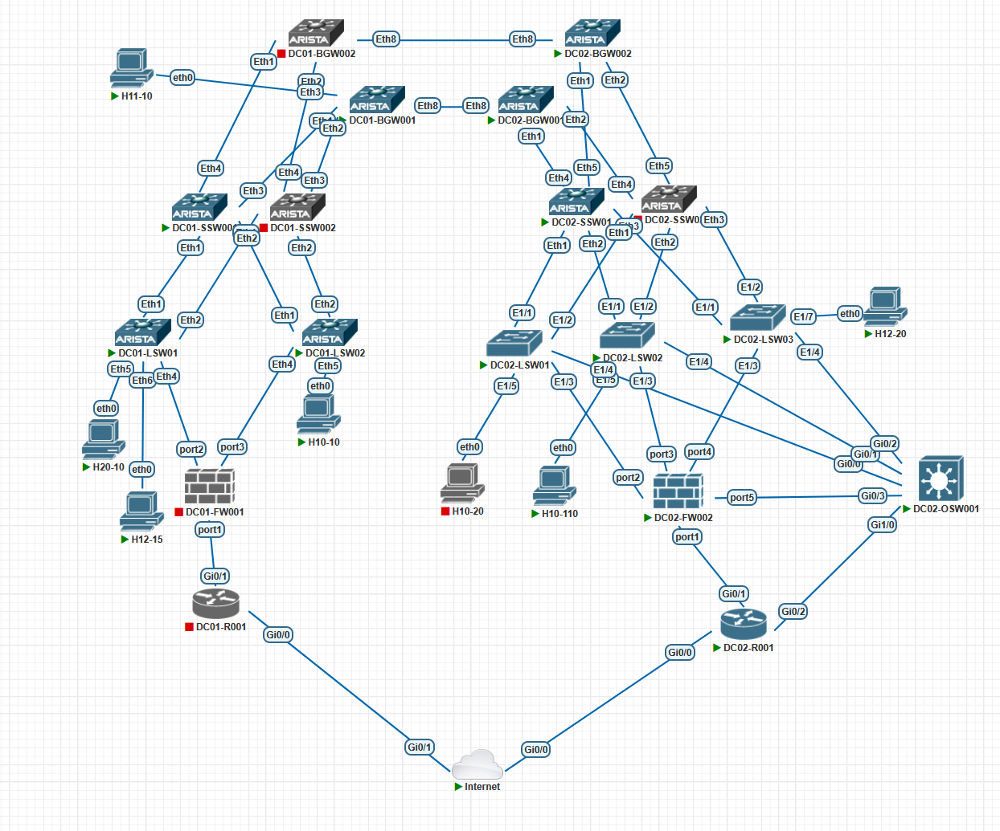
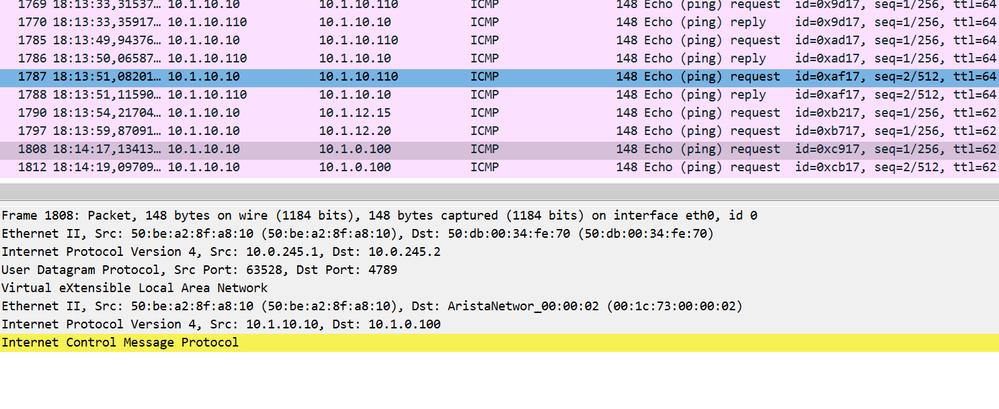

# Задание:
Проектирование геораспределенной инфраструктуры цод на базе MULTISITE.

В рамках задачи мы проектируем инфраструктуру ЦОД управляющей компании агрохолдинга. В агрохолдинге имеются подразделения, которые занимаются автономной операционной деятельностью. Выход в интернет общий. Имеется ASN. 
Для примера в агрохолдинге рассматриваем компании, которых поместим в vrf POTATO, TOMATO, CARROT.


# Решение:

1. [Описание сети](#описание-сети)
2. [Конфигурация сетевого оборудования](#конфигурация-сетевого-оборудования)
3. [Выполненная работа](#выполненная-работа)


    
### Описание сети:
В сети имеется три коммутатора Nexus, МСЭ Fortigate, маршрутизаторы Cisco, а также классический коммутатор Cisco.
На основе имеющегося оборудования будем выстраивать инфраструктуру на двух географически разнесенных ЦОДах




#### План адресного пространства:
- 10.0.0.0/16 - mgmt
-  10.0.0.0/24 - блок LOOPBACK адресов для всех L3 устройств 
-  10.0.1.0/24 - свободно
-  10.0.2.0/23 - свободно
-  10.0.4.0/24 - свободно
-  10.0.5.0/24 - блок линковых адресов между DC01 и DC02
-  10.0.6.0/24 - блок линковых адресов в DC01
-  10.0.7.0/24 - блок для loopback адресов SPINEs в DC01 для BGP ipv4
-  10.0.8.0/22 - блок для loopback адресов LEAFs в DC01 для BGP ipv4
-  10.0.12.0/22 - блок для loopback адресов LEAFs в DC01 для vxlan
-  10.0.16.0/21 - блок линковых адресов между LEAFs and SPINE 01 в DC01. Размер выбран так: макс. число VTEP 1000. 1000*2 (/31 подсеть)=2000 адресов
-  10.0.24.0/21 - блок линковых адресов между LEAFs and SPINE 02 в DC01. 
- 
- 
-  10.0.208.0/20 - блок линковых адресов между LEAFs and SPINE 01 в DC02
-  10.0.224.0/20 - блок линковых адресов между LEAFs and SPINE 02 в DC02
-  10.0.240.0/22 - свободно
-  10.0.244.0/24 - свободно
-  10.0.245.0/24 - блок LOOPBACK VIP адресов DCI
-  10.0.246.0/24 - блок линковых адресов в DC02
-  10.0.247.0/24 - блок для loopback адресов SPINEs в DC02
-  10.0.248.0/22 - блок для loopback адресов LEAFs в DC02 для BGP ipv4
-  10.0.252.0/22 - блок для loopback адресов LEAFs в DC02 для vxlan
-  
- 
- 
- 10.1.0.0/16 - vrf POTATO
-  10.1.x.0/24 - подсеть в vrf POTATO, где x - номер VLAN
- 10.2.0.0/16 - vrf TOMATO
-  10.1.x.0/24 - подсеть в vrf TOMATO, где x - номер VLAN
- 10.3.0.0/16 - vrf CARROT
-  10.3.x.0/24 - подсеть в vrf CARROT, где x - номер VLAN
-  
-  
- 192.0.2.0/24 (TEST-NET-1) линковые сети от оператора до нас
- 
- 203.0.113.0/24 (TEST-NET-3) наш блок IPv4, AS 20000
- 

- AS4200NN0000 - номер автономной системы для SPINE'ов в DC0N, где NN - номер DC
- AS4200NN0XXX - номера автономных систем для LEAF'ов, где XXX - соотвествует номеру LEAF'а с добавлением нулей в начале
- Хосты имеют именя HXX-YY, где XX - номер VLAN и 3-й октет IP-адреса, YY - 4-й октет IP-адреса.
- Используем схему VLAN-BASED
- VNI в формате 1YYYY, YYYY - номер VLAN


#### Конфигурация сетевого оборудования:
<details>
<summary><b></b></summary>

```


```
</details>


#### Конфигурация хостов:

📥 [Скачать](./configs)  файлы лабы в текстовом формате 

### Выполненная работа:
DC02 - условно "старый" ЦОД. в нём имеется LEGACY сеть, стык осуществляется через DC02-OSW001.
Была спланирована адресация андерлей сетииз расчёта макс. 1000 VTEP для cisco, два адреса на стык со спайном по /31 сети, итого /21 Блок на стыки, /22 для loopback'ов.
ООО Картошка занимается картошкой, ей присвоен vrf POTATO. В настоящей работе ей выделены VLAN 10-19, ip 10.1.0.0/16, ООО Томат - vrf TOMATO, vlan 20-20, ip 10.2.0.0/16, ООО Морковка - vrf CARROT, vlan 30-39, ip 10.3.0.0/16.
Выход в интернет осуществляется через МСЭ Fortigate, каждая компания выходит в интернет через "свой" IP-адрес из PI-блока, зарегистрированного на управляющую компанию. 
Публикация ресурсов осуществляется при помощи двойного NAT'а.


### Проверка доступности: 

Возникла проблема - не ходит L3 между DC. L2 ходит

Проверка:
<details>
<summary><b></b></summary>

```

H10110> ping 10.1.10.1

84 bytes from 10.1.10.1 icmp_seq=1 ttl=255 time=19.015 ms
84 bytes from 10.1.10.1 icmp_seq=2 ttl=255 time=8.312 ms
^C
H10110> ping 10.1.12.20

84 bytes from 10.1.12.20 icmp_seq=1 ttl=62 time=79.785 ms
84 bytes from 10.1.12.20 icmp_seq=2 ttl=62 time=57.000 ms
^C
H10110> show ip all

NAME   IP/MASK              GATEWAY           MAC                DNS
H10110 10.1.10.110/24       10.1.10.1         00:50:79:66:68:59

---------

H10-10> ping 10.1.10.1

84 bytes from 10.1.10.1 icmp_seq=1 ttl=64 time=9.649 ms
84 bytes from 10.1.10.1 icmp_seq=2 ttl=64 time=3.011 ms
^C
H10-10> show arp

00:50:79:66:68:59  10.1.10.110 expires in 33 seconds
02:00:00:00:00:01  10.1.10.1 expires in 48 seconds

H10-10> ping 10.1.10.110

84 bytes from 10.1.10.110 icmp_seq=1 ttl=64 time=150.438 ms
84 bytes from 10.1.10.110 icmp_seq=2 ttl=64 time=45.582 ms
^C
H10-10> ping 10.1.12.15

84 bytes from 10.1.12.15 icmp_seq=1 ttl=62 time=114.040 ms
84 bytes from 10.1.12.15 icmp_seq=2 ttl=62 time=13.713 ms
^C
H10-10> ping 10.1.12.20

10.1.12.20 icmp_seq=1 timeout
^C
H10-10> ping 10.1.0.100

10.1.0.100 icmp_seq=1 timeout
^C

--------

DC02-BGW001#show bgp evpn  route-type mac-ip 10.1.10.10 detail
BGP routing table information for VRF default
Router identifier 10.0.248.4, local AS number 4200020004
BGP routing table entry for mac-ip 0050.7966.685e 10.1.10.10, Route Distinguisher: 4200020004:10010
 Paths: 1 available
  4200010003 4200010000 4200010002
    - from - (0.0.0.0)
      Origin IGP, metric -, localpref 100, weight 0, tag 0, valid, external, best
      Extended Community: Route-Target-AS:64512:10 TunnelEncap:tunnelTypeVxlan
      VNI: 10010 ESI: 0000:0000:0000:0000:0000
      D-PATH: 4200010000:1:EVPN 4200010000:1:EVPN
BGP routing table entry for mac-ip 0050.7966.685e 10.1.10.10 remote, Route Distinguisher: 4200010003:10010
 Paths: 1 available
  4200010003 4200010000 4200010002
    10.0.245.1 from 10.0.5.0 (10.0.8.3)
      Origin IGP, metric -, localpref 100, weight 0, tag 0, valid, external, best
      Extended Community: Route-Target-AS:64512:10 TunnelEncap:tunnelTypeVxlan
      VNI: 10010 ESI: 0000:0000:0000:0000:0000
      D-PATH: 4200010000:1:EVPN
DC02-BGW001#

DC02-BGW001#
DC02-BGW001#show bgp evpn  route-type mac-ip 10.1.10.110 detail

BGP routing table information for VRF default
Router identifier 10.0.248.4, local AS number 4200020004
BGP routing table entry for mac-ip 0050.7966.6859 10.1.10.110, Route Distinguisher: 4200020002:10
 Paths: 1 available
  4200020000 4200020002
    10.0.252.2 from 10.0.208.6 (10.0.247.1)
      Origin IGP, metric -, localpref 100, weight 0, tag 0, valid, external, best
      Extended Community: Route-Target-AS:64512:10 Route-Target-AS:64512:997 TunnelEncap:tunnelTypeVxlan EvpnRouterMac:50:00:5a:00:1b:08
      VNI: 10010 L3 VNI: 20997 ESI: 0000:0000:0000:0000:0000
BGP routing table entry for mac-ip 0050.7966.6859 10.1.10.110 remote, Route Distinguisher: 4200020004:10010
 Paths: 1 available
  4200020000 4200020002
    - from - (0.0.0.0)
      Origin IGP, metric -, localpref 100, weight 0, tag 0, valid, external, best
      Extended Community: Route-Target-AS:64512:10 TunnelEncap:tunnelTypeVxlan
      VNI: 10010 ESI: 0000:0000:0000:0000:0000
      D-PATH: 4200020000:1:EVPN
DC02-BGW001#
DC02-BGW001#
DC02-BGW001#
DC02-BGW001#show bgp evpn  route-type mac-ip 10.1.12.20 detail
BGP routing table information for VRF default
Router identifier 10.0.248.4, local AS number 4200020004
BGP routing table entry for mac-ip 0050.7966.685c 10.1.12.20, Route Distinguisher: 4200020003:12
 Paths: 1 available
  4200020000 4200020003
    10.0.252.3 from 10.0.208.6 (10.0.247.1)
      Origin IGP, metric -, localpref 100, weight 0, tag 0, valid, external, best
      Extended Community: Route-Target-AS:64512:12 Route-Target-AS:64512:997 TunnelEncap:tunnelTypeVxlan EvpnRouterMac:50:00:4b:00:1b:08
      VNI: 10012 L3 VNI: 20997 ESI: 0000:0000:0000:0000:0000
BGP routing table entry for mac-ip 0050.7966.685c 10.1.12.20 remote, Route Distinguisher: 4200020004:10012
 Paths: 1 available
  4200020000 4200020003
    - from - (0.0.0.0)
      Origin IGP, metric -, localpref 100, weight 0, tag 0, valid, external, best
      Extended Community: Route-Target-AS:64512:12 TunnelEncap:tunnelTypeVxlan
      VNI: 10012 ESI: 0000:0000:0000:0000:0000
      D-PATH: 4200020000:1:EVPN


-----

DC01-BGW001#show bgp evpn  route-type mac-ip 10.1.12.20 detail
BGP routing table information for VRF default
Router identifier 10.0.8.3, local AS number 4200010003
BGP routing table entry for mac-ip 0050.7966.685c 10.1.12.20, Route Distinguisher: 4200010003:10012
 Paths: 1 available
  4200020004 4200020000 4200020003
    - from - (0.0.0.0)
      Origin IGP, metric -, localpref 100, weight 0, tag 0, valid, external, best
      Extended Community: Route-Target-AS:64512:12 TunnelEncap:tunnelTypeVxlan
      VNI: 10012 ESI: 0000:0000:0000:0000:0000
      D-PATH: 4200020000:1:EVPN 4200020000:1:EVPN
BGP routing table entry for mac-ip 0050.7966.685c 10.1.12.20 remote, Route Distinguisher: 4200020004:10012
 Paths: 1 available
  4200020004 4200020000 4200020003
    10.0.245.2 from 10.0.5.1 (10.0.248.4)
      Origin IGP, metric -, localpref 100, weight 0, tag 0, valid, external, best
      Extended Community: Route-Target-AS:64512:12 TunnelEncap:tunnelTypeVxlan
      VNI: 10012 ESI: 0000:0000:0000:0000:0000
      D-PATH: 4200020000:1:EVPN
DC01-BGW001#
DC01-BGW001#
DC01-BGW001#
DC01-BGW001#show bgp evpn  route-type mac-ip 10.1.10.110 detail
BGP routing table information for VRF default
Router identifier 10.0.8.3, local AS number 4200010003
BGP routing table entry for mac-ip 0050.7966.6859 10.1.10.110, Route Distinguisher: 4200010003:10010
 Paths: 1 available
  4200020004 4200020000 4200020002
    - from - (0.0.0.0)
      Origin IGP, metric -, localpref 100, weight 0, tag 0, valid, external, best
      Extended Community: Route-Target-AS:64512:10 TunnelEncap:tunnelTypeVxlan
      VNI: 10010 ESI: 0000:0000:0000:0000:0000
      D-PATH: 4200020000:1:EVPN 4200020000:1:EVPN
BGP routing table entry for mac-ip 0050.7966.6859 10.1.10.110 remote, Route Distinguisher: 4200020004:10010
 Paths: 1 available
  4200020004 4200020000 4200020002
    10.0.245.2 from 10.0.5.1 (10.0.248.4)
      Origin IGP, metric -, localpref 100, weight 0, tag 0, valid, external, best
      Extended Community: Route-Target-AS:64512:10 TunnelEncap:tunnelTypeVxlan
      VNI: 10010 ESI: 0000:0000:0000:0000:0000
      D-PATH: 4200020000:1:EVPN
DC01-BGW001#show bgp evpn  route-type mac-ip 10.1.10.10 detail
BGP routing table information for VRF default
Router identifier 10.0.8.3, local AS number 4200010003
BGP routing table entry for mac-ip 0050.7966.685e 10.1.10.10, Route Distinguisher: 4200010002:10010
 Paths: 1 available
  4200010000 4200010002
    10.0.12.2 from 10.0.16.4 (10.0.7.1)
      Origin IGP, metric -, localpref 100, weight 0, tag 0, valid, external, best
      Extended Community: Route-Target-AS:64512:10 Route-Target-AS:64512:997 TunnelEncap:tunnelTypeVxlan EvpnRouterMac:50:25:e8:25:6e:7b
      VNI: 10010 L3 VNI: 20997 ESI: 0000:0000:0000:0000:0000
BGP routing table entry for mac-ip 0050.7966.685e 10.1.10.10 remote, Route Distinguisher: 4200010003:10010
 Paths: 1 available
  4200010000 4200010002
    - from - (0.0.0.0)
      Origin IGP, metric -, localpref 100, weight 0, tag 0, valid, external, best
      Extended Community: Route-Target-AS:64512:10 TunnelEncap:tunnelTypeVxlan
      VNI: 10010 ESI: 0000:0000:0000:0000:0000
      D-PATH: 4200010000:1:EVPN
DC01-BGW001#

-------

DC01-LSW001#show ip route vrf POTATO

VRF: POTATO
Source Codes:
       C - connected, S - static, K - kernel,
       O - OSPF, IA - OSPF inter area, E1 - OSPF external type 1,
       E2 - OSPF external type 2, N1 - OSPF NSSA external type 1,
       N2 - OSPF NSSA external type2, B - Other BGP Routes,
       B I - iBGP, B E - eBGP, R - RIP, I L1 - IS-IS level 1,
       I L2 - IS-IS level 2, O3 - OSPFv3, A B - BGP Aggregate,
       A O - OSPF Summary, NG - Nexthop Group Static Route,
       V - VXLAN Control Service, M - Martian,
       DH - DHCP client installed default route,
       DP - Dynamic Policy Route, L - VRF Leaked,
       G  - gRIBI, RC - Route Cache Route,
       CL - CBF Leaked Route

Gateway of last resort is not set

 B E      10.1.0.100/32 [200/0]
           via VTEP 10.0.245.1 VNI 20997 router-mac 00:1c:73:00:00:01 local-interface Vxlan1
 B E      10.1.10.10/32 [200/0]
           via VTEP 10.0.12.2 VNI 20997 router-mac 50:25:e8:25:6e:7b local-interface Vxlan1
 C        10.1.10.0/24
           directly connected, Vlan10
 C        10.1.11.0/24
           directly connected, Vlan11
 C        10.1.12.0/24
           directly connected, Vlan12
 C        10.3.0.3/32
           directly connected, Loopback110

DC01-LSW001#show ip bgp vrf POTATO
BGP routing table information for VRF POTATO
Router identifier 10.3.0.3, local AS number 4200010001
Route status codes: s - suppressed contributor, * - valid, > - active, E - ECMP head, e - ECMP
                    S - Stale, c - Contributing to ECMP, b - backup, L - labeled-unicast
                    % - Pending best path selection
Origin codes: i - IGP, e - EGP, ? - incomplete
RPKI Origin Validation codes: V - valid, I - invalid, U - unknown
AS Path Attributes: Or-ID - Originator ID, C-LST - Cluster List, LL Nexthop - Link Local Nexthop

          Network                Next Hop              Metric  AIGP       LocPref Weight  Path
 * >      10.1.0.100/32          10.0.245.1            0       -          100     0       4200010000 4200010003 4200020004 i
 * >      10.1.10.0/24           -                     -       -          -       0       i
 *        10.1.10.0/24           10.0.12.2             0       -          100     0       4200010000 4200010002 i
 *        10.1.10.0/24           10.0.245.1            0       -          100     0       4200010000 4200010003 4200020004 4200020000 4200020002 ?
 * >      10.1.10.10/32          10.0.12.2             0       -          100     0       4200010000 4200010002 i
 * >      10.1.11.0/24           -                     -       -          -       0       i
 *        10.1.11.0/24           10.0.245.1            0       -          100     0       4200010000 4200010003 i
 *        10.1.11.0/24           10.0.245.1            0       -          100     0       4200010000 4200010003 4200020004 4200020000 4200020003 ?
 *        10.1.11.0/24           10.0.245.1            0       -          100     0       4200010000 4200010003 4200020004 4200020000 4200020002 ?
 * >      10.1.12.0/24           -                     -       -          -       0       i
 *        10.1.12.0/24           10.0.245.1            0       -          100     0       4200010000 4200010003 4200020004 4200020000 4200020003 ?
 * >      10.3.0.3/32            -                     -       -          -       0       i
DC01-LSW001#show bgp evpn vni 20997
BGP routing table information for VRF default
Router identifier 10.0.8.1, local AS number 4200010001
Route status codes: * - valid, > - active, S - Stale, E - ECMP head, e - ECMP
                    c - Contributing to ECMP, % - Pending best path selection
Origin codes: i - IGP, e - EGP, ? - incomplete
AS Path Attributes: Or-ID - Originator ID, C-LST - Cluster List, LL Nexthop - Link Local Nexthop

          Network                Next Hop              Metric  LocPref Weight  Path
 * >      RD: 4200010002:10010 mac-ip 0050.7966.685e 10.1.10.10
                                 10.0.12.2             -       100     0       4200010000 4200010002 i
 * >      RD: 4200010001:10012 mac-ip 0050.7966.6863 10.1.12.15
                                 -                     -       -       0       i
 * >      RD: 4200020004:997 ip-prefix 10.1.0.100/32
                                 10.0.245.1            -       100     0       4200010000 4200010003 4200020004 i
 * >      RD: 4200010001:997 ip-prefix 10.1.10.0/24
                                 -                     -       -       0       i
 * >      RD: 4200010002:997 ip-prefix 10.1.10.0/24
                                 10.0.12.2             -       100     0       4200010000 4200010002 i
 * >      RD: 4200020002:997 ip-prefix 10.1.10.0/24
                                 10.0.245.1            -       100     0       4200010000 4200010003 4200020004 4200020000 4200020002 ?
 * >      RD: 4200010001:997 ip-prefix 10.1.11.0/24
                                 -                     -       -       0       i
 * >      RD: 4200010003:997 ip-prefix 10.1.11.0/24
                                 10.0.245.1            -       100     0       4200010000 4200010003 i
 * >      RD: 4200020002:997 ip-prefix 10.1.11.0/24
                                 10.0.245.1            -       100     0       4200010000 4200010003 4200020004 4200020000 4200020002 ?
 * >      RD: 4200020003:997 ip-prefix 10.1.11.0/24
                                 10.0.245.1            -       100     0       4200010000 4200010003 4200020004 4200020000 4200020003 ?
 * >      RD: 4200010001:997 ip-prefix 10.1.12.0/24
                                 -                     -       -       0       i
 * >      RD: 4200020003:997 ip-prefix 10.1.12.0/24
                                 10.0.245.1            -       100     0       4200010000 4200010003 4200020004 4200020000 4200020003 ?
 * >      RD: 4200010001:997 ip-prefix 10.3.0.3/32
                                 -                     -       -       0       i
DC01-LSW001#show bgp evpn vni 10012 ?
  detail     Detailed view
  domain     Filter by route domain
  esi        Filter by Ethernet Segment Identifier
  multicast  Filter by multicast group and/or source
  next-hop   Filter by next hop (remote VTEP) IPv4 or IPv6 address
  >          Redirect output to URL
  >>         Append redirected output to URL
  |          Command output pipe filters
  <cr>

DC01-LSW001#show bgp evpn vni 10012
BGP routing table information for VRF default
Router identifier 10.0.8.1, local AS number 4200010001
Route status codes: * - valid, > - active, S - Stale, E - ECMP head, e - ECMP
                    c - Contributing to ECMP, % - Pending best path selection
Origin codes: i - IGP, e - EGP, ? - incomplete
AS Path Attributes: Or-ID - Originator ID, C-LST - Cluster List, LL Nexthop - Link Local Nexthop

          Network                Next Hop              Metric  LocPref Weight  Path
 * >      RD: 4200010003:10012 mac-ip 0050.7966.685c
                                 10.0.245.1            -       100     0       4200010000 4200010003 4200020004 4200020000 4200020003 i
 * >      RD: 4200010003:10012 mac-ip 0050.7966.685c 10.1.12.20
                                 10.0.245.1            -       100     0       4200010000 4200010003 4200020004 4200020000 4200020003 i
 * >      RD: 4200010001:10012 mac-ip 0050.7966.6863
                                 -                     -       -       0       i
 * >      RD: 4200010001:10012 mac-ip 0050.7966.6863 10.1.12.15
                                 -                     -       -       0       i
 * >      RD: 4200010001:10012 imet 10.0.12.1
                                 -                     -       -       0       i
 * >      RD: 4200010002:10012 imet 10.0.12.2
                                 10.0.12.2             -       100     0       4200010000 4200010002 i
 * >      RD: 4200010003:10012 imet 10.0.245.1
                                 10.0.245.1            -       100     0       4200010000 4200010003 i
DC01-LSW001#

```
</details>

В процессе диагностики был также снят дамп трафика c DC02-BGW002 eth8 (в сторону DC01). С DC01 долетает, а дальше, на линках в сторону SPINE ничего. Поднял Loopback в vrf POTATO на DC02-BGW002, он тоже не пингается.
📥 [Скачать](./files) файлы с дампом трафика

<details>
<summary><b></b></summary>

```


```
</details>
